```{r setup, include=FALSE}
#AnnArbor 
knitr::opts_chunk$set(echo = TRUE, comment = NA,cache=TRUE,out.width = "60%",fig.align='center')
leccion=0
```


# Lección `r leccion=leccion+1; leccion`:   Conociendo R


## ¿Qué es R?


```{r, echo=FALSE,fig.cap="",out.width = "20%",fig.align='center'}

```


- Entorno de programación para el análisis estadístico y gráfico de datos
- Software libre
- Sintaxis sencilla e intuitiva
- Enorme comunidad de usuarios (Comprehensive R Archive Network, CRAN)
- ¿Aún tenéis dudas de por qué usarlo? [Hay muchas opiniones en la web](https://www.google.com/search?q=Why+use+R&rlz=1C1CHBF_esES891ES891&sxsrf=ALiCzsY4-woeo8PpPd0yw3j3b8guwp9zZQ%3A1664188143209&ei=734xY5C1DOaIur4PjI2XoAU&ved=0ahUKEwjQ6PX4n7L6AhVmhM4BHYzGBVQQ4dUDCA4&uact=5&oq=Why+use+R&gs_lcp=Cgdnd3Mtd2l6EAMyCggAEEcQ1gQQsAMyCggAEEcQ1gQQsAMyCggAEEcQ1gQQsAMyCggAEEcQ1gQQsAMyCggAEEcQ1gQQsAMyCggAEEcQ1gQQsAMyCggAEEcQ1gQQsAMyCggAEEcQ1gQQsAMyBwgAELADEENKBAhBGABKBAhGGABQAFgAYIMMaAFwAHgAgAEAiAEAkgEAmAEAyAEJwAEB&sclient=gws-wiz)


## ¿Qué es RStudio?

En este curso usaremos RStudio-desktop como interfaz gráfica de usuario de R para todos los sistemas operativos

Es un entorno integrado para utilizar y programar con R


```{r grafico_Rstudio2, echo=FALSE,fig.align='center',out.width = "20%"}

```


## Cómo instalar R

**Si sois de Windows o Mac**

1. Id a [CRAN](http://cran.r-project.org/)
2. Pulsad sobre el enlace correspondiente a vuestro sistema operativo
3. Seguid las instrucciones de instalación correspondientes

**Si trabajáis con Ubuntu o Debian**

1. Abrid la terminal, estando conectados a internet
2. Introducid lo siguiente: ```sudo aptitude install r-base```


## Rstudio

Un editor de R y muchas más cosas

```{r rstudioID, echo=FALSE,out.width="55%",fig.align='center'}
knitr::include_graphics("Imgs/InterfazRStudio.png")
```

## Cómo instalar RStudio

1. [Obtener RStudio](http://www.rstudio.com/products/rstudio/download/)
2. **Solo si utilizáis Linux**, ejecutad en una terminal la siguiente instrucción para completar la instalación: ```sudo dpkg -i rstudio-<version>-i386.deb```, donde ```version``` refiere a la versión concreta que se haya descargado


```{r icono_Rstudio3, echo=FALSE,fig.align='center',out.width="25%"}


```


## Trabajando con RStudio

```{r grafico_Rstudio_02, echo=FALSE,fig.align='center',out.width="60%"}
knitr::include_graphics("Imgs/easy_plus_tools.png")
```


## Cómo pedir ayuda

- ```help()```: obtener ayuda por consola
- ```??...```: obtener ayuda por consola
- Pestaña ```Help``` de Rstudio
- [Cheat Sheet de RStudio](https://www.rstudio.com/wp-content/uploads/2015/02/rmarkdown-cheatsheet.pdf) y [más](https://www.google.com/search?q=Cheat+Sheet++RStudio&rlz=1C1CHBF_esES891ES891&sxsrf=ALiCzsYTamg5AX36RN8EhpV8lSO55ijfRw%3A1664221782651&ei=VgIyY5GzJ5nCa6rfovAP&ved=0ahUKEwiRtrqhnbP6AhUZ4RoKHaqvCP4Q4dUDCA4&uact=5&oq=Cheat+Sheet++RStudio&gs_lcp=Cgdnd3Mtd2l6EAMyCAgAEB4QBxATMggIABAeEAUQEzIICAAQHhAFEBMyCAgAEB4QBRATMggIABAeEAUQEzIICAAQHhAFEBMyCAgAEB4QBRATMggIABAeEAgQEzIICAAQHhAIEBMyCAgAEB4QCBATOgoIABBHENYEELADOggIABAeEAgQB0oECEEYAEoECEYYAFCmCljnC2DOEWgBcAF4AIABaogBzQGSAQMxLjGYAQCgAQHIAQjAAQE&sclient=gws-wiz)
- Buscad  por la red (stackoverflow, R project...)


```{r grafico_Rstudio, include=FALSE,fig.align='center'}
knitr::include_graphics("Imgs/help.png")
```


## Paquetes: cómo instalarlos y cargarlos

\blue{Paquete/librería}. Un **package** es una librería de funciones y datos que que pueden venir o no instaladas en la carga de R básico. 

- `install.packages("nombre_paquete", dep = TRUE)`: instala o actualiza un paquete de R
- ```library(nombre_del_paquete)```: carga un paquete ya instalado


# Lección `r leccion=leccion+1; leccion`:   Operaciones básicas

## Operaciones

Código |  Operación                                
--------------------|--------------------
```+``` | Suma
```-``` | Resta 
```*```  | Multiplicación
```/``` | División 
```^``` | Potencia 
```%/%``` | Cociente entero
``%%`` | Resto de división entera

## Calculadora básica - Operaciones

Código |  Significado                                 
--------------------|--------------------
`pi` |  el número $\pi$, `r pi`
`Inf` | [$\infty$](https://es.wikipedia.org/wiki/Infinito)
`NaN` | Indeterminación (Not a Number)
`NA` | Valor desconocido (Not Available)

## Calculadora básica - Operaciones

```{r}
2+2
77%/%5
77%%5
```

## Funciones básicas

Código |  Función                            
--------------------|--------------------
`sqrt(x)`  | $\sqrt{x}$
`exp(x)`   | $e^x$  
`log(x)`   | $\ln(x)$
`log10(x)` | $\log_{10}(x)$
`log(x,a)` | $\log_a(x)$ 
`abs(x)`   | $\begin{vmatrix}x\end{vmatrix}$

## Funciones básicas

```{r}
sqrt(9)
log(exp(1))
log(1000,10)
log10(1000)
```


## Combinatoria básica

Código |  Operación                                 
--------------------|--------------------
`factorial(x)` | [x!](https://es.wikipedia.org/wiki/Factorial)  
`choose(n,m)` | $\begin{pmatrix}n\\ m\end{pmatrix}$   


\vspace{0.2cm}

- \blue{Número factorial.}
Se define como número factorial de un número entero positivo $n$ como $n!=n\cdot(n-1)\cdots 2\cdot 1$
- [Coeficiente binomial](https://es.wikipedia.org/wiki/Coeficiente_binomial). Se define el coeficiente binomial de $n$ sobre $m$ como $$\begin{pmatrix}n\\ m\end{pmatrix}=\frac{n!}{m!(n-m)!}$$


## Calculadora básica - Combinatoria

```{r}
factorial(5)
choose(4,2)
factorial(6)
factorial(5)*6
```

## Trigonometría en radianes

Código |  Función                                 
--------------------|--------------------
`sin(x)` | $\sin(x)$
`cos(x)` | $\cos(x)$
`tan(x)` | $\tan(x)$
`asin(x)` | $\arcsin(x)$
`acos(x)` | $\arccos(x)$
`atan(x)` | $\arctan(x)$

## Trigonometría en radianes

```{r}
sin(pi/2)
cos(pi)
tan(0)
```

## Un  ejemplo de  gráficos

```{r plot_tema1, eval=FALSE}
x = seq(0,2*pi,0.1)
plot(x,sin(x),type="l",col="blue",lwd=3, 
     xlab=expression(x), ylab="",
     xlim=c(0,4),cex=0.5)
curve(cos(x),col="red",add=TRUE)
lines(x, tan(x/2), col="purple",lwd=3)
legend("bottomleft",
       col=c("blue","green","purple"),
       legend=c("Seno","Coseno", "Tangente"),
       lwd=3, bty="l",cex=0.8)
```


## Un  ejemplo de  gráficos


```{r plot2_tema1, fig.align = "center",echo=FALSE,out.width="60%"}
x = seq(0,2*pi,0.1)
plot(x,sin(x),type="l",col="blue",lwd=3, xlab=expression(x), ylab="",
     xlim=c(0,4),cex=0.5)
curve(cos(x),col="red",add=TRUE)
lines(x, tan(x/2), col="purple",lwd=3)
legend("bottomleft",col=c("blue","green","purple"),
     legend=c("Seno","Coseno", "Tangente"), lwd=3, bty="l",cex=0.8)
```


## Números en coma flotante

Código |  Función                                 
-------|--------------------
`print(x,n)` | Muestra las $n$ cifras significativa del número $x$
`round(x,n)` | Redondea a $n$ cifras significativas un resultado o vector numérico $x$
`floor(x)` | $\lfloor x\rfloor$, parte entera por defecto de $x$
`ceiling(x)` | $\lceil x\rceil$, parte entera por exceso de $x$
`trunc(x)` | Parte entera de $x$, eliminando la parte decimal


## Números en coma flotante

```{r}
print(pi,5)
round(pi,5)
floor(pi)
ceiling(pi)
```


## Variables y funciones

- `nombre_variable = valor`: define una variable con dicho valor
- `nombre_función = function(variable){función}`: define una función

```{r}
a= 8
cubo = function(x){x^3}
cubo(x=a)
raiz_cúbica = function(x){x^(1/3)}
raiz_cúbica(a)
raiz_cúbica(cubo(x=a))
```


# Lección `r leccion=leccion+1; leccion`:   R Markdown 

## Introducción

\blue{R Markdown.} Es un tipo de fichero-programa en el cual podemos intercalar sin problema alguno texto, código y fórmulas matemáticas.

Para la mayor parte de las necesidades de este curso, en lo referente a la creación y composición de este tipo de ficheros, el documento
*[Markdown Quick Reference](https://en.support.wordpress.com/markdown-quick-reference/)
* y la [chuleta](https://www.rstudio.com/wp-content/uploads/2015/02/rmarkdown-cheatsheet.pdf) de R Markdown deberían ser suficientes.

Sin embargo, a lo largo de este curso iremos ampliando estos contenidos en algunos temas cuando lo creamos necesario.

Nosotros, en este tema, veremos cómo controlar el comportamiento de los bloques de código (\blue{chunks}) al compilar el fichero R Markdown y cómo escribir fórmulas matemáticas bien formateadas.

## Fórmulas matemáticas


Para escribir fórmulas matemáticas bien formateadas utilizaremos la sintaxis \LaTeX

   - Para tener ecuaciones o fórmulas en el mismo párrafo, escribimos nuestro código entre dos símbolos de dólar:  código 
   - Si queremos tener ecuaciones o fórmulas centradas en un párrafo aparte, escribimos nuestro código entre dos dobles símbolos de dólar:   código 
   
\red{¡Cuidado!} Al escribir una fórmula de la forma indicada anteriormente o simplemente texto en R Markdown, los espacios en blanco son completamente ignorados. RStudio solamente añade los espacios en blanco a partir del significado lógico de sus elementos.


## Símbolos 

Hay muchísimos símbolos matemáticos que puedes escribirse con la sintaxis \LaTeX. En el ejemplo anterior ya os hemos mostrado unos pocos. En este tema, nosotros solo veremos los más utilizados.

Para quien quiera ir más allá, aquí os dejamos un [documento muy útil](http://www.ptep-online.com/ctan/symbols.pdf) con gran cantidad de símbolos de \LaTeX.

## Símbolos matemáticos - Básico

Significado |  Código  |  Resultado                                
--------------------|--------------------|--------------------
Suma | `+`    | $+$              
Resta | `-` | $-$               
Producto | `\cdot` | $\cdot$                     
Producto | `\times` | $\times$ 
División | `\div` | $\div$
Potencia | `a^{x}` | $a^{x}$
Subíndice | `a_{i}` | $a_{i}$
 

## Símbolos matemáticos - Básico

Significado |  Código  |  Resultado                                
--------------------|--------------------|--------------------
Fracción | `\frac{a}{b}`    | $\frac{a}{b}$              
Más menos | `\pm` | $\pm$
Raíz n-ésima | `\sqrt[n]{x}` | $\sqrt[n]{x}$
Unión | `cup` | $\cup$                     
Intersección | `\cap` | $\cap$  
OR lógico | `\vee` | $\vee$
AND lógico | `\wedge` | $\wedge$
 
## Símbolos matemáticos - Relaciones

Significado |  Código  |  Resultado                                
--------------------|--------------------|--------------------
Igual | `=` | $=$
Aproximado | `\approx` | $\approx$
No igual | `\ne` | $\ne$  
Mayor que | `>` | $>$
Menor que | `<` | $<$
Mayor o igual que | `\geq`    | $\geq$              
Menor o igual que | `\leq` | $\leq$

## Símbolos matemáticos - Operadores

Significado |  Código  |  Resultado                                
--------------------|--------------------|--------------------
Sumatorio | `\sum_{i=0}^{n}` | $\sum_{i=0}^{n}$
Productorio | `\prod_{i=0}^{n}` | $\prod_{i=0}^{n}$
Integral | `\int_{a}^{b}` | $\int_{a}^{b}$  
Unión (grande) | `\bigcup` | $\bigcup$
Intersección (grande) | `\bigcap` | $\bigcap$
OR lógico (grande) | `\bigvee`    | $\bigvee$              
AND lógico (grande) | `\bigwedge` | $\bigwedge$

## Símbolos matemáticos - Delimitadores

Significado |  Código  |  Resultado                                
--------------------|--------------------|--------------------
Paréntesis | `()` | $(\ )$
Corchetes | `[]` | $[\ ]$
Llaves | `\{ \}` | $\{\ \}$  
Diamante | `\langle \rangle` | $\langle\ \rangle$
Parte entera por defecto | `\lfloor \rfloor` | $\lfloor\  \rfloor$
Parte entera por exceso | `\lceil \rceil`    | $\lceil\ \rceil$
Espacio en blanco | `hola\ caracola` | $hola\ caracola$
## Símbolos matemáticos - Letras griegas

Significado |  Código  |  Resultado                                
--------------------|--------------------|--------------------
Alpha | `\alpha` | $\alpha$
Beta | `\beta` | $\beta$
Gamma | `\gamma \Gamma` | $\gamma\  \Gamma$  
Delta | `\delta \Delta` | $\delta\  \Delta$
Epsilon | `\epsilon` | $\epsilon$
Epsilon | `\varepsilon`    | $\varepsilon$              
Zeta | `\zeta` | $\zeta$

## Símbolos matemáticos - Letras griegas

Significado |  Código  |  Resultado                                
--------------------|--------------------|--------------------
Eta | `\eta` | $\eta$
Theta | `\theta \Theta` | $\theta\ \Theta$
Kappa | `\kappa` | $\kappa$  
Lambda | `\lambda \Lambda` | $\lambda\  \Lambda$
Mu | `\mu` | $\mu$
Nu | `\nu`    | $\nu$              
Xi | `\xi \Xi` | $\xi\ \Xi$

## Símbolos matemáticos - Letras griegas

Significado |  Código  |  Resultado                                
--------------------|--------------------|--------------------
Pi | `\pi \Pi` | $\pi\ \Pi$
Rho | `\rho` | $\rho$
Sigma | `\sigma \Sigma` | $\sigma\ \Sigma$  
Tau | `\tau` | $\tau$
Upsilon | `\upsilon \Upsilon` | $\upsilon\ \Upsilon$
Phi | `\phi \Phi`    | $\phi\ \Phi$              
Phi | `\varphi` | $\varphi$

## Símbolos matemáticos - Letras griegas

Significado |  Código  |  Resultado                                
--------------------|--------------------|--------------------
Chi | `\chi` | $\chi$
Psi | `\psi \Psi` | $\psi\ \Psi$
Omega | `\omega \Omega` | $\omega\ \Omega$ 


## Símbolos matemáticos - Acentos matemáticos

Significado |  Código  |  Resultado                                
--------------------|--------------------|--------------------
Gorrito | `\hat{x}` | $\hat{x}$
Barra | `\bar{x}` | $\bar{x}$
Punto 1 | `\dot{x}` | $\dot{x}$
Punto 2 | `\ddot{x}` | $\ddot{x}$ 
Punto 3 | `\dddot{x}` | $\dddot{x}$ 
Tilde | `\tilde{x}` | $\tilde{x}$
Vector | `\vec{x}` | $\vec{x}$

## Símbolos matemáticos - Acentos expansibles

Significado |  Código  |  Resultado                                
--------------------|--------------------|--------------------
Gorrito | `\widehat{xyz}` | $\widehat{xyz}$
Barra | `\overline{xyz}` | $\overline{xyz}$
Subrallado | `\underline{xyz}` | $\underline{xyz}$
Llave superior | `\overbrace{xyz}` | $\overbrace{xyz}$ 
Llave inferior | `\underbrace{xyz}` | $\underbrace{xyz}$ 
Tilde | `\widetilde{xyz}` | $\widetilde{xyz}$
Vector | `\overrightarrow{xyz}` | $\overrightarrow{xyz}$

## Símbolos matemáticos - Flechas

Significado |  Código  |  Resultado                                
--------------------|--------------------|--------------------
Simple | `\leftarrow \rightarrow` | $\leftarrow\ \rightarrow$
Doble | `\Leftarrow \Rightarrow` | $\Leftarrow\ \Rightarrow$
Simple larga | `\longleftarrow \longrightarrow` | $\longleftarrow\  \longrightarrow$
Doble larga | `\Longleftarrow \Longrightarrow` | $\Longleftarrow\ \Longrightarrow$ 
Doble sentido simple | `\leftrightarrow` | $\leftrightarrow$ 
Doble sentido doble | `\Leftrightarrow` | $\Leftrightarrow$

## Símbolos matemáticos - Flechas

Significado |  Código  |  Resultado                                
--------------------|--------------------|--------------------
Doble sentido larga simple | `\longleftrightarrow` | $\longleftrightarrow$
Doble sentido larga doble | `\Longleftrightarrow` | $\Longleftrightarrow$
Mapea | `\mapsto` | $\mapsto$
Arriba | `\uparrow` | $\uparrow$ 
Abajo | `\downarrow` | $\downarrow$ 

## Símbolos matemáticos - Funciones

Significado |  Código  |  Resultado                                
--------------------|--------------------|--------------------
Seno | `\sin` | $\sin$
Coseno | `\cos` | $\cos$
Tangente | `\tan` | $\tan$
Arcoseno | `\arcsin` | $\arcsin$ 
Arcocoseno | `\arccos` | $\arccos$ 
Arcotangente | `\arctan` | $\arctan$

## Símbolos matemáticos - Funciones

Significado |  Código  |  Resultado                                
--------------------|--------------------|--------------------
Exponencial | `\exp` | $\exp$
Logaritmo | `\log` | $\log$
Logaritmo neperiano | `\ln` | $\ln$
Máximo | `\max` | $\max$ 
Mínimo | `\min` | $\min$ 
Límite | `\lim` | $\lim$


## Símbolos matemáticos - Funciones

Significado |  Código  |  Resultado                                
--------------------|--------------------|--------------------
Supremo | `\sup` | $\sup$
Ínfimo | `\inf` | $\inf$
Determinante | `\det` | $\det$
Argumento | `\arg` | $\arg$ 

## Símbolos matemáticos - Otros

Significado |  Código  |  Resultado                                
--------------------|--------------------|--------------------
Puntos suspensivos bajos | `\ldots` | $\ldots$
Puntos suspensivos centrados | `\cdots` | $\cdots$
Puntos suspensivos verticales | `\vdots` | $\vdots$
Puntos suspensivos diagonales | `\ddots` | $\ddots$
Cuantificador existencial | `\exists` | $\exists$
Cuantificador universal | `\forall` | $\forall$
Infinito | `\infty` | $\infty$

## Símbolos matemáticos - Otros

Significado |  Código  |  Resultado                                
--------------------|--------------------|--------------------
Aleph | `\aleph` | $\aleph$
Conjunto vacío | `\emptyset` | $\emptyset$
Negación | `\neg` | $\neg$
Barra invertida | `\backslash` | $\backslash$
Dollar | `\$` | $\$$ 
Porcentaje | `\%` | $\%$
Parcial | `\partial` | $\partial$

## Símbolos matemáticos - Tipos de letra

Significado |  Código  |  Resultado                                
--------------------|--------------------|--------------------
Negrita | `\mathbf{palabra}` | $\mathbf{palabra}$
Negrita | `\boldsymbol{palabra}` | $\boldsymbol{palabra}$
Negrita de pizarra | `\mathbb{NZQRC}` | $\mathbb{NZQRC}$
Caligráfica | `\mathcal{NZQRC}` | $\mathcal{NZQRC}$
Gótica | `\mathfrak{NZQRC}` | $\mathfrak{NZQRC}$

## Observaciones

- A la hora de componer en el interior de un párrafo una fracción, existen dos formas: adaptada al tamaño del texto,`$\frac{a}{b}$`, que resulta en $\frac{a}{b}$; o a tamaño real, `$\dfrac{a}{b}$`, que da lugar a $\dfrac{a}{b}$.

- Podemos especificar que los delimitadores se adapten a la altura de la expresión que envuelven utilizando `\left` y `\right`. Observad el cambio en el siguiente ejemplo: `$(\dfrac{a}{b})$` y `$\left(\dfrac{a}{b}\right)$` producen, respectivamente $(\dfrac{a}{b})$ y $\left(\dfrac{a}{b}\right)$.


## Matrices

`$$\begin{matrix}
a_{11} & a_{12} & a_{13}\\
a_{21} & a_{22} & a_{23}
\end{matrix}$$`

$$\begin{matrix}
a_{11} & a_{12} & a_{13}\\
a_{21} & a_{22} & a_{23}
\end{matrix}$$

`$$\begin{pmatrix}
a_{11} & a_{12} & a_{13}\\
a_{21} & a_{22} & a_{23}
\end{pmatrix}$$`

$$\begin{pmatrix}
a_{11} & a_{12} & a_{13}\\
a_{21} & a_{22} & a_{23}
\end{pmatrix}$$

## Matrices

`$$\begin{vmatrix}
a_{11} & a_{12} & a_{13}\\
a_{21} & a_{22} & a_{23}
\end{vmatrix}$$`

$$\begin{vmatrix}
a_{11} & a_{12} & a_{13}\\
a_{21} & a_{22} & a_{23}
\end{vmatrix}$$

`$$\begin{bmatrix}
a_{11} & a_{12} & a_{13}\\
a_{21} & a_{22} & a_{23}
\end{bmatrix}$$`

$$\begin{bmatrix}
a_{11} & a_{12} & a_{13}\\
a_{21} & a_{22} & a_{23}
\end{bmatrix}$$

## Matrices

`$$\begin{Bmatrix}
a_{11} & a_{12} & a_{13}\\
a_{21} & a_{22} & a_{23}
\end{Bmatrix}$$`

$$\begin{Bmatrix}
a_{11} & a_{12} & a_{13}\\
a_{21} & a_{22} & a_{23}
\end{Bmatrix}$$

`$$\begin{Vmatrix}
a_{11} & a_{12} & a_{13}\\
a_{21} & a_{22} & a_{23}
\end{Vmatrix}$$`

$$\begin{Vmatrix}
a_{11} & a_{12} & a_{13}\\
a_{21} & a_{22} & a_{23}
\end{Vmatrix}$$

## Sistema de ecuaciones

`\begin{array}{ll}\end{array}` nos produce una tabla alineada a la izquierda. El hecho de introducir el código `\left. \right.` hace que el delimitador respectivo no aparezca.


## Sistema de ecuaciones
`
$$\left.\begin{array}{ll}
ax+by=& c\\
ex-fy=& g
\end{array}\right\}$$
`
$$\left.\begin{array}{ll}
ax+by=& c\\
ex-fy=& g
\end{array}\right\}$$

`
$$|x|=\left\{\begin{array}{ll}
-x & \text{si }x\leq 0\\
x & \text{si }x\geq 0
\end{array}\right.
$$
`

$$|x|=\left\{\begin{array}{ll}
-x & \text{si }x\leq 0\\
x & \text{si }x\geq 0
\end{array}\right.$$

## Sistema de ecuaciones
La función de \LaTeX `\text{}` nos permite introducir texto en fórmulas matemáticas.


# Lección `r leccion=leccion+1; leccion`:   Parámetros de los chuncks de R

## Chunks de R

\blue{Chunk.} Bloque de código.

Los bloques de código de R dentro de un documento R Markdown se indican de la manera siguiente


```{r echo=FALSE,out.width="15%"}
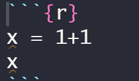
```

que resulta en

```{r, comment = NA}
x = 1+1
x
```

## Chunks de R

Hay diversas opciones de crear un bloque de código de R:

- Ir al menú desplegable de "Chunks" y seleccionar el de R
- Introducir manualmente
- Alt + Command + I (para Mac) o Alt + Control + I (para Windows)

## Chunks de R

A los chunks se les puede poner etiqueta, para así localizarlos de manera más fácil. Por ejemplo


```{r echo=FALSE,out.width="30%",echo=FALSE}
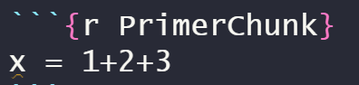
```


```{r echo=FALSE,out.width="30%",echo=FALSE}
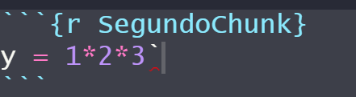
```


## Parámetros de los chunks

La parte entre llaves también puede contener diversos parámetros, separados por comas entre ellos y separados de la etiqueta (o de r, si hemos decidido no poner ninguna).

Estos parámetros determinan el comportamiento del bloque al compilar el documento pulsando el botón `Knit` situado en la barra superior del área de trabajo.

## Parámetros de los chunks

Código |  Significado                                  
--------------------|--------------------
`echo` | Si lo igualamos a `TRUE`, que es el valor por defecto, estaremos diciendo que queremos que se muestre el código fuente del chunk. En cambio, igualado a `FALSE`, no se mostrará
`eval` | Si lo igualamos a `TRUE`, que es el valor por defecto, estaremos diciendo que queremos que se evalúe el código. En cambio, igualado a `FALSE`, no se evaluará

## Parámetros de los chunks

Código |  Significado                                  
--------------------|--------------------                               
`message` | Nos permite indicar si queremos que se muestren los mensajes que R produce al ejecutar código. Igualado a `TRUE` se muestran, igualado a `FALSE` no
`warning` | Nos permite indicar si queremos que se muestren los mensajes de advertencia que producen algunas funciones al ejecutarse. Igualado a `TRUE` se muestran, igualado a `FALSE` no

## Parámetros de los chunks

```{r, echo=FALSE,out.width="30%"}
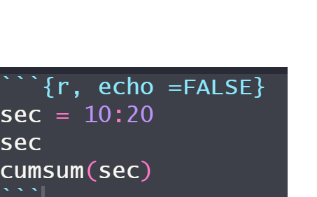
```


No aparece el código solo la salida

```{r, echo =FALSE}
sec = 10:20
sec
cumsum(sec)
```


## Parámetros de los chunks

```{r, echo=FALSE, message = TRUE,out.width="30%",echo=FALSE}
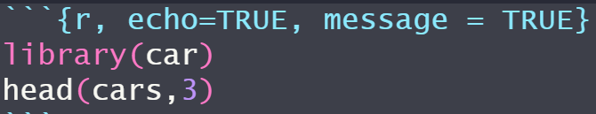
```


```{r, echo = TRUE, message = TRUE}
library(car)
head(cars,3)
```

## Parámetros de los chunks

```{r, echo=FALSE, out.width="30%",echo=FALSE}
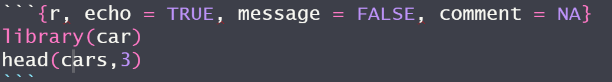
```


```{r, echo = TRUE, message = FALSE, comment = NA}
library(car)
head(cars,3)
```

Fijaos que `comment=NA` evita que aparezcan los `##`

## Parámetros de los chunks 1

Significado |  Código  |  Resultado                                
--------------------|--------------------|--------------------
`results` | `markup` | Valor por defecto. Nos muestra los resultados en el documento final línea a línea, encabezados por `##`
`results` | `hide` | No se nos muestra el resultado en el documento final


## Parámetros de los chunks 2

Significado |  Código  |  Resultado                                
--------------------|--------------------|--------------------
`results` | `asis` | Nos devuelve los resultados línea a línea de manera literal en el documento final y el programa con el que se abre el documento final los interpreta como texto y formatea adecuadamente
`results` | `hold` | Miestra todos los resultados al final del bloque de código
 
## Parámetros de los chunks


```{r,out.width="30%",echo=FALSE}
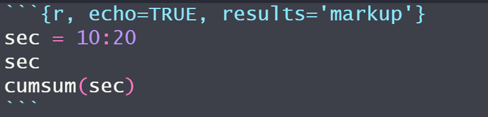
```


```{r, echo=TRUE, results='markup'}
sec = 10:20
sec
cumsum(sec)
```

## Parámetros de los chunks

```{r out.width="30%",echo=FALSE}
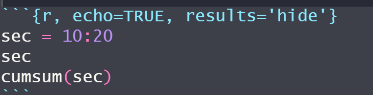
```


```{r, echo=TRUE, results='hide'}
sec = 10:20
sec
cumsum(sec)
```

## Parámetros de los chunks


```{r out.width="30%",echo=FALSE}
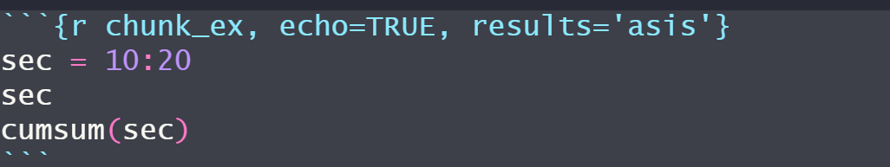
```


```{r chunk_ex, echo=TRUE, results='asis'}
sec = 10:20
sec
cumsum(sec)
```

## Parámetros de los chunks


```{r out.width="30%",echo=FALSE}
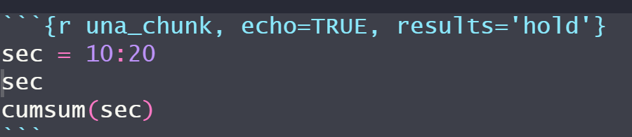
```

```{r una_chunk, echo=TRUE, results='hold'}
sec = 10:20
sec
cumsum(sec)
```


# Lección `r leccion=leccion+1; leccion`:   Estructuras de datos 

## Tipos de datos en R, vectores

Un **vector** es una secuencia ordenada de datos. `R` dispone de muchos tipos de datos, por ejemplo:

- `logical`: lógicos (```TRUE``` o ```FALSE```)
- `integer`: números enteros, $\mathbb Z$
- `numeric`: números reales, $\mathbb R$
- `complex`: números complejos, $\mathbb C$
- `character`: palabras

En los vectores de `R`, todos sus objetos han de ser del mismo tipo: todos números, todos palabras, etc. Cuando queramos usar vectores formados por objetos de diferentes tipos, tendremos que usar **listas generalizadas**, `lists` que veremos al final del tema.

## Básico

- `c()`: para definir un vector
- `scan()`: para definir un vector
- `fix(x)`: para modificar visualmente el vector $x$
- `rep(a,n)`: para definir un vector constante que contiene el dato $a$ repetido $n$ veces

```{r}
c(1,2,3)
rep("Mates",7)
```


## Función scan() {.example}

**Ejemplo**

Vamos a crear un vector que contenga 3 copias de 1 9 9 8 0 7 2 6 con la función scan:

```{r scan3_copias,out.width="60%",echo=FALSE}
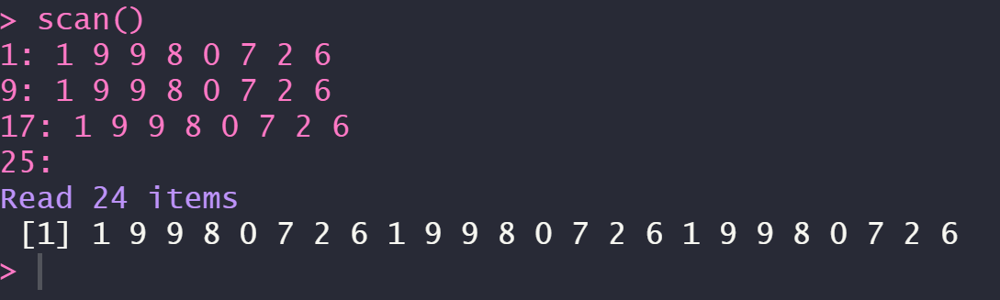
```


## Básico {.exercise}


**Ejercicio**

1. Repite tu año de nacimiento 10 veces


2. Crea el vector que tenga como entradas $16, 0, 1, 20, 1, 7, 88, 5, 1, 9$, llámalo vec y modifica la cuarta entrada con la función fix()


## Progresiones y Secuencias

Una progresión aritmética es una sucesión de números tales que la **diferencia**, $d$, de cualquier par de términos sucesivos de la secuencia es constante.
$$a_n = a_1 + (n-1)\cdot d$$

- `seq(a,b,by=d)`: para generar una [progresión aritmética](https://es.wikipedia.org/wiki/Progresión_aritmética) de diferencia $d$ que empieza en $a$ hasta llegar a $b$
- `seq(a,b, length.out=n)`: define progresión aritmética de longitud $n$ que va de $a$ a $b$ con diferencia $d$. Por tanto $d=(b-a)/(n-1)$
- `seq(a,by=d, length.out=n)`: define la progresión aritmética de longitud $n$ y diferencia $d$ que empieza en $a$
- `a:b`: define la secuencia de números **enteros** ($\mathbb{Z}$) consecutivos entre dos números $a$ y $b$


## Secuencias {.exercise}

**Ejercicio**

- Imprimid los números del 1 al 20

- Imprimid los 20 primeros números pares

- Imprimid 30 números equidistantes entre el 17 y el 98, mostrando solo 4 cifras significativas


## Funciones

Cuando queremos aplicar una función a cada uno de los elementos de un vector de datos, la función `sapply` nos ahorra tener que programar con bucles en `R`:

- `sapply(nombre_de_vector,FUN=nombre_de_función)`: para aplicar dicha función a todos los elementos del vector
- `sqrt(x)`: calcula un nuevo vector con las raíces cuadradas de cada uno de los elementos del vector $x$

## Funciones

Dado un vector de datos $x$ podemos calcular muchas medidas estadísticas acerca del mismo: 

- `length(x)`: calcula la longitud del vector $x$
- `max(x)`: calcula el máximo del vector $x$
- `min(x)`: calcula el mínimo del vector $x$
- `sum(x)`: calcula la suma de las entradas del vector $x$
- `prod(x)`: calcula el producto de las entradas del vector $x$


## Funciones

- `mean(x)`: calcula la media aritmética de las entradas del vector $x$
- `diff(x)`: calcula el vector formado por las diferencias sucesivas entre entradas del vector original $x$
- `cumsum(x)`: calcula el vector formado por las sumas acumuladas de las entradas del vector original $x$
	- Permite definir sucesiones descritas mediante sumatorios
	- Cada entrada de ``cumsum(x)`` es la suma de las entradas de $x$ hasta su posición
	

## Funciones

```{r}
cuadrado = function(x){x^2}
v = c(1,2,3,4,5,6)
sapply(v, FUN = cuadrado)
mean(v)
cumsum(v)
```


## Orden

- `sort(x)`: ordena el vector en orden natural de los objetos que lo forman: el orden numérico creciente, orden alfabético...
- `rev(x)`: invierte el orden de los elementos del vector $x$

```{r}
v = c(1,7,5,2,4,6,3)
sort(v)
rev(v)
```

## Orden{.exercise}

**Ejercicio**

- Combinad las dos funciones anteriores, `sort` y `rev` para crear una función que dado un vector $x$ os lo devuelva ordenado en orden decreciente.

- Razonad si aplicar primero `sort` y luego `rev` a un vector $x$ daría en general el mismo resultado que aplicar primero `rev` y luego `sort`.

- Investigad la documentación de la función `sort` (recordad que podéis usar la sintaxis `?sort` en la consola) para leer si cambiando algún argumento de la misma podéis obtener el mismo resultado que habéis programado en el primer ejercicio.

## Subvectores

- `vector[i]`: da la $i$-ésima entrada del vector

	- Los índices en R empiezan en 1
	- `vector[length(vector)]`: nos da la última entrada del vector
	- `vector[a:b]`: si $a$ y $b$ son dos números naturales, nos da el subvector con las entradas del vector original que van de la posición $a$-ésima hasta la $b$-ésima.
	- `vector[-i]`: si $i$ es un número, este subvector está formado por todas las entradas del vector original menos la entrada $i$-ésima. Si $i$ resulta ser un vector, entonces es un vector de índices y crea un nuevo vector con las entradas del vector original,cuyos índices pertenecen a $i$
	- `vector[-x]`: si $x$ es un vector (de índices), entonces este es el complementario de vector[$x$]
	

## Subvectores

- También podemos utilizar operadores lógicos:
	
	- `==`: =
	- `!=`: $\neq$
	- `>=`: $\ge$  
	- `<=`: $\le$
	- `<`: $<$
	- `>`: $>$
	- `!`: NO lógico
	- `&`: Y lógico
	- `|`: O lógico
	
	
## Subvectores

```{r}
v = c(14,5,6,19,32,0,8)
v[2]
v[-c(3,5)]
v[v != 19 & v>15]
```
	
	
## Condicionales

- `which(x cumple condición)`: para obtener los índices de las entradas del vector $x$ que satisfacen la condición dada
- `which.min(x)`: nos da la primera posición en la que el vector $x$ toma su valor mínimo
- `which(x==min(x))`: da todas las posiciones en las que el vector $x$ toma sus valores mínimos
- `which.max(x)`: nos da la primera posición en la que el vector $x$ toma su valor máximo
- `which(x==max(x))`: da todas las posiciones en las que el vector $x$ toma sus valores máximos


```{r,echo=FALSE}
cuadrado = function(x){x^2}
v = c(1,2,3,4,5,6)
sapply(v, FUN = cuadrado)
mean(v)
cumsum(v)
```


# Lección `r leccion=leccion+1; leccion`:   Factores

## Factor

\blue{Factor}: es como un vector, pero con una estructura interna más rica que permite usarlo para clasificar observaciones

- `levels`: atributo del factor. Cada elemento del factor es igual a un nivel. Los niveles clasifican las entradas del factor. Se ordenan por orden alfabético
- Para definir un factor, primero hemos de definir un vector y trasformarlo por medio de una de las funciones `factor()` o `as.factor()`.

## La función factor()

- `factor(vector,levels=...)`: define un factor a partir del vector y dispone de algunos parámetros que permiten modificar el factor que se crea:
  
    - `levels`: permite especificar los niveles e incluso añadir niveles que no aparecen en el vector
    - `labels`: permite cambiar los nombres de los niveles
    
-  `levels(factor)`: para obtener los niveles del factor


## Factor ordenado

\blue{Factor ordenado.} Es un factor donde los niveles siguen un orden

- `ordered(vector,levels=...)`: función que define un factor ordenado y tiene los mismos parámetros que factor


## Factores y factores ordenados

```{r}
fac = factor(c(1,1,1,2,2,3,2,4,1,3,3,4,2,3,4,4), 
       levels = c(1,2,3,4), 
       labels = c("Sus","Apr","Not","Exc"))
fac
facOrd = ordered(c(1,1,1,2,2,3,2,4,1,3,3,4,2,3,4,4), 
       levels = c(1,2,3,4), 
       labels = c("Sus","Apr","Not","Exc"))
facOrd
```


# Lección `r leccion=leccion+1; leccion`:   Lists

## List

\blue{List.} Lista formada por diferentes objetos, no necesariamente del mismo tipo, cada cual con un nombre interno

- `list(...)`: función que crea una list
    - Para obtener una componente concreta usamos la instrucción `list$componente`
    - También podemos indicar el objeto por su posición usando dobles corchetes: `list[[i]]`. Lo que obtendremos es una list formada por esa única componente, no el objeto que forma la componente


## Obtener información de una list

- `str(list)`: para conocer la estructura interna de una list
- `names(list)`: para saber los nombres de la list


## Obtener información de una list

```{r}
x = c(1,-2,3,4,-5,6,7,-8,-9,0)
miLista = list(nombre = "X", vector = x, media = mean(x), 
               sumas = cumsum(x))
miLista
```


## Obtener información de una list

```{r}
str(miLista)
names(miLista)
```

# Lección `r leccion=leccion+1; leccion`:   Matrices

## Cómo definirlas

- `matrix(vector, nrow=n, byrow=valor_lógico)`: para definir una matriz de $n$ filas formada por las entradas del vector
    - `nrow`: número de filas
    - `byrow`: si se iguala a TRUE, la matriz se construye por filas; si se iguala a FALSE (valor por defecto), se construye por columnas.
    -` ncol`: número de columnas (puede usarse en lugar de nrow)
    - R muestra las matrices indicando como [$i,$] la fila $i$-ésima y [$,j$] la columna $j$-ésima
	- Todas las entradas de una matriz han de ser del mismo tipo de datos
	

## Cómo definirlas{.exercise}

**Ejercicio**

- ¿Cómo definirías una matriz constante? Es decir, ¿cómo definirías una matriz $A$ tal que $\forall\  i=1,...,n; j = 1,...,m$, $a_{i,j}=k$ siendo $k\in\mathbb{R}$? Como R no admite incógnitas, prueba para el caso específico $n = 3, m = 5, k = 0$
```
matrix(0, nrow = 3, ncol = 5)
```
- Con el vector vec = (1,2,3,4,5,6,7,8,9,10,11,12) crea la matriz 
$$\begin{pmatrix}
1 & 4 & 7 & 10\\
2 & 5 & 8 & 11\\
3 & 6 & 9 & 12
\end{pmatrix}$$

```
matrix(vec, ncol = 4)
```


## Cómo construirlas

- `rbind(vector1, vector2, ...)`: construye la matriz de filas vector1,  vector2,...
- `cbind(vector1, vector2, ...)`: construye la matriz de columnas vector1,  vector2,...
    - Los vectores han de tener la misma longitud
    - También sirve para añadir columnas (filas) a una matriz o concatenar por columnas (filas) matrices con el mismo número de filas (columnas)
- `diag(vector)`: para construir una matriz diagonal con un vector dado
    - Si aplicamos diag a un número $n$, produce una matriz identidad de orden $n$


## Submatrices

- `matriz[i,j]`: indica la entrada ($i,j$) de la matriz, siendo $i,j\in\mathbb{N}$. Si $i$ y $j$ son vectores de índices, estaremos definiendo la submatriz con las filas pertenecientes al vector $i$ y columnas pertenecientes al vector $j$
- `matriz[i,]`: indica la fila $i$-ésima de la matriz, siendo $i\in\mathbb{N}$
- `matriz[,j]`: indica la columna $j$-ésima de la siendo $j\in\mathbb{N}$
    - Si $i$ ($j$) es un vector de índices, estaremos definiendo la submatriz con las filas (columnas) pertenecientes al vector $i$ ($j$)
    
    
## Funciones

- `diag(matriz)`: para obtener la diagonal de la matriz
- `nrow(matriz)`: nos devuelve el número de filas de la matriz
- `ncol(matriz)`: nos devuelve el número de columnas de la matriz
- `dim(matriz)`: nos devuelve las dimensiones de la matriz
- `sum(matriz)`: obtenemos la suma de todas las entradas de la matriz
- `prod(matriz)`: obtenemos el producto de todas las entradas de la matriz
- `mean(matriz)`: obtenemos la media aritmética de todas las entradas de la matriz


## Funciones 

- `colSums(matriz)`: obtenemos las sumas por columnas de la matriz
- `rowSums(matriz)`: obtenemos las sumas por filas de la matriz
- `colMeans(matriz)`: obtenemos las medias aritméticas por columnas de la matriz
- `rowMeans(matriz)`: obtenemos las medias aritméticas por filas de la matriz


## Funciones


**Ejemplo**

Dada la matriz $$A = \begin{pmatrix}
1 & 4 & 7\\
2 & 5 & 8\\
3 & 6 & 9
\end{pmatrix}$$


```{r}
A = matrix(c(1,2,3,4,5,6,7,8,9), ncol = 3)
dim(A)
diag(A)
```


## Función apply()

- `apply(matriz, MARGIN=..., FUN=función)`: para aplicar otras funciones a las filas o las columnas de una matriz
    - `MARGIN`: ha de ser 1 si queremos aplicar la función por filas; 2 si queremos aplicarla por columnas; o c(1,2) si la queremos aplicar a cada entrada
 
 
## Función apply()

```{r}
apply(A, MARGIN = c(1,2), FUN = cuadrado)
apply(A, MARGIN = 1, FUN = sum)
apply(A, MARGIN = 2, FUN = sum)
```


## Operaciones

- `t(matriz)`: para obtener la transpuesta de la matriz
- `+`: para sumar matrices
- `*`: para el producto de un escalar por una matriz
- `%*%`: para multiplicar matrices
- `mtx.exp(matriz,n)`: para elevar la matriz a $n$
    - Del paquete `Biodem`
		- No calcula las potencias exactas, las aproxima
- `%^%`: para elevar matrices
    - Del paquete `expm`
		- No calcula las potencias exactas, las aproxima


## Operaciones {.exercise}

**Ejercicio**

Observad qué ocurre si, siendo $A = \begin{pmatrix}
2 & 0 & 2\\
1 & 2 & 3\\
0 & 1 & 3
\end{pmatrix}$ y $B = \begin{pmatrix}
3 & 2 & 1\\
1 & 0 & 0\\
1 & 1 & 1
\end{pmatrix}$, realizamos las operaciones $A*B$, $A^2$ y $B^3$


## Operaciones			
			
- `det(matriz)`: para calcular el determinante de la matriz
- `qr(matriz)$rank`: para calcular el rango de la matriz
- `solve(matriz)`: para calcular la inversa de una matriz invertible
    - También sirve para resolver sistemas de ecuaciones lineales. Para ello introducimos `solve(matriz,b)`, donde $b$ es el vector de términos independientes
    
    
## Valores y vectores propios

[Vector propio y valor propio](https://es.wikipedia.org/wiki/Vector_propio_y_valor_propio)

- `eigen(matriz)`: para calcular los valores (vaps) y vectores propios (veps)
    - `eigen(matriz)$values`: nos da el vector con los vaps de la matriz en orden decreciente de su valor absoluto y repetidos tantas veces como su multiplicidad algebraica.
    - `eigen(matriz)$vectors`: nos da una matriz cuyas columnas son los veps de la matriz.
    
## Valores y vectores propios

```{r}
M = rbind(c(2,6,-8), c(0,6,-3), c(0,2,1))
eigen(M)
```


## Valores y vectores propios {.exercise}

**Ejercicio**

Comprobad, con los datos del ejemplo anterior, que si $P$ es la matriz de vectores propios de $M$ en columna y $D$ la matriz diagonal cuyas entradas son los valores propios de $M$, entoces se cumple la siguiente igualdad llamada **descomposición canónica**: $$M = P\cdot D\cdot P^{-1}$$


## Valores y vectores propios

Si hay algún vap con multiplicidad algebraica mayor que 1 (es decir, que aparece más de una vez), la función `eigen()` da tantos valores de este vap como su multiplicidad algebraica indica. Además, en este caso, R intenta que los veps asociados a cada uno de estos vaps sean [linealmente independientes](https://es.wikipedia.org/wiki/Dependencia_e_independencia_lineal). Por tanto, cuando como resultado obtenemos veps repetidos asociados a un vap de multiplicidad algebraica mayor que 1, es porque para este vap no existen tantos veps linealmente independientes como su multiplicidad algebraica y, por consiguiente, la matriz no es [diagonalizable](https://es.wikipedia.org/wiki/Matriz_diagonalizable).


## Valores y vectores propios

```{r}
M = matrix(c(0,1,0,-7,3,-1,16,-3,4), nrow=3, byrow=TRUE)
eigen(M)
```
    


# Lección `r leccion=leccion+1; leccion`:   Gráficos R base

## Gráfico básico de puntos
- `plot(x,y)`: para dibujar un gráfico básico de puntos siendo $x,y$ vectores numéricos
    - `plot(x)` = `plot(1:length(x),x)`
    
- `plot(x,función)`: para dibujar el gráfico de una función 


## Gráfico básico de puntos

```{r, fig.height = 4, fig.width = 7, fig.align = "center",out.width="50%"}
alumnos = c(1:10)
notas = c(2,5,7,9,8,3,5,6,10,7)
plot(alumnos,notas)
```


## Parámetros de la función plot()

- `log`: para indicar que queremos el gráfico en escala logarítmica
- `main("título")`: para poner título al gráfico. Si en vez de un texto queráis poner una expresión matemática, tenéis que utilizar la función `expression()` 
- `xlab("etiqueta")`: para poner etiqueta al eje $X$
- `ylab("etiqueta")`: para poner etiqueta al eje $Y$
- `pch=n`: para elegir el símbolo de los puntos. $n=0,1,...,25$. El valor por defecto es `pch = 1`
- `cex`: para elegir el tamaño de los símbolos
- `col="color en inglés"`: para elegir el color de los símbolos. [Gama de colores](http://www.stat.columbia.edu/~tzheng/files/Rcolor.pdf).


## Parámetro pch - Tipos de símbolos


```{r cph , echo=FALSE,fig.align = "center", out.width="45%"}
knitr::include_graphics("Imgs/pch.png")
```


## Escala logarítmica

```{r, fig.height = 3.75, fig.width = 9, fig.align = "center",out.width="60%"}
par(mfrow = c(1,2))
plot = plot(exp(1:20), xlab = "Indice",
            ylab = expression(e^{1:20}), 
            main = "Escala lineal")
plotLog = plot(exp(1:20), log = "y", xlab = "Indice", 
               ylab = expression(e^{1:20}), 
               main = "Escala logaritmica en el eje y")
par(mfrow = c(1,1))
```


## Parámetros de la función plot()

- `type`: para elegir el tipo de gráfico que queremos:
    - `p`: puntos (valor por defecto)
    - `l`: líneas rectas que unen los puntos (dichos puntos no tienen símbolo)
    - `b`: líneas rectas que unen los puntos (dichos puntos tienen símbolo). Las líneas no traspasan los puntos
    - `o`: como el anterior pero en este caso las líneas sí que traspasan los puntos
    - `h`: histograma de líneas
    - `s`: histograma de escalones
    - `n`: para no dibujar los puntos


## Tipos de gráfico

```{r, eval=FALSE}
par(mfrow = c(3,2))
x = c(50:59)
y = c(2,9,25,3,100,77,62,54,19,40)
plot(x,y, pch = 23, cex = 2, col = "blue", type = "p")
plot(x,y, pch = 23, cex = 2, col = "blueviolet", type = "l")
plot(x,y, pch = 23, cex = 2, col = "gold", type = "b")
plot(x,y, pch = 23, cex = 2, col = "deeppink", type = "o")
plot(x,y, pch = 23, cex = 2, col = "springgreen",
     type = "h")
plot(x,y, pch = 23, cex = 2, col = "firebrick1",
     type = "s")
par(mfrow = c(1,1))
```

## Tipos de gráfico

```{r tipo2,fig.align='center',out.width="45%",echo=FALSE}
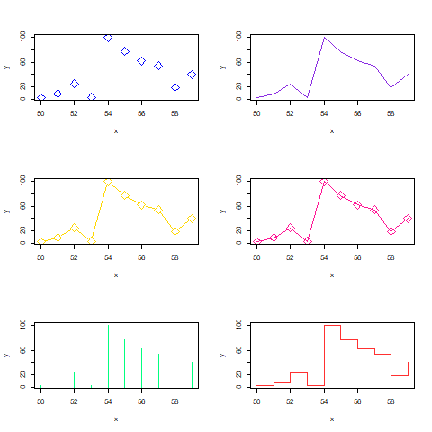
```

## Parámetros de la función plot()

- `lty`: para especificar el tipo de línea
    - "solid" : $1$: línea continua (valor por defecto)
    - "dashed" : $2$: línea discontinua
    - "dotted" : $3$: línea de puntos
    - "dotdashed" : $4$: línea que alterna puntos y rayas
    
- `lwd`: para especificar el grosor de las líneas
- `xlim`: para modificar el rango del eje $X$
- `ylim`: para modificar el rango del eje $Y$
- `xaxp`: para modificar posiciones de las marcas en el eje $X$
- `yaxp`: para modificar posiciones de las marcas en el eje $Y$


## Parámetros de la función plot()

```{r , fig.height = 4, fig.width = 9, fig.align = "center",out.width="60%" }
x = (2*(1:20))
y = (-1)^(1:20)*5*(1:20)
plot(x,y, main = "Ejemplo de grafico", pch = 8, cex = 1,
     type = "b", lty = 4, lwd = 4, 
     xaxp = c(0,40,2), yaxp = c(-100,100,8))
```


## Añadir elementos al gráfico

- `points(x,y)`: añade un punto de coordenadas $(x, y)$ a un gráfico ya existente
- `abline`: para añadir una recta a un gráfico ya existente
    - `abline(a,b)`: añade la recta $y=ax+b$
    - `abline(v = x0)`: añade la recta vertical $x=x_0$. $v$ puede estar asignado a un vector
    - `abline(h = y0)`:  añade la recta horizontal $y=y_0$. $h$ puede estar asignado a un vector
    

## Añadir punto y recta

```{r, eval=FALSE}
x = (2*(1:20))
y = (-1)^(1:20)*5*(1:20)
plot(x,y, main = "Poniendo un punto y una recta", pch = 8,
     cex = 1, type = "b", lty = 4, 
     lwd = 4, xaxp = c(0,40,2), yaxp = c(-100,100,8))
points(20,0, col = "red", cex = 4, pch = 16)
abline (h = 0, lty = 2, col = "dodgerblue")
```

## Añadir punto y recta

```{r, echo = FALSE, fig.width = 9, fig.align = "center",out.width="50%"}
x = (2*(1:20))
y = (-1)^(1:20)*5*(1:20)
plot(x,y, main = "Poniendo un punto y una recta", pch = 8, 
     cex = 1, type = "b", lty = 4, lwd = 4, 
     xaxp = c(0,40,2), yaxp = c(-100,100,8))
points(20,0, col = "red", cex = 4, pch = 16)
abline (h = 0, lty = 2, col = "dodgerblue")
```
## Añadir elementos al gráfico

- `text(x,y,labels = "....")`: añade en el punto de coordenadas $(x,y)$ el texto especificado como argumento de labels
    - `pos`: permite indicar la posición del texto alrededor de las coordenadas $(x,y)$. Admite los siguientes valores:
        - 1: abajo
        - 2: izquierda
        - 3: arriba
        - 4: derecha
        - 5: sin especificar: el texto se sitúa centrado en el punto $(x,y)$
    
    
## Añadir etiquetas

```{r, fig.width = 9, fig.height = 3.75,fig.align = "center",out.width="65%"}
alumnos = c(1:10)
notas = c(2,5,7,9,8,3,5,6,10,7)
plot(alumnos,notas, main = "Grafico con texto")
text(alumnos,notas, 
     labels = c("S","A","N","E","N","S","A","A","E","N"), 
     pos = c(rep(3,times = 8),1,3))
```


## Añadir elementos al gráfico

- `lines(x, y)`:añade a un gráfico existente una línea poligonal que une los puntos $(x_i, y_i)$ sucesivos. $x,y$ son vectores numéricos
- `curve(curva)`: permite añadir la gráfica de una curva a un gráfico existente
    - `add=TRUE`: si no, la curva no se añade
    - La curva se puede especificar mediante una expresión algebraica con variable $x$, o mediante su nombre si la hemos definido antes
    
    

## Añadir líneas y curvas

```{r, results='hide', fig.align="center", fig.height=4,out.width="80%"}
x = c(5*(1:20))
plot(x,c(exp(-x)+(-1)^x*x/2*sin(x)^2))
lines(c(20,10,40,80,60,60,20),c(20,0,-20,-20,40,0,20), 
      lwd = 2, col = "darkslategray1")
curve(20*sin(x), add = TRUE, col = "green")
```

## Añadir elementos al gráfico

- `legend(posición, legend = ...)`: para añadir una leyenda
    - La posición indica donde queremos situar la leyenda. Puede ser o bien las coordenadas de la esquina superior izquierda de nuestra leyenda, o bien una de las palabras siguientes:
        - "bottom" / "bottomright" / "bottomleft"
        - "top" / "topright" / "topleft"
        - "center" / "right" / "left"
        
    - `legend`: contiene el vector de nombres entre comillas con los que queremos identificar a las curvas en la leyenda
    
    
## Añadir leyenda

```{r, eval = FALSE}
x = seq(0,2*pi,0.1)
plot(x,sin(x),type="l",col="blue",lwd=3, xlab="", ylab="")
lines(x,cos(x),col="green",lwd=3)
lines(x, tan(x), col="purple",lwd=3)
legend("bottomleft",col=c("blue","green","purple"), 
       legend=c("Seno","Coseno", "Tangente"), 
       lwd=3, bty="l")
```


## Añadir leyenda

```{r, echo = FALSE, fig.align="center",out.width="60%"}
x = seq(0,2*pi,0.1)
plot(x,sin(x),type="l",col="blue",lwd=3,
     xlab="", ylab="")
lines(x,cos(x),col="green",lwd=3)
lines(x, tan(x), col="purple",lwd=3)
legend("bottomleft",
       col=c("blue","green","purple"),
       legend=c("Seno","Coseno", "Tangente"),
       lwd=3, bty="l")
```

## Añadir elementos al gráfico

- `segments`: para añadir segmentos a un gráfico existente
- `arrows`: para añadir flechas a un gráfico existente
- `symbols`: para añadir símbolos a un gráfico existente
- `polygon`: para añadir polígonos cerrados especificando sus vértices a un gráfico existente


## Añadir elementos

```{r, eval = FALSE}
x = c(5*(1:10))
plot(x,c(exp(-x)+(-1)^x*x/2*sin(x)^2), xlab = "", ylab = "", 
     main = "Grafico con varios elementos")
segments(10,0,40,0, col = "red", lwd = 4)
arrows(10,0,40,-10, col = " blue", length = 0.5,
       angle = 5, code = 3)
symbols(40,0,stars = cbind(1,.5,1,.5,1,.5,1,.5,1,.5), 
        add = TRUE, lwd = 3, inches = 0.5)
symbols(40,0,stars = cbind(1,.5,1,.5,1,.5,1,.5,1,.5),
        add = TRUE, lwd = 3)
polygon(c(20,30,40),c(10,-10,10), col = "gold",
        density = 3, angle = 90, lty = 4, 
        lwd = 5)
```

## Añadir elementos

```{r, echo = FALSE, fig.align="center",out.width="60%"}
x = c(5*(1:10))
plot(x,c(exp(-x)+(-1)^x*x/2*sin(x)^2), xlab = "", ylab = "", 
     main = "Grafico con varios elementos")
segments(10,0,40,0, col = "red", lwd = 4)
arrows(10,0,40,-10, col = " blue", length = 0.5, angle = 5, code = 3)
symbols(40,0,stars = cbind(1,.5,1,.5,1,.5,1,.5,1,.5),
        add = TRUE, lwd = 3, inches = 0.5)
symbols(40,0,stars = cbind(1,.5,1,.5,1,.5,1,.5,1,.5),
        add = TRUE, lwd = 3)
polygon(c(20,30,40),c(10,-10,10), col = "gold", density = 3, 
        angle = 90, lty = 4, lwd = 5)
```


# Lección `r leccion=leccion+1; leccion`:   Hojas de datos: data frames

## Data frames

\blue{Data frame.} Un data frame es una tabla de doble entrada, formada por variables en las columnas y observaciones de estas variables en las filas, de manera que cada fila contiene los valores de las variables para un mismo caso o un mismo individuo.

- `data()`: para abrir una ventana con la lista de los objetos de datos a los que tenemos acceso en la sesión actual de R (los que lleva la instalación básica de R y los que aportan los paquetes que tengamos cargados.

    - Si entramos `data(package=.packages(all.available = TRUE))` obtendremos la lista de todos los objetos de datos a los que tenemos acceso, incluyendo los de los paquetes que tengamos instalados, pero que no estén cargados en la sesión actual.
    

## Acceder a la información, estructura  y atributos  de un data frame

- `head(d.f,n)`: para mostrar las $n$ primeras filas del data frame. Por defecto se muestran las 6 primeras filas
- `tail(d.f,n)`: para mostrar las $n$ últimas filas del data frame. Por defecto semuestran las 6 últimas
- `str(d.f)`: para conocer la estructura global de un data frame
- `names(d.f)`:  para producir un vector con los nombres de las columnas
  
    
## Acceder a la información, estructura  y atributos  de un data frame 

```{r}
str(Orange)
```


## Acceder a la información, estructura  y atributos  de un data frame 

```{r}
head(Orange,4)
tail(Orange,4)
```


## Acceder a la información, estructura  y atributos  de un data frame

- `rownames(d.f)`: para producir un vector con los identificadores de las filas
    - R entiende siempre que estos identificadores son palabras, aunque sean números, de ahí que los imprima entre comillas
- `colnames(d.f)`: para producir un vector con los identificadores de las columnas
- `dimnames(d.f)`: para producir una list formada por dos vectores (el de los identificadores de las filas y el de los nombres de las columnas)
- `nrow(d.f)`: para consultar el número de filas de un data frame
- `ncol(d.f)`: para consultar el número de columnas de un data frame
- `dim(d.f)`: para producir un vector con el número de filas y el de columnas


## Acceder a la información, estructura  y atributos  de un data frame

- `d.f$nombre_variable`: para obtener una columna concreta de un dataframe
    - El resultado será un vector o un factor, según cómo esté definida la columna dentro del data frame
    - Las variables de un data frame son internas, no están definidas en el entorno global de trabajo de R
    

## Sub-data frames

- `d.f[n,m]`: para extraer “trozos” del data frame por filas y columnas (funciona exactamente igual que en matrices) donde $n$ y $m$ pueden definirse como:
    - intervalos
    - condiciones
    - números naturales
    - no poner nada
    - Si sólo queremos definir la subtabla quedándonos con algunas variables, basta aplicar el nombre del data frame al vector de variables 
    - Estas construcciones se pueden usar también para reordenar las filas o columnas
    
    
## Sub-data frames

```{r}
dataOrange = Orange
dataOrange[c(10:12),]
dataOrange[c(2,17),c(1,3)]
```
    
    
## Sub-data frames

```{r}
dataOrange[2,3]
dataOrange[dataOrange$circumference<=50,]
```

## Leyendo tablas de datos

- `read.table()`: para definir un data frame a partir de una tabla de datos contenida en un fichero
    - Este fichero puede estar guardado en nuestro ordenador o bien podemos conocer su url. Sea cual sea el caso, se aplica la función al nombre del fichero o a la dirección entre comillas
    
Aquí tenéis una [lista de data frames](http://aprender.uib.es/) para practicar
    
## Parámetros de la función  read.table()

- `header = TRUE`: para indicar si la tabla que importamos tiene una primera fila con los nombres de las columnas. El valor por defecto es FALSE
- `col.names = c(...)`: para especificar el nombre de las columnas. No olvidéis que cada nombre debe ir entre comillas
- `sep`: para especificar las separaciones entre columnas en el fichero (si no es un espacio en blanco). Si es así, hay que introducir el parámetro pertinente entre comillas
- `dec`: para especificar el signo que separa la parte entera de la decimal (si no es un punto. Si es así, hay que introducir el parámetro pertinente entre comillas

## Parámetros de read.table()

```{r}
notas = read.table(
  "http://aprender.uib.es/Rdir/Controls11-12.txt", 
  col.names = c("Nota_Parcial","Nota_Final","Grup"),
  sep=",",header=TRUE)
head(notas,8)
```


## Más parámetros de read.table()

- `stringsAsFactors`: para prohibir la transformación de las columnas de palabras en factores debemos usar `stringsAsFactors=FALSE` (ya que por defecto, R realiza dicha transformación) 

- Para importar un fichero de una página web segura (cuyo url empiece con https),
no podemos entrar directamente la dirección en `read.table()`; una solución es instalar y cargar el paquete RCurl y entonces usar la instrucción `read.table (textConnection(getURL(“url ”)),...)`.


## Otros formatos de  fichero de datos

- `read.csv()`: para importar ficheros en formato CSV
- `read.xls()` o `read.xlsx()`: para importar hojas de cálculo tipo Excel u OpenOffice en formato XLS o XLSX, respectivamente. Se necesita el paquete xlsx
- `read.mtb()`: para importar tablas de datos Minitab. Se necesita el paquete foreign
- `read.spss()`: para importar tablas de datos SPSS. Se necesita el paquete foreign

## Exportación de  datos a ficheros

- `write.table(df, file = "")`: para exportar un data frame a un fichero
    - `file = ""`: es donde indicaremos el nombre que queremos darle al fichero
    - Podemos usar el parámetro `sep` para indicar el símbolo de separación de columnas. Siempre entre comillas
    - También podemos utilizar el parámetro `dec` para indicar la separación entre la parte entera y decimal de los datos
    
## Exportando datos a ficheros

```{r}
write.table(notas, file = "../data/NotasData.csv",
            dec = ".")
notas2 = read.table("../data/NotasData.csv", header = TRUE)
str(notas2)
```

## Crear data frames

- `data.frame(vector_1,...,vector_n)`: para construir un data frame a partir de vectores introducidos en el orden en el que queremos disponer las columnas de la tabla
    - R considera del mismo tipo de datos todas las entradas de una columna de un data frame
    - Las variables tomarán los nombres de los vectores. Estos nombres se pueden especificar en el argumento de `data.frame` entrando una construcción de la forma `nombre_variable = vector`
    - `rownames`: para especificar los identificadores de las filas
    - También en esta función podemos hacer uso del parámetro `stringsAsFactors` para evitar la transformación de las columnas de tipo palabra en factores


## Crear data frames

```{r}
Programacion = c(1,2,0,5,4,6,7,5,5,8)
Calculo = c(3,3,2,7,9,5,6,8,5,6)
Empresa = c(4,5,4,8,8,9,6,7,9,10)
grados = data.frame(Pr = Programacion, 
                    Ca = Calculo, Em = Empresa)
str(grados)
```

## Crear data frames

- `fix(d.f)`: para crear / editar un data frame con el editor de datos
- `names(d.f)`: para cambiar los nombres de las variables
- `rownames(d.f)`: para modificar los identificadores de las filas. Han de ser todos diferentes
- `dimnames(d.f)=list(vec_nom_fil, vec_nom_col)`: para modificar el nombre de las filas y de las columnas simultáneamente

## Crear data frames

- `d.f[núm_fila,] = c(...)`: para añadir una fila a un data frame
    - Las filas que añadimos de esta manera son vectores, y por tanto sus entradas han de ser todas del mismo tipo
    - Si no añadimos las filas inmediatamente siguientes a la última fila del data frame, los valores entre su última fila y las que añadimos quedarán no definidos y aparecerán como NA
    - Para evitar el problema anterior, vale más usar la función `rbind()` para concatenar el data frame con la nueva fila
    
## Crear data frames

```{r}
Ingles = c(5,4,6,2,1,0,7,8,9,6)
grados2 = cbind(grados, Ingles)
head(grados2)
```

## Crear data frames

- `d.f$new_var`: para añadir una nueva variable al data frame
    - Podemos concatenar columnas con un data frame existente mediante la función `cbind()`. De este modo se puede añadir la columna directamente sin necesidad de convertirla antes a data frame
    - Esta nueva variable ha de tener la misma longitud que el resto de columnas del data frame original. Si no, se añadirán valores NA a las variables del data frame original o a la nueva variable hasta completar la misma longitud
    
## Cambiando los tipos de datos

- `as.character`: para transformar todos los datos de un objeto en palabras
- `as.integer`: para transformar todos los datos de un objeto a números enteros
- `as.numeric`: para transformar todos los datos de un objeto a números reales

## Más sobre sub-data frames

- `droplevels(d.f)`: para borrar los niveles sobrantes de todos los factores, ya que las columnas que son factores heredan en los sub-data frames todos los niveles del factor original, aunque no aparezcan en el trozo que hemos extraído

- `select(d.f, parámetros)`: para especificar que queremos extraer de un data frame
    - `starts_with("x")`: extrae del data frame las variables cuyo nombre empieza con la palabra "x"
    - `ends_with("x")`: extrae del data frame las variables cuyo nombre termina con la palabra "x"
    - `contains("x")`: extrae del data frame las variables cuyo nombre contiene la palabra "x"
    - Se necesita el paquete `dplyr` o mejor aún `tidyverse`

## Más sobre sub-data frames

- `subset(d.f,condición,select = columnas)`: para extraer del data frame las filas que cumplen la condición y las columnas especificadas
    - Si queremos todas las filas, no hay que especificar ninguna condición
    - Si queremos todas las columnas, no hace especificar el parámetro `select`
    - Las variables en la condición se especifican con su nombre, sin añadir antes el nombre del data frame
    
## Aplicando funciones a data frames

- `sapply(d.f, función)`: para aplicar una función a todas las columnas de un data frame en un solo paso
    - `na.rm=TRUE`: para evitar que el valor que devuelva la función para las columnas que contengan algún NA sea NA

- `aggregate(variables~factors,data=d.f,FUN=función)`: para aplicar una función a variables de un data frame clasificadas por los niveles de un, o más de un, factor
    - Si queremos aplicar la función a más de una variable, tenemos que agruparlas con un `cbind`
    - Si queremos separar las variables mediante más de un factor, tenemos que agruparlos con signos $+$
    
## Variables globales

No son funciones de \red{R etiqueta}

- `attach(d.f)`: para hacer que R entienda sus variables como globales y que las podamos usar por su nombre, sin necesidad de añadir delante el nombre del data frame y el símbolo $
    - Si ya hubiera existido una variable definida con el mismo nombre que una variable del data frame al que aplicamos `attach`, hubiéramos obtenido un mensaje de error al ejecutar esta función y no se hubiera reescrito la variable global original
- `detach(d.f)`: para devolver la situación original, eliminando del entorno global las variables del data frame


# Lección `r leccion=leccion+1; leccion`:   Análisis  de datos

## Principales indicadores descriptivos de series de datos

Cuando tenemos una serie de datos que describen algunos aspectos de un conjunto de individuos queremos llevar a cabo un análisis estadístico. Estos análisis estadísticos se clasifican en:

- \blue{Análisis exploratorio}, o \blue{descriptivo}, o \blue{Key Perfomance indicators} si nuestro objetivo es resumir, representar y explicar los datos concretos de los que disponemos. La \blue{estadística descriptiva/ análisis de datos} es el conjunto de técnicas que se usan con este fin.

- \blue{Análisis inferencial}, si nuestro objetivo es deducir (\red{inferir}), a partir de estos datos, información significativa sobre el total de la población o las poblaciones de interés. Las técnicas que se usan en este caso forman la \blue{>estadística inferencial.}


## Análisis estadístico de los datos

Existe relación entre ambos. Cualquier análisis inferencial se suele empezar explorando los datos que se usarán así cómo también muchas técnicas descriptivas permiten estimar propiedades de la población de la que se ha extraído la muestra. 


**Ejemplo**

La media aritmética de las alturas de una muestra de individuos nos da un valor representativo de esta muestra, pero también estima la media de las alturas del total de la población


## Análisis estadístico de los datos

Nos centraremos en entender algunas técnicas básicas de la estadística descriptiva orientadas al análisis de datos.

Estas consistirán en una serie de medidas, gráficos y modelos descriptivos que nos permitirán resumir y explorar un conjunto de datos.

**Objetivo final**: entender los datos lo mejor posible.

## Tipos de datos

Trabajamos con \blue{datos multidimensionales:} observamos varias características de una serie de individuos. 

Se registran en un archivo de ordenador con un formato preestablecido. Por ejemplo texto simple (codificado en diferentes formatos: ASCII, isolatin$\dots$), hojas de cálculo (archivos de Open Office o Excel), bases de datos, etc. 

## Tipos de datos

Una de las maneras básicas de almacenar datos es en forma de tablas de datos. En R hacemos uso de data frames.

En una tabla de datos cada columna expresa una variable, mientras que cada fila corresponde a las observaciones de estas variables para un individuo concreto. 

- Los datos de una misma columna tienen que ser del mismo tipo, porque corresponden a observaciones de una misma propiedad. 
- Las filas en principio son de naturaleza heterogénea, porque pueden contener datos de diferentes tipos. 


## Tipos de datos

Los tipos de datos que consideramos son los siguientes:

- \blue{Datos de tipo atributo}, o \blue{cualitativos}: Expresan una cualidad del individuo. En R guardaremos las listas de datos cualitativos en vectores (habitualmente, de palabras), o en factores si vamos a usarlos para clasificar individuos.

- \blue{Datos ordinales}: Similares a los cualitativos, con la única diferencia de que se pueden ordenar de manera natural. Por ejemplo, las calificaciones en un control (suspenso, aprobado, notable, sobresaliente). En R guardaremos las listas de datos ordinales en factores ordenados.

- \blue{Datos cuantitativos}: Se refieren a medidas, tales como edades, longitudes, etc. En R guardaremos las listas de datos cuantitativos en vectores numéricos.

## Tipos de datos


```{r}
head(iris ,5)
str(iris)
```

# Lección `r leccion=leccion+1; leccion`:    Descripción de datos cualitativos

## ¿Qué son los datos cualitativos?

Los \blue{datos cualitativos} corresponden a observaciones sobre cualidades de un objeto o individuo. 

Suelen codificarse por medio de palabras, pero también se pueden usar números que jueguen el papel de etiquetas.


**Ejemplo**

Es habitual representar No (o Falso, Fracaso, Ausente...) con un 0, y Sí (o Verdadero, Éxito, Presente...) con un 1


## ¿Qué son los datos cualitativos?

Los datos cualitativos son aquellos que pueden ser iguales o diferentes, pero que no admiten ningún otro tipo de comparación significativa.

Es decir, que no tenga ningún sentido preguntarse si uno es más grande que otro, ni efectuar operaciones aritméticas con ellos, aunque estén representados por números. 

## ¿Qué son los datos cualitativos?

Por lo tanto, un mismo conjunto de datos puede ser cualitativo o de otro tipo, según el análisis que vayamos a hacer de él. 


**Ejemplo**

Si hemos anotado durante unos años los días de la semana en los que ha llovido y queremos contar cuántas veces ha ocurrido en lunes, cuántas en martes, etc., esta lista de nombres (o números) serán datos cualitativos. Si, en cambio, queremos estudiar cómo se comportan los días de lluvia según avanza la semana, y por lo tanto el orden de los días es relevante, serán datos ordinales

## ¿Qué son los datos cualitativos?

\blue{Variable cualitativa}: lista de observaciones de un tipo de datos cualitativos sobre un conjunto concreto de objetos. 

\blue{Niveles}: diferentes valores que pueden tomar estos datos. Por ejemplo, los dos niveles de una variable Sexo serían `M` (Macho) y `H` (Hembra), o sinónimos.

Con R, usaremos vectores y factores para representar variables cualitativas. Los factores nos servirán para agrupar las observaciones según los niveles de la variable. De esta manera podremos segmentar la población que representa la variable en grupos o subpoblaciones, asignando un grupo a cada nivel, y podremos comparar el comportamiento de otras variables sobre estos grupos.

## Estudio de Frecuencias

Dada una variable cualitativa, para cada uno de sus niveles podemos contar cuántos datos hay en ese nivel (\blue{frecuencia absoluta}) y qué fracción del total representan (\blue{frecuencia relativa}).

## Estudio de Frecuencias{.example}

**Ejemplo**

Supongamos que tenemos un tipo de datos cualitativos con niveles 
$$l_1,l_2,\cdots,l_k$$ 
Efectuamos $n$ observaciones de este tipo de datos, y denotamos por 
$$x_1,x_2,\cdots,x_n$$
los resultados que obtenemos con 
$$x_j\in\{l_1, l_2,\cdots, l_k\}$$
Estas observaciones forman una variable cualitativa

## Estudio de Frecuencias

Con estas notaciones:

La \blue{frecuencia absoluta}, $n_j$, del nivel $l_j$ en esta variable cualitativa es el número de observaciones en las que $x_i$ toma el valor $l_j$.

La \blue{frecuencia relativa} del nivel $l_j$ en esta variable cualitativa es la fracción 
$$f_j = \frac{n_j}{n}$$

Es decir, la frecuencia relativa del nivel $l_j$ es la fracción (en tanto por uno) de observaciones que corresponden a este nivel. 

La \blue{moda} de esta variable cualitativa es su nivel, o niveles, de mayor frecuencia (absoluta o relativa).

## Estudio de Frecuencias{.example}

**Ejemplo**

Supongamos que se ha realizado un seguimiento a 20 personas asistentes a un congreso. Uno de los datos que se han recogido sobre estas personas ha sido su sexo. El resultado ha sido una variable cualitativa formada por las 20 observaciones siguientes:

`Mujer, Mujer, Hombre, Mujer, Mujer, Mujer, Mujer, Mujer, Hombre, Mujer, Hombre, Hombre, Mujer, Mujer, Hombre, Mujer, Mujer, Mujer, Mujer, Hombre`

Sus dos niveles son `Hombre` y `Mujer`. En esta variable hay 14 mujeres y 6 hombres. Éstas son las frecuencias absolutas de estos niveles. 

## Estudio de Frecuencias{.example}
Puesto que en total hay 20 individuos, sus frecuencias relativas son
$$\text{Hombre} = \frac{6}{20} = 0.3,\qquad \text{Mujer} = \frac{14}{20} = 0.7$$
En este caso $l_1 = \text{Hombre}$ y $l_2 = \text{Mujer}$,  $n = 20$ (el número de observaciones efectuadas), y $x_1,\cdots, x_{20}$ formarían la muestra de sexos


## Estudio de Frecuencias{.example}

**Ejemplo**

La tabla siguiente resume las frecuencias absolutas y relativas de la variable cualitativa del ejemplo anterior, con las notaciones que acabamos de introducir.

$$\begin{array}{|l|c|c|c|}
\hline
Sexo   & n_i & f_i & \%     \\ 
\hline
\text{Hombre} & 6    & 0.3  & 30\%   \\ 
\text{Mujer}  & 14   & 0.7  & 70\%   \\ 
\text{Total}  & 20   & 1    & 100\%  \\
\hline
\end{array}$$

Su moda es el nivel `Mujer`


## Tablas de frecuencias unidimensionales

Supongamos que tenemos una variable cualitativa guardada en un vector o un factor como la siguiente:

```{r}
x = sample(1:5, size = 12, replace = TRUE)
x

Respuestas=factor(sample(c("Si", "No"), size = 12, replace = TRUE)) 
Respuestas
```

## Tablas de frecuencias unidimensionales

Con R, la tabla de frecuencias absolutas de un vector que representa una variable cualitativa se calcula con la función `table()`.

```{r}
table(x)

table(Respuestas)
```

## Tablas de frecuencias unidimensionales

El resultado de una función `table()` es un objeto de datos de un tipo nuevo: una \blue{tabla de contingencia}, una `table` en el argot de R. 

Al aplicar `table()` a un vector obtenemos una tabla unidimensional formada por una fila con los niveles de la variable y una segunda fila donde, debajo de cada nivel, aparece su frecuencia absoluta en el vector.

## Tablas de frecuencias unidimensionales

Los nombres de las columnas de una tabla unidimensional se obtienen con la función `names()`.

```{r}
names(table(x))

names(table(Respuestas))
```

## Tablas de frecuencias unidimensionales

En la `table` de un vector sólo aparecen los nombres de los niveles presentes en el vector. Si el tipo de datos cualitativos usado tenía más niveles y queremos que aparezcan explícitamente en la tabla (con frecuencia 0), hay que transformar el vector en un factor con los niveles deseados.

```{r}
z=factor(x, levels=1:7) #Los niveles serán 1,2,3,4,5,6,7 
z
table(z)
```

## Tablas de frecuencias unidimensionales

Podemos pensar que una tabla unidimensional es como un vector de números donde cada entrada está identificada por un nombre: el de su columna. Para referirnos a una entrada de una tabla unidimensional, podemos usar tanto su posición como su nombre (entre comillas, aunque sea un número).

```{r}
table(x)[3] #La tercera columna de table(x)
table(x)["7"] #¿La columna de table(x) con nombre 7?
```

## Tablas de frecuencias unidimensionales

```{r}
table(x)["5"] #La columna de table(x) con nombre 5
3*table(x)[2] #El triple de la segunda columna de table(x)
```

## Tablas de frecuencias unidimensionales

Las tablas de contingencia aceptan la mayoría de las funciones que ya hemos utilizado para vectores.

```{r}
sum(table(x)) #Suma de las entradas de table(x)
sqrt(table(Respuestas))
# Raíces cuadradas de las entradas de table(Respuestas)
```

## Tablas de frecuencias unidimensionales

La tabla de \blue{frecuencias relativas} de un vector se puede calcular aplicando la función `prop.table()` a su `table`. El resultado vuelve a ser una tabla de contingencia unidimensional.

```{r}
prop.table(table(x))

prop.table(table(Respuestas))
```

## Tablas de frecuencias unidimensionales

\red{**¡CUIDADO!**} La función `prop.table()` se tiene que aplicar al resultado de `table`, no al vector original. Si aplicamos `prop.table()` a un vector de palabras o a un factor, dará un error, pero si la aplicamos a un vector de números, nos dará una tabla.

Esta tabla no es la tabla de frecuencias relativas de la variable cualitativa representada por el vector, sino la tabla de frecuencias relativas de una variable que tuviera como tabla de frecuencias absolutas este vector de números, entendiendo que cada entrada del vector representa la frecuencia de un nivel diferente.

```{r}
prop.table(x)
```

## Tablas de frecuencias unidimensionales
```{r}
X=c(1,1,1)
prop.table(table(X))
prop.table(X)
```

## Tablas de frecuencias unidimensionales

También podemos calcular la tabla de frecuencias relativas de un vector dividiendo el resultado de `table` por el número de observaciones.


```{r}
table(x)/length(x)

```

## Tablas de frecuencias unidimensionales

Dados un vector $x$ y un número natural $n$, la instrucción 


```
names(which(table(x)==n))
```


nos da los niveles que tienen frecuencia absoluta $n$ en $x$.

```{r}
table(x)
names(which(table(x)==1))
```

## Tablas de frecuencias unidimensionales

En particular, por lo tanto,

```
names(which(table(x)==max(table(x))))
```

nos da los niveles de frecuencia máxima en $x$: su \blue{moda}.

```{r}
names(which(table(x)==max(table(x))))
names(which(table(Respuestas)==max(table(Respuestas))))
```


## Tablas de frecuencias unidimensionales{.exercise}

**Ejercicio**

Recuperad el ejemplo de los 6 hombres y las 14 mujeres anterior y utilizando R, calculad su tabla de frecuencias absolutas, su tabla de frecuencias relativas y la moda.

Pista: usad la función `rep()` para no tener que escribir los datos a mano.

## Tablas de frecuencias unidimensionales{.exercise}

```{r}
Sexo_Ger=c("Mujer","Mujer","Hombre","Mujer","Mujer","Mujer",
           "Mujer","Mujer","Hombre","Mujer","Hombre","Hombre",
           "Mujer", "Mujer","Hombre","Mujer","Mujer","Mujer",
           "Mujer","Hombre")
t0=table(Sexo_Ger)
prop.table(t0) 
names(which(t0==max(t0))) 
```


## Tablas de frecuencias bidimensionales

La función `table()` también permite construir tablas de frecuencias conjuntas de dos o más variables. 

Supongamos que el vector `Respuestas` anterior contiene las respuestas a una pregunta dadas por unos individuos cuyos sexos tenemos almacenados en un vector `Sexo`, en el mismo orden que sus respuestas. En este caso, podemos construir una tabla que nos diga cuántas personas de cada sexo han dado cada respuesta.

```{r}
Sexo= sample(c("H", "M"), size = length(Respuestas), 
             replace = T) #H = hombre, M = mujer
table(Respuestas ,Sexo)
```

## Tablas de frecuencias bidimensionales{.exercise}

**Ejercicio**

- Comprobad qué ocurre si cambiamos el orden de las columnas en la función `table()`
- Usad la función `t()` para transponer ambas tablas y comprobad el resultado

## Tablas de frecuencias bidimensionales

Para referirnos a una entrada de una tabla bidimensional podemos usar el sufijo `[ , ]` como si estuviéramos en una matriz o un data frame. Dentro de los corchetes, tanto podemos usar los índices como los nombres (entre comillas) de los niveles.

```{r}
table(Respuestas ,Sexo)[1,2]
table(Respuestas ,Sexo)["No","M"]
```

## Tablas de frecuencias bidimensionales
 
Como en el caso unidimensional, la función `prop.table()` sirve para calcular tablas bidimensionales de frecuencias relativas conjuntas de pares de variables. Pero en el caso bidimensional tenemos dos tipos de frecuencias relativas:

\blue{Frecuencias relativas globales}: para cada par de niveles, uno de cada variable, la fracción de individuos que pertenecen a ambos niveles respecto del total de la muestra.

\blue{Frecuencias relativas marginales}: dentro de cada nivel de una variable y para cada nivel de la otra, la fracción de individuos que pertenecen al segundo nivel respecto del total de la subpoblación definida por el primer nivel. 

## Tablas de frecuencias bidimensionales

Dadas dos variables, se pueden calcular dos familias de frecuencias relativas marginales, según cuál sea la variable que defina las subpoblaciones en las que calculemos las frecuencias relativas de los niveles de la otra variable; no es lo mismo la fracción de mujeres que han contestado que sí respecto del total de mujeres, que la fracción de mujeres que han contestado que sí respecto del total de personas que han dado esta misma respuesta.

## Tablas de frecuencias bidimensionales

La tabla de frecuencias relativas globales se calcula aplicando sin más la función `prop.table()` a la `table`.


```{r}
prop.table(table(Sexo,Respuestas)) #Global
```

De este modo, la tabla `prop.table(table(Sexo,Respuestas))` nos da la fracción del total que representa cada pareja (sexo, respuesta).

## Tablas de frecuencias bidimensionales

Para obtener las marginales, debemos usar el parámetro `margin` al aplicar la función `prop.table()` a la `table`. Con `margin=1`  obtenemos las frecuencias relativas de las filas y con `margin=2`, de las columnas.

```{r}
prop.table(table(Sexo,Respuestas), margin=1) #Por sexo
prop.table(table(Sexo,Respuestas), margin=2) #Por respuesta
```

## Tablas de frecuencias bidimensionales

La función `CrossTable()` del paquete `gmodels` permite producir (especificando el parámetro `prop.chisq=FALSE`) un resumen de la tabla de frecuencias absolutas y las tres tablas de frecuencias relativas de dos variables en un formato adecuado para su visualización.

La leyenda *Cell Contents* explica los contenidos de cada celda de la tabla: la frecuencia absoluta, la frecuencia relativa por filas, la frecuencia relativa por columnas, y la frecuencia relativa global. Esta función dispone de muchos parámetros que permiten modificar el contenido de las celdas, y que podéis consultar en `help(CrossTable)`.


## Tablas de frecuencias bidimensionales

Una \blue{tabla de contingencia bidimensional} es, básicamente, una matriz con algunos atributos extra. En particular, podemos usar sobre estas tablas la mayoría de las funciones para matrices que tengan sentido para tablas:

- `rowSums()` y `colSums()` se pueden aplicar a una tabla y suman sus filas y sus columnas, respectivamente.

- También podemos usar sobre una tabla bidimensional (o, en general, multidimensional) la función `apply()` con la misma sintaxis que para matrices.

```{r}
table(Sexo,Respuestas) 
```

## Tablas de frecuencias bidimensionales


```{r}
colSums(table(Sexo,Respuestas)) 
rowSums(table(Sexo,Respuestas)) 
```

## Tablas de frecuencias bidimensionales

```{r}
colSums(prop.table(table(Sexo,Respuestas)))
rowSums(prop.table(table(Sexo,Respuestas)))
```


## Tablas a partir de data frames de variables cualitativas

Como ya hemos comentado en varias ocasiones, la manera natural de organizar datos multidimensionales en R es en forma de data frame. 

En esta sección explicaremos algunas instrucciones para calcular tablas de frecuencias absolutas a partir de un data frame de variables cualitativas. 

## Tablas a partir de data frames de variables cualitativas

Para ilustrarla, usaremos el fichero que se encuentra en el la carpeta de datos:
`"../data/EnergyDrink"`

Este fichero consiste en una tabla de datos con la siguiente información sobre 122 estudiantes de una Universidad de España: su sexo (variable `sexo`), el estudio en el que están matriculados (variable `estudio`) y si consumen habitualmente bebidas energéticas para estudiar (variable `bebe`).

```{r}
Beb_Energ=read.table("../data/EnergyDrink",header=TRUE)
```

## Tablas a partir de data frames de variables cualitativas

```{r}
str(Beb_Energ)
head(Beb_Energ,4)
```

## Tablas a partir de data frames de variables cualitativas

Aplicando la función `summary()` a un data frame de variables cualitativas, obtenemos, a modo de resumen, una tabla con las frecuencias absolutas de cada variable.

```{r}
summary(Beb_Energ)
```

## Tablas a partir de data frames de variables cualitativas

Esta tabla sólo sirve para ver la información, porque sus entradas son palabras.

```{r}
summary(Beb_Energ)[,2]
```

Para calcular en un solo paso la table de cada variable, podemos usar la función `apply()` de la manera siguiente:

## Tablas a partir de data frames de variables cualitativas

```{r}
apply(Beb_Energ, MARGIN=2, FUN=table)
```

## Tablas a partir de data frames de variables cualitativas

De esta manera, obtenemos una `list` cuyas componentes son las tablas que queríamos.

```{r}
apply(Beb_Energ,MARGIN=2,FUN=table)$sexo

table(Beb_Energ$sexo)
```

## Tablas a partir de data frames de variables cualitativas

Si aplicamos la función `table()` a un data frame de variables cualitativas, obtenemos su tabla de frecuencias absolutas, con las variables ordenadas tal y como aparecen en el data frame.


```{r}
table(Beb_Energ)
```

## Tablas a partir de data frames de variables cualitativas
O también podemos hacer...

```{r}
table(Beb_Energ[c(1,3)])
```

## Tablas a partir de data frames de variables cualitativas

Una tercera opción es usar la función `ftable()`, que produce la misma tabla de frecuencias pero en formato plano.

```{r}
ftable(Beb_Energ)
```

## Diagrama de barras

El tipo de gráfico más usado para representar variables cualitativas son los \blue{diagramas de barras} (`bar plots`). Como su nombre indica, un diagrama de barras contiene, para cada nivel de la variable cualitativa, una barra de altura su frecuencia.

La manera más sencilla de dibujar un diagrama de barras de las frecuencias absolutas o relativas de una variable cualitativa es usando la instrucción `barplot()` aplicada a la tabla correspondiente.

## Diagrama de barras

\red{**¡Atención!**} Como pasaba con `prop.table()`, el argumento de `barplot` ha de ser una tabla, y, por consiguiente, se ha de aplicar al resultado de `table()` o de `prop.table()`, nunca al vector de datos original.

```{r,out.width="50%",fig.align='center',eval=FALSE}
barplot(table(Sexo), col=c("lightblue","pink"), 
main="Diagrama de barras de 
las frecuencias absolutas\n de la variable \"Sexo\"")
```

## Diagrama de barras

```{r,out.width="45%",fig.align='center',echo=FALSE}
barplot(table(Sexo), col=c("lightblue","pink"), 
main="Diagrama de barras de 
las frecuencias absolutas\n de la variable \"Sexo\"")
```


## Diagrama de barras

```{r,out.width="50%",fig.align='center',eval=FALSE}
barplot(prop.table(table(Respuestas)), 
main="Diagrama de barras de frecuencias 
      relativas\n de la variable \"Respuestas\"")
```

## Diagrama de barras

```{r,out.width="45%",fig.align='center',echo=FALSE}
barplot(prop.table(table(Respuestas)), 
main="Diagrama de barras de frecuencias 
      relativas\n de la variable \"Respuestas\"")
```
## Diagrama de barras - Parámetros

Habréis observado que en las funciones `barplot()` anteriores hemos usado el parámetro `main` para poner título a los diagramas; en general, la función `barplot()` admite los parámetros de `plot` que tienen sentido en el contexto de los diagramas de barras: `xlab`, `ylab`, `main`, etc. Los parámetros disponibles se pueden consultar en `help(barplot)`. Aquí sólo vamos a comentar algunos.

## Diagrama de barras - Colores

```{r,out.width="45%",fig.align='center'}
par(mfrow=c(1,2))
barplot(table(Respuestas), col=c("green"))
barplot(table(Respuestas), col=c("red","blue"))
par(mfrow=c(1,1))
```

## Diagrama de barras - Colores

```{r,out.width="50%",fig.align='center'}
barplot(table(x), horiz=TRUE)
```


## Diagrama de barras - Tabla bidimensional

```{r,out.width="50%",fig.align='center'}
barplot(table(Sexo,Respuestas), legend.text = TRUE)
```

## Diagrama de barras - Tabla bidimensional

```{r,out.width="50%",fig.align='center'}
barplot(table(Sexo,Respuestas), beside=TRUE, 
        legend.text=TRUE)
```

## Diagrama de barras - Parámetros de las leyendas

```{r,out.width="50%",fig.align='center'}
barplot(table(Respuestas,Sexo), beside=TRUE, 
        names=c("Men", "Women"), col=c("yellow","lightblue"),  legend.text=c("No","Yes"))
```

## Diagrama circular

Un tipo muy popular de representación gráfica de variables cualitativas son los \blue{diagramas circulares}. En un diagrama circular (`pie chart`) se representan los niveles de una variable cualitativa como sectores circulares de un círculo, de manera que el ángulo (o equivalentemente, el área) de cada sector sea proporcional a la frecuencia del nivel al que corresponde. 

Con R, este tipo de diagramas se producen con la instrucción `pie`, de nuevo aplicada a una tabla de frecuencias y no al vector original. 

## Diagrama circular - Parámetros

La función `pie` admite muchos parámetros para modificar el resultado: se pueden cambiar los colores con `col`, se pueden cambiar los nombres de los niveles con `names`, se puede poner un título con `main`, etc.; podéis consultar la lista completa de parámetros en `help(pie)`.

## Diagrama circular

```{r,out.width="20%",fig.align='center'}
pie(table(x), main="Diagrama circular de la variable x")
```

## Diagrama circular

```{r,out.width="20%",fig.align='center'}
Respuestas
pie(table(Respuestas), main="Diagrama circular de la variable Respuestas")
```

## Diagrama circular

Pese a su popularidad, es poco recomendable usar diagramas circulares porque a veces es difícil, a simple vista, comprender las relaciones entre las frecuencias que representan. 


## Gráficos de mosaico

Otra representación de las tablas multidimensionales de frecuencias son los \blue{gráficos de mosaico}. Estos gráficos se obtienen sustituyendo cada entrada de la tabla de frecuencias por una región rectangular de área proporcional a su valor. 

En concreto, para obtener el gráfico de mosaico de una tabla bidimensional, se parte de un cuadrado de lado 1, primero se divide en barras verticales de amplitudes iguales a las frecuencias relativas de una variable, y luego cada barra se divide, a lo alto, en regiones de alturas proporcionales a las frecuencias relativas marginales de cada nivel de la otra variable, dentro del nivel correspondiente de la primera variable.

Un gráfico de mosaico de una tabla se obtiene con R aplicando la función `plot` a la tabla, o también la función `mosaicplot`. Esta última también se puede aplicar a matrices. 

## Gráficos de mosaico

```{r,out.width="40%",fig.align='center'}
plot(table(Sexo,Respuestas), 
main="Gráfico de mosaico de las variables
  \"Sexo\" y \"Respuestas\"")
```

## Gráficos de mosaico

En el gráfico de mosaico de una tabla tridimensional, primero se divide el cuadrado en barras verticales de amplitudes iguales a las frecuencias relativas de una variable. 

Luego cada barra se divide, a lo alto, en regiones de alturas proporcionales a las frecuencias relativas marginales de cada nivel de una segunda variable, dentro del nivel correspondiente de la primera variable. 

Finalmente, cada sector rectangular se vuelve a dividir a lo ancho en regiones de amplitudes proporcionales a las frecuencias relativas marginales de cada nivel de la tercera variable dentro de la combinación correspondiente de niveles de las otras dos. 


## Gráficos de mosaico

```{r,out.width="40%",fig.align='center'}
plot(HairEyeColor, main="Gráfico de mosaico de la tabla HairEyeColor", 
     col=c("pink","lightblue"))
```

## Muchos más gráficos

Además de sus parámetros usuales, la función `plot` admite algunos parámetros específicos cuando se usa para producir el gráfico de mosaico de una tabla. Estos parámetros se pueden consultar en `help(mosaicplot)`.

Los paquetes `vcd` y `vcdExtra` incluyen otras funciones que producen representaciones gráficas interesantes de tablas tridimensionales. 

- La función `cotabplot` de `vcd` produce un diagrama de mosaico para cada nivel de la tercera variable.
- La función `mosaic3d` de `vcdExtra` produce un diagrama de mosaico tridimensional en una ventana de una aplicación para gráficos 3D interactivos.

<!--
Muchos más gráficos

```{r}
#library(vcd)
#País = sample(c("Francia","Alemania","España"), size = length(Sexo), replace = T)
#cotabplot(table(Sexo,Respuestas,País))
```

Muchos más gráficos

```{r}
#library(vcdExtra)
#mosaic3d(HairEyeColor, type="expected", box=TRUE,
#col=c("pink","lightblue"))
```
-->

# Lección `r leccion=leccion+1; leccion`:   Ejemplo final

## Un ejemplo final

Vamos a llevar a cabo un análisis completo de un ejemplo con lo que hemos aprendido en esta lección y aprovecharemos para aprender algo nuevo.

El objeto de datos `HairEyeColor` que lleva predefinido R es una tabla de frecuencias absolutas de tres variables cualitativas: color de cabello (`Hair`), color de los ojos (`Eye`) y sexo (`Sex`). 

Vamos a extraer de esta tabla una tabla bidimensional de frecuencias absolutas de las variables `Eye` y `Hair`, sin distinguir según el sexo. La manera más sencilla de obtener esta tabla es sumando las subtablas de frecuencias para hombres y mujeres, y aplicando `as.table()` al resultado para transformarlo en una `table` por si no lo es.

```{r, echo=FALSE}
HEC=as.table(HairEyeColor[ , , 1]+ HairEyeColor[ , , 2])
```


## Un ejemplo final

Vamos a traducir al castellano los nombres de las variables de esta tabla y de sus niveles. Esto lo podemos llevar a cabo en un solo paso con la función `dimnames()` que ya usamos sobre data frames. El resultado de aplicar esta función a una table es una `list` cuyas componentes son los niveles de cada variable.

```{r}
dimnames(HEC)
```

**Ejercicio.** 

Redefinid dicha `list` para tener los niveles de los factores en castellano

```{r, echo = FALSE}
dimnames(HEC)=list(Cabello=c("Negro","Marron","Rojo","Rubio"), Ojos=c("Marrones","Azules","Pardos","Verdes"))
```

## Un ejemplo final

Vamos a dibujar un diagrama de mosaico de esta tabla, para visualizar gráficamente sus entradas.

```{r mosaico_x1 ,out.width="50%",fig.align='center',echo = FALSE}
plot(HEC,col=c("lightblue"),main="Diagrama de mosaico de la tabla bidimensional de frecuencias
     \n de colores de cabellos y ojos")
```


## Un ejemplo final

A continuación, vamos a calcular el número total de individuos representados en esta tabla:

```{r, echo = FALSE}
sum(HEC) #Número total de individuos [1] 592
```

## Un ejemplo final

Las tablas de frecuencias absolutas y relativas de cada variable, 

```{r, echo = FALSE}
colSums(HEC) #Frec. abs. de Ojos
rowSums(HEC)
round(prop.table(colSums(HEC)),3) #Frec. rel. de Ojos
round(prop.table(rowSums(HEC)),3) #Frec. rel. de Cabello Negro Castaño Rojo Rubio
```

## Un ejemplo final

Representaremos estas últimas en sendos diagramas de barras.

```{r,out.width="50%",fig.align='center', echo = F}
par(mfrow=c(1,2))
barplot(prop.table(colSums(HEC)), ylim=c(0,0.4), col=c("burlywood4","lightblue","orange3","lightgreen"), main="Frecuencias relativas \nde colores de ojos")
barplot(prop.table(rowSums(HEC)),
        col=c("black","chocolate4","red","gold"), ylim=c(0,0.5), main="Frecuencias relativas \nde colores de cabello")
par(mfrow=c(1,1))
```

## Un ejemplo final

En el diagrama anterior vemos que el color dominante de cabellos es el castaño, mientras que en el color de ojos el marrón y el azul están prácticamente empatados.
Pasamos ahora a calcular las tablas de frecuencias relativas y dibujar los dos diagramas de barras de las frecuencias relativas marginales.

```{r, echo = F}
round(prop.table(HEC), 3) #Frec. rel. globales
```

## Un ejemplo final


```{r, echo = F}

round(prop.table(HEC, margin=1), 3) #Frec. rel. por filas
round(prop.table(HEC, margin=2), 3) #Frec. rel. por columnas
```

## Un ejemplo final

```{r, echo = F,out.width="50%",fig.align='center'}
par(mfrow=c(1,2))
barplot(prop.table(HEC, margin=1), beside=TRUE, legend.text=TRUE,
col=c("black","brown","red","gold"), ylim=c(0,0.8), main="Frecuencias relativas de colores de \ncabello en cada color de ojos")

barplot(t(prop.table(HEC, margin=2)), beside=TRUE, legend.text=TRUE, ylim=c(0,0.6), col=c("burlywood4","lightblue","orange3","lightgreen"), main="Frecuencias relativas de colores \nde ojo en cada color de cabellos")
par(mfrow = c(1,1))
```

Vemos que entre las personas de ojos azules, los cabellos rubios son los más frecuentes, y que entre las personas castañas el color de ojos más frecuente es el pardo.

## Un ejercicio para vosotros{.exercise}

**Ejercicio**

Instalad y cargad el paquete `MASS`. Encontraréis una tabla de datos llamada `birthwt` sobre factores que pueden incidir en el peso de los niños al nacer. Con `str()` y `head()`, explorad la estructura, y con `help()`, mirad el significado de cada variable.

- Calculad una tabla de frecuencias relativas marginales de los pares (raza de la madre, peso inferior a 2.5 kg o no) que permita ver si la raza de la madre influye en el peso del bebé. Dibujad un diagrama de mosaico de esta tabla.

- Dibujad un diagrama bidimensional de barras, con las barras organizadas en bloques, que permita visualizar esta información. Poned nombres adecuados a los bloques, colores a las barras, y añadid una leyenda que explique qué representa cada barra. ¿Se puede obtener alguna conclusión de esta tabla y de este diagrama de barras?

## Un ejercicio para vosotros{.exercise}

- Repetid los dos puntos anteriores para los pares (madre fumadora o no, peso inferior a 2.5 kg o no) y para los pares (madre hipertensa o no, peso inferior a 2.5 kg o no).

- Calculad una tabla de frecuencias relativas marginales de las ternas (raza de la madre, madre fumadora o no, peso inferior a 2.5 kg o no) que permita ver si la raza de la madre y su condición de fumadora o no fumadora influyen en el peso del bebé. Dibujad un diagrama de mosaico de esta tabla.

# Lección `r leccion=leccion+1; leccion`:   Analisis de   datos ordinales

## Descripción de datos ordinales

Los \blue{datos ordinales} son parecidos a los cualitativos, en el sentido de que son cualidades de los individuos u objetos.

La diferencia existente entre los datos cualitativos y los ordinales reside  en las características que expresan. En el caso de los ordinales, éstas tienen un orden natural que permite "acumular" observaciones.


## Frecuencias para datos ordinales

Al trabajar con datos ordinales, el orden de los niveles de los datos nos permite calcular no solo frecuencias absolutas y relativas, sino también \blue{frecuencias acumuladas}.

Es decir, podemos contar cuantas veces hemos observado un dato menor o igual a este.

## Ejemplo 1


**Ejemplo 1**

Suponed que tenemos una muestra de 15 estudiantes de los cuales sabemos su nota en el examen de Estadística. Clasificamos todos estos resultados en Suspenso ($S$), Aprobado ($A$), Notable ($N$) y Excelente ($Ex$) y consideramos su orden natural $S<A<N<Ex$.

Las notas obtenidas han sido las siguientes
$$S,\ A,\ N,\ Ex,\ S,\ S,\ Ex,\ Ex,\ N,\ A,\ A,\ A,\ A,\ N,\ S$$

Como recordaréis, para saber cuantas hay de cada una (su frecuencia absoluta), utilizamos la función `table()`


## Ejemplo 1

```{r}
notas = ordered(c("S","A", "N", "Ex", "S", "S",
                  "Ex","Ex", "N", "A", "A", "A",
                  "A", "N", "S"),
                levels = c("S", "A", "N", "Ex"))
table(notas)
```


Como podréis observar, hay 4 $S$, 5 $A$, 3 $N$ y 3 $Ex$.


## Ejemplo 1


En lo referente a **frecuencias absolutas acumuladas**, hay

- 4 estudiantes con $S$ o menos. Ello implica que la frecuencia acumulada de $S$ es 4
- 9 estudiantes que han obtenido $A$ o menos. Entonces, la frecuencia acumulada de $A$ es 9
- 12 estudiantes los cuales han obtenido $N$ o menos. Así, la frecuencia acumulada de $N$ es 12
- 15 estudiantes (todos) que han obtenido $Ex$ o menos. De este modo, la frecuencia acumulada de $Ex$ es 15, o sea, el total.


## Ejemplo 1

\blue{
Frecuencia relativa acumulada.
} Es la fracción del total de las observaciones en tanto por 1 que representa su frecuencia absoluta acumulada 


Así, las recuencias relativas acumuladas respectivas son

- $S:\ \frac{4}{15} \approx$ `r round(4/15,2)`
- $A:\ \frac{9}{15}\approx$ `r round(9/15,2)`
- $N:\ \frac{12}{15}\approx$ `r round(12/15,2)`
- $Ex:\ \frac{15}{15}=1$


## Frecuencia relativa acumulada

En general, supongamos que realizamos $n$ observaciones

$$x_1,\dots,x_n$$

de un cierto tipo de datos ordinales, cuyos posibles niveles ordenados son

$$l_1<l_2<\dots<l_k$$

Por tanto, cada una de las observaciones $x_j$ es igual a algún $l_i$. Diremos que todas estas observaciones forman una \blue{variable ordinal}. En nuestro ejemplo anterior, los 4 niveles eran $$S<A<N<Ex$$

## Frecuencia relativa acumulada

Además, nuestro $n = 15$ y nuestros $x_1,\dots,x_{15}$ son las calificaciones obtenidas por los alumnos.

De este modo, con estas notaciones

- Las definiciones de frecuencias absolutas $n_j$ y las relativas $f_j$, para cada nivel $l_j$ son las mismas que en una variable cualitativa.
- Las frecuencia absoluta acumulada del nivel $l_j$  en esta variable ordinal es el número $N_j$ de observaciones $x_i$ tales que $x_i\le l_j$. Es decir, $$N_j=\sum_{i=1}^jn_i$$

## Frecuencia relativa acumulada

- La frecuencia relativa acumulada del nivel $l_j$ en esta variable ordinal es la fracción en tanto por 1 $F_j$ de observaciones $x_i$ tales que $x_i\le l_j$. Es decir,
$$F_j=\frac{N_j}{n}=\sum_{i=1}^jf_i$$

## Ejemplo 2


**Ejemplo 2**

En un estudio, a un grupo de clientes de un restaurante se les hizo la siguiente pregunta:

"¿Estás contento con el trato ofrecido por los trabajadores del establecimiento?"

Las posibles respuestas forman una escala ordinal con $1<2<3<4<5$.

Supongamos que se recogieron las siguientes respuestas de 50 técnicos:


```{r}
set.seed(2018)
clientes = sample(1:5, 50, replace = TRUE)
clientes
set.seed(NULL)
```

## Ejemplo 2


En este caso tenemos 5 niveles ($k=5$) y 50 observaciones ($n=50$) que forman una variable ordinal a la que hemos llamado `clientes`.

Hemos calculado todas sus frecuencias (absoluta, relativa, acumulada y relativa acumulada) y las hemos representado en la siguiente talbla.


```{r, echo = FALSE}
absolut = table(clientes)
relative = prop.table(absolut)
acumul = cumsum(absolut)
rel.acumul = cumsum(relative)
absolut = (as.matrix(absolut))
relative = (as.matrix(relative))
acumul = (as.matrix(acumul))
rel.acumul = (as.matrix(rel.acumul))

clientela = data.frame(absolut,relative,acumul,rel.acumul)
colnames(clientela) = c("Absoluta", "Relativa", "Acumulada", "Rel. Acumulada")
clientela

```


**Ejercicio.** Calculad todas las frecuencias y comprobad que son exactamente estas.


## Frecuencia relativa acumulada

Los gráficos para frecuencias absolutas y relativas absolutas de variables ordinales son exactamente los mismos que para las variables cualitativas.

También podemos utilizar diagramas de barras para describir frecuencias acumuladas: en este caso, la altura de cada barra debe ser igual a la frecuencia acumulada del nivel respectivo. Además, estos niveles deben de aparecer ordenados de manera ascendente, de forma que las alturas de las barras también tengan un orden ascendente.

No obstante, se recomienda no hacer uso de diagramas circulares a la hora de representar frecuencias acumuladas, debido a que éstos no representan la información sobre la acumulación de datos de forma fácil de entender a simple vista.


# Lección `r leccion=leccion+1; leccion`:   Descripción de datos ordinales con R

## Función cumsum()

¿Recordáis la función `cumsum()`? Pues esta puede ser utilizada a la hora de calcular frecuencias acumuladas.

Retomemos el ejemplo anterior de las notas de los estudiantes y calculemos y representemos en un diagrama de barras las frecuencias acumuladas de la muestra de notas.

```{r}
notas
fAbs = table(notas) #Frec. abs.
cumsum(fAbs) #Frec. abs. acumuladas
```

## Función cumsum()

```{r, fig.height=3.75,,out.width="50%",fig.align='center'}
cumsum(prop.table(fAbs)) #Frec. relativas acumuladas
barplot(fAbs, main = "Diagrama de barras de frecuencias absolutas")
```

## Función cumsum()

```{r ,out.width="50%",fig.align='center'}
barplot(cumsum(fAbs), main = "Diagrama de barras de 
    frecuencias absolutas acumuladas")
```

## Función cumsum()

Podríamos haber calculado las frecuencias relativas acumuladas de la forma

```{r}
cumsum(table(notas))/length(notas)
cumsum(table(notas)/length(notas))
```

## Función cumsum()

Pero no podemos hacer `prop.table(cumsum(table(notas)))`.


**Ejercicio.** Pensad qué ha entendido R que queríamos hacer con esta última instrucción.


## Ejemplo 3


**Ejemplo 3**

Se ha evaluado el tamaño de los cuellos de 100 jirafas. Los niveles que se han utilizado se los considera ordenados de la siguiente manera:

$$\text{Muy.corto}<\text{Corto}<\text{Normal}<\text{Largo}<\text{Muy.largo}$$

Los valores obtenidos en dicho estudio han sido los siguientes


## Ejemplo 3

```{r, echo = FALSE}
set.seed(2018)
longitud = sample(1:5,100, replace = TRUE)
longitud = ordered(longitud)
levels(longitud) = c("Muy.corto","Corto","Normal","Largo","Muy.largo")
```

```{r}
longitud
```
```{r, echo = FALSE}
set.seed(NULL)
```

## Ejemplo 3


Estudiemos sus frecuencias


```{r}
Fr.Abs = table(longitud)
Fr.Abs
Fr.Rel = prop.table(Fr.Abs)
Fr.Rel
```

## Ejemplo 3

```{r}
Fr.Acum = cumsum(Fr.Abs)
Fr.Acum
Fr.RAcum = cumsum(Fr.Rel)
Fr.RAcum
```

## Ejemplo 3


La instrucción `barplot` produce el siguiente diagrama de barras de frecuencias relativas acumuladas


```{r ,out.width="40%",fig.align='center'}
barplot(Fr.RAcum, main = "Diagrama de frecuencias relativas acumuladas")
```

## Función cumsum()

Para calcular frecuencias acumuladas en una tabla multidimensional, hay que aplicar a la tabla la función `cumsum` mediante la función `apply` que ya explicábamos para matrices. En este caso en concreto, la sintaxis de la instrucción sería

`apply(tabla, MARGIN=..., FUN=cumsum)`

donde el valor `MARGIN` ha de ser el de la dimensión en la que queremos acumular las frecuencias: 1 si queremos hacerlo por filas, 2 para hacerlo por columnas, etc. Lo veremos todo más claro con un ejemplo


## Ejemplo 4{.example}

**Ejemplo 4**

Supongamos que en el ejemplo anterior, el de las jirafas, estas provienen de 4 zonas diferentes, A,B,C y D, de manera que las 30 primeras son de la zona A, las 25 siguientes de la B, las 35 siguientes de la C y las 10 últimas de la D. Nos interesa estudiar la distribución de las longitudes según la zona.

Vamos a organizar todos estos datos en un data frame llamado `jirafas`. Para que nos sea más fácil visualizar la información, es conveniente que las filas de las tablas de frecuencias correspondan a las zonas. Por lo tanto, al definir el data frame, entraremos como primera variable la de la muestra las zonas. Así, conseguiremos que éstas aparezcan en las filas al aplicarle la función table.

## Ejemplo 4

```{r}
zonas = rep(c("A","B","C","D"), c(30,25,35,10))
jirafas = data.frame(zonas,longitud)
str(jirafas)
head(jirafas)
```

## Ejemplo 4


Para calcular la tabla de frecuencias absolutas acumuladas de las longitudes por zonas y como las zonas definen las filas de la tabla anterior, debemos utilizar la función `apply` con `MARGIN = 1`.


```{r}
apply(table(jirafas), MARGIN = 1, FUN = cumsum)
```

## Ejemplo 4


Fijaos que la tabla se ha traspuesto. Resulta que cuando se aplica `apply` a una `table` bidimensional, R intercambia, en caso de ser necesario, filas por columnas en el resultado para que la dimensión de la tabla resultante en la que se haya aplicado la función sea la de las columnas.

Con lo cual, para volver a tener las zonas en las filas, hay que trasponer el resultado de la función `apply`.


```{r}
t(apply(table(jirafas), MARGIN = 1, FUN = cumsum))
```

## Ejemplo 4


Vamos ahora a calcular la tabla de frecuencias relativas acumuladas de las longitudes de cuello por zonas. Para conseguirlo, y en una única instrucción, primero calculamos la tabla de frecuencias relativas por filas, a continuación, con las funciones `apply` y `cumsum` las acumulamos y, finalmente, trasponemos el resultado.


```{r}
t(apply(prop.table(table(jirafas),
                   margin = 1), 
        MARGIN = 1, FUN = cumsum))
```

## Ejemplo 4


Vamos ahora a dibujar el diagrama de barras por bloques de esta tabla. Nos interesa que las barras de este diagrama se agrupen por zonas. Entonces, tendremos que aplicar `barplot` a la tabla sin trasponer.

Además, vamos a colocar la leyenda en la esquina superior izquierda para que no se superponga a ninguna barra. También reduciremos el tamaño del texto de la leyenda para que quepa completamente.


## Ejemplo 4

```{r ,eval=FALSE,,out.width="50%",fig.align='center'}
Diagrama = apply(prop.table(table(jirafas), margin = 1),
                 MARGIN = 1, FUN = cumsum)
barplot(Diagrama, beside = TRUE, legend = TRUE,
main = "Diagrama de barras de frecuencias relativas acumuladas 
        de longitudes por zonas",
args.legend=list(x="topleft", cex=0.55))
```


## Ejemplo 4

```{r , echo=FALSE,out.width="50%",fig.align='center'}
Diagrama = apply(prop.table(table(jirafas), margin = 1),
                 MARGIN = 1, FUN = cumsum)
barplot(Diagrama, beside = TRUE, legend = TRUE,
main = "Diagrama de barras de frecuencias relativas acumuladas 
        de longitudes por zonas",
args.legend=list(x="topleft", cex=0.55))
```

## Ejemplo 5


**Ejemplo 5**

Consideremos el data frame `datacrab` y arreglemos los datos.


```{r}
crabs = read.table("../data/datacrab.txt", header = TRUE)
crabs = crabs[,-1] #Omitimos la primera columna
str(crabs)
```


La variable numérica `width` contiene la anchura de cada cangrejo


## Ejemplo 5

```{r}
table(crabs$width)
```


## Ejemplo 5


Vamos a convertir a la variable `width` en una variable ordinal que agrupe las entradas de la variable original en niveles. 

La manera más sencilla de llevarlo a cabo es utilizando la función `cut`, que estudiaremos en detalle en lecciones posteriores. Por ahora, basta con saber que la instrucción dividirá el vector numérico `crabs$width` en intervalos de extremos los puntos especificados en el argumento `breaks`. El parámetro `right = FALSE` sirve para indicar que los puntos de corte pertenecen la intervalo de su derecha, e `Inf` indica $\infty$.

Por lo tanto, nosotros llevaremos a cabo la siguiente instrucción


```{r}
intervalos = cut(crabs$width, breaks = c(21,25,29,33,Inf), right = FALSE, 
                 labels = c("21-25", "25-29", "29-33", "33-..."))
```

## Ejemplo 5


El resultado de la instrucción es un factor que tiene como niveles estos intervalos, identificados con las etiquetas especificadas en el parámetro `labels`. Como nostros vamos a usar estos intervalos como niveles de una variable ordinal, además convertiremos este factor en ordenado.


```{r}
crabs$width.rank = ordered(intervalos)
str(crabs)
```

## Ejemplo 5


Nos interesa estudiar la distribución de las anchuras de los cangrejos según el número de colores. Por lo tanto, vamos a calcular las tablas bidimensionales de frecuencais relativas y relativas acumuladas de los intervalos de las anchuras en cada nivel de `color` y las representaremos por medio de diagramas de barras.

La tabla de frecuencias absolutas de los pares se puede obtener aplicando `table` al data frame formado por la primera y última columnas.


```{r}
Tabla = table(crabs[,c(1,6)])
Tabla
```

## Ejemplo 5

```{r}
Fr.rel = round(prop.table(Tabla,margin = 1),3)
Fr.rel
```

## Ejemplo 5

```{r}
Fr.rel.acu = round(apply(prop.table(Tabla, margin = 1), 
                         MARGIN = 1, FUN = cumsum), 3)
t(Fr.rel.acu)
```

## Ejemplo 5

```{r , eval=FALSE}
azul = c("cyan", "cyan4", "cyan1", "cyan3")

barplot(t(Fr.rel), beside = TRUE, legend = TRUE, ylim = c(0,1), col = azul, 
        main = "Diagrama de barras de frecuencias relativas", 
        args.legend=list(x = "topright", cex=0.55))
```


## Ejemplo 5

```{r ,echo=FALSE ,out.width="50%",fig.align='center'}
azul = c("cyan", "cyan4", "cyan1", "cyan3")

barplot(t(Fr.rel), beside = TRUE, legend = TRUE, ylim = c(0,1), col = azul, 
        main = "Diagrama de barras de frecuencias relativas", 
        args.legend=list(x = "topright", cex=0.55))
```


## Ejemplo 5

```{r  , eval=FALSE}
barplot(Fr.rel.acu, beside = TRUE, legend = TRUE, col = azul, 
        main = "Diagrama de barras de frecuencias relativas acumuladas", 
        args.legend=list(x = "topleft", cex=0.55))
```


## Ejemplo 5

```{r  ,out.width="50%",fig.align='center',echo=FALSE}
barplot(Fr.rel.acu, beside = TRUE, legend = TRUE, col = azul, 
        main = "Diagrama de barras de frecuencias relativas acumuladas", 
        args.legend=list(x = "topleft", cex=0.55))
```


# Lección `r leccion=leccion+1; leccion`:   Descripción de datos cuantitativos

## Datos cuantitativos

Los \blue{datos cuantitativos} son los que expresan cantidades que se representan mediante números. Éstos se suelen clasificar en continuos y discretos.

- Los \blue{datos continuos} son los que, si existiese la posibilidad de medirlos con precisión infinita, en principio podrían tomar todos los valores de un intervalo de la recta real. A modo de ejemplo, el peso, la altura, el tiempo... son datos de este tipo.

- Por su parte, los \blue{datos discretos} son los que pueden tomar un solo conjunto contable de valores. El número de colores de un gato, el número de individuos que conforman una población son algunos ejemplos de este tipo de datos.

Conviene tener en cuenta que esta división es solo teórica. Es decir, en la práctica, todos estos datos son discretos puesto que la precisión infinita no existe. Sin embargo, es necesario de vez en cuando suponer los datos de tipo continuo para así poder utilizar técnicas específicas en su análisis.


## Datos cuantitativos

A la hora de estudiar \blue{variables cuantitativas}, podemos utilizar las frecuencias que hemos visto hasta el momento: absoluta, relativa, acumulada y relativa acumulada. Esto se debe a que podemos ordenar los datos cuantitativos en el orden natural de los números reales.

En este caso, disponemos de muchas otras técnicas descriptivas aparte de las frecuencias, puesto que estamos trabajando con números reales y podemos operar con ellos. 

Los datos cuantitativos admiten dos tipos de tratamiento según trabajemos con los \blue{raw data} (datos brutos u originales) o bien los agrupemos en clases o intervalos. 

En esta lección trabajaremos sobre la primera situación. En la siguiente, estudiaremos la descripción de datos cuantitativos agrupados. 


## Frecuencias de datos cuantitativos

El tratamiento de las frecuencias de datos cuantitativos es similar al de los datos ordinales. La cosa cambia ligeramente debido a que no se tienen en cuenta todos los niveles posibles, sino únicamente los observados.

## Ejemplo 1


**Ejemplo 1**

Se han pedido las edades a 20 clientes de un museo. Las respuestas obtenidas han sido las siguientes:


```{r}
edad = c(15,18,25,40,30,29,56,40,13,27,42,23,11,26,25,32,30,40,33,29)
```


Recordemos que solamente nos interesan las frecuencias de las edades observadas. Es decir, solamente nos interesan 


```{r}
table(edad)
```

## Ejemplo 1


Calculemos el resto de frecuencias como ya sabemos


```{r}
round(prop.table(table(edad)),3)
cumsum(table(edad))
```

## Ejemplo 1

```{r}
round(cumsum(prop.table(table(edad))),3)
```

## Frecuencias de datos cuantitativos

En general, supongamos que tenemos $n$ observaciones de una propiedad que se mide con un número real y obtenemos la variable cuantitativa formada por los datos 
$$x_1,\dots, x_n$$

Sean ahora $X_1,\dots,X_k$ los valores distintos que aparecen en esta lista de datos y considerémoslos ordenados
$$X_1<X_2<\cdots<X_k$$

## Frecuencias de datos cuantitativos

Entonces, en esta variable cuantitativa

- La frecuencia absoluta de $X_i$ es el número $n_i$ de elementos que son iguales a $X_i$
- La frecuencia relativa de $X_i$ es $f_i=\frac{n_i}{n}$
- La frecuencia absoluta acumulada de $X_i$ es $N_i=\sum_{j=1}^in_j$
- La frecuencia relativa acumulada de $X_i$ es $F_i=\frac{N_i}{n}$

## Ejemplo 2


**Ejemplo 2**

Lanzamos 25 veces un dado de 6 caras y anotamos las puntuaciones obtenidas en cada tirada.

En este caso, $n=25$ y, los distintos valores observados son 

$$X_1 = 1,\ X_2 = 2,\ X_3 = 3,\ X_4 = 4,\ X_5 = 5,\ X_6 = 6$$

Nos interesa ahora calcular las frecuencias de este experimento. Además, las organizaremos en un data frame para observarlas de forma más clara y sencilla en una tabla.


```{r}
set.seed(162017)
dados = sample(1:6,25,replace = TRUE)
dados
set.seed(NULL)
```

## Ejemplo 2

```{r}
table(dados)
round(prop.table(table(dados)),2)
cumsum(table(dados))
```

## Ejemplo 2

```{r}
round(cumsum(prop.table(table(dados))),2)
dados.df = data.frame(
  Puntuacion = 1:6,
  Fr.abs = as.vector(table(dados)),
  Fr.rel = as.vector(round(prop.table(table(dados)),2)),
  Fr.acu = as.vector(cumsum(table(dados))),
  Fr.racu = as.vector(round(cumsum(
    prop.table(table(dados))),2)))
```


## Ejemplo 2

```{r}
dados.df
``` 

<l class="important">¡OJO! Para entrar una tabla unidimensional como una variable en un data frame, es conveniente transformarla en vector con `as.vector`. Si no, cada `table` y cada `prop.table` añadirían una columna extra con los nombres de los niveles.


# Lección `r leccion=leccion+1; leccion`:    Medidas de tendencia central

## Medidas de tendencia central

Las <l class="definition">medidas de tendencia central} son las que dan un valor representativo a todas las observaciones. Algunas de las más importantes son:

- La <l class="definition">media aritmética} o <l class="definition">valor medio}
$$\bar{x} = \frac{\sum_{i=1}^nx_i}{n}=\frac{\sum_{j=1}^kn_jX_j}{n}=\sum_{j=1}^kf_jX_j$$
- La <l class="definition">mediana}, que representa el valor central en la lista ordenada de observaciones.
- La <l class="definition">moda} es el valor (o valores) de máxima frecuencia (absoluta o relativa, el resultado será el mismo).

## La mediana

La definición formal de la mediana es la siguiente. Denotando por $$x_{(1)}\le x_{(2)}\le\dots\le x_{(n)}$$ los datos de la variable cuantitativa ordenados de menor a mayor, la mediana es

- Si $n$ par, la medio de los dos datos centrales $$\frac{x_{(\frac{n}{2})}+x_{(\frac{n}{2}+1)}}{2}$$
- Si $n$ impar, el dato central $x_{(\frac{n+1}{2})}$

## Ejemplo 1


Recordemos el ejemplo de las edades.


```{r}
sort(edad) #Ordenamos los datos por su orden natural
table(edad)
```


En este caso, la moda es 40, la mediana es $\frac{29+29}{2}=29$ y la media aritmética es

\begin{align*}
& \frac{11+13+15+18+23+25+25+26+27+29+29+30+30+32+33+40+40+40+42+56}{20}  \\  &= 29.2
\end{align*}


## Ejemplo 2


Recordemos el ejemplo de los dados.


```{r}
dados.df
```


En este caso, la moda son dos valores: el 2 y el 3. La mediana es $x_{(13)}=$ 3 y la media aritmética es `r sum(dados)/length(dados)`


## Medidas de tendencia central en R

Vamos a calcular la media aritmética, mediana y moda de los dos ejemplos anteriores con instrucciones de R.

```{r}
mean(edad) #La media aritmética
mean(dados)
median(edad) #La mediana
```

## Medidas de tendencia central en R

```{r}
median(dados)
as.numeric(names(which(
  table(edad)==max(table(edad))))) #La moda
as.numeric(names(which(
  table(dados)==max(table(dados)))))
```

Cuando trabajamos con datos cuantitativos, es conveniente que el resultado lo demos como un número. De ahí que hayamos aplicado la función `as.numeric`.

# Lección `r leccion=leccion+1; leccion`:   Medidas de posición

## Medidas de posición

Las \blue{medidas de posición} estiman qué valores dividen las observaciones en unas determinadas proporciones.

Los valores que determinan estas posiciones son conocidos como los \blue{cuantiles}.

Pensándolo de este modo, la mediana puede interpretarse como una medida de posición, debido a que divide la variable cuantitativa en dos mitades.

## Medidas de posición

Dada una proporción $p\in(0,1)$, el \blue{cuantil de orden $p$} de una variable cuantitativa, $Q_p$, es el valor más pequeño tal que su frecuencia relativa acumulada es mayor o igual a $p$.

Dicho de otro modo, si tenemos un conjunto de observaciones $x_1,\dots,x_n$ y los ordenamos de menor a mayor, entonces $Q_p$ será el número más pequeño que deja a su izquierda (incluyéndose a sí mismo) como mínimo a la fracción $p$ de los datos. Es decir, $p\cdot n$.

Así, ahora es más claro ver que la mediana vendría a ser $Q_{0.5}$, el cuantil de orden 0.5.

## Ejemplo 3


**Ejemplo 3**

Consideremos un experimento en el que lanzamos 50 veces un dado de 4 caras y obtenemos los siguientes resultados


```{r}
set.seed(260798)
dado = sample(1:4, 50, replace = TRUE)
set.seed(NULL)
length(dado)
dado = sort(dado) #Los ordenamos de menor a mayor
dado
```

## Ejemplo 3

```{r}
df.dado = data.frame(
  Puntuacion = 1:4,
  Fr.abs = as.vector(table(dado)),
  Fr.rel = as.vector(round(prop.table(table(dado)),2)),
  Fr.acu = as.vector(cumsum(table(dado))),
  Fr.racu = as.vector(round(cumsum(
    prop.table(table(dado))),2))
  )
df.dado
```
## Ejemplo 3

Si nos piden el cuantil $Q_{0.3}$, sabemos que este es el primer elemento de la lista cuya frecuencia relativa acumulada es mayor o igual a 0.3. Este se corresponde con la puntuación 1.


## Ejemplo 3


También podríamos hallarlo de otro modo: fijándonos en la lista ordenada de puntuaciones, el cuantil $Q_{0.3}$ sería el primer elemento de dicha lista tal que fuera mayor o igual que, como mínimo, el 30% de los datos. Si calculamos el 30% de 50, obtenemos que es 15. Esto lo que nos dice es que el cuantil que buscamos es el número que se encuentrae en la quinceava posición de la lista ordenada.


```{r}
dado[15]
```

## Cuantiles

Algunos cuantiles tienen nombre propio:

- Los <l class="definition">cuartiles} son los cuantiles $Q_{0.25},Q_{0.5}$ y $Q_{0.75}$. Respectivamente, son llamados primer, segundo y tercer cuartil. El primer cuartil, $Q_{0.25}$, será el menor valor que es mayor o igual a una cuarta parte de las observaciones y $Q_{0.75}$, el menor valor que es mayor o igual a tres cuartas partes de los datos observados.
- El cuantil $Q_{0.5}$ es la mediana
- Los <l class="definition">deciles} son los cuantiles $Q_p$ con $p$ un múltiplo de 0.1.
- Los <l class="definition">percentiles} son son los cuantiles $Q_p$ con $p$ un múltiplo de 0.01.

## Cuantiles

La definición de cuantil anteriormente dada es orientativa. La realidad es que, exceptuando el caso de la mediana, no hay consenso sobre cómo deben calcularse los cuantiles. En verdad, existen diferentes métodos que pueden dar lugar a soluciones distintas.

Al fin y al cabo, nuestro objetivo no es el de encontrar el primer valor de una muestra cuya frecuencia relativa acumulada en la variable sea mayor o igual a $p$, sino estimar el valor de esta cantidad para el total de la población.

Para calcular los cuantiles de orden $p$ de una variable cualitativa $x$ con R, se utiliza la instrucción `quantile(x,p)`, la cual dispone de 9 métodos diferentes que se especifican con el parámetro `type`. El valor por defecto es `type = 7` y no hace falta especificarlo, como veremos en el siguiente ejemplo. Para más información sobre todos los valores posibles de este parámetro, haced click en el enlace a [Wikipedia](https://es.wikipedia.org/wiki/Cuantil)

## Ejemplo 4

```{r}
set.seed(0)
dados2 = sample(1:6,15, replace = TRUE)
dados2
set.seed(NULL)
quantile(dados2,0.25) #Primer cuartil
quantile(dados2,0.8)
```

```{r,echo=FALSE}
set.seed(260798)
dado = sample(1:4, 50, replace = TRUE)
set.seed(NULL)
dado = sort(dado) #Los ordenamos de menor a mayor
set.seed(162017)
dados = sample(1:6,25,replace = TRUE)
set.seed(NULL)
set.seed(0)
dados2 = sample(1:6,15, replace = TRUE)
set.seed(NULL)
```

# Lección `r leccion=leccion+1; leccion`:   Medidas de dispersión

## Medidas de dispersión

Las \blue{medidas de dispersión} evalúan lo dispersos que están los datos. Algunas de las más importantes son:

- El \blue{rango} o \blue{recorrido}, que es la diferencia entre el máximo y el mínimo de las observaciones.

- El \blue{rango intercuartílico}, que es la diferencia entre el tercer y primer cuartil, $Q_{0.75}-Q_{0.25}$.

- La \blue{varianza}, a la que denotaremos por $s^2$, es la media aritmética de las diferencias al cuadrado entre los datos $x_i$ y la media aritmética de las observaciones, $\bar{x}$. $$s^2 = \frac{\sum_{j=1}^n(x_j-\bar{x})^2}{n}=\frac{\sum_{j=1}^kn_j(X_j-\bar{x})^2}{n}=\sum_{j=1}^kf_j(X_j-\bar{x})^2$$.

## Medidas de dispersión

- La \blue{desviación típica} es la raíz cuadrada positiva de la varianza, $s=\sqrt{s^2}$.

- La \blue{varianza muestral} es la corrección de la varianza. La denotamos por $\tilde{s}^2$ y se corresponde con
$$\tilde{s}^2 = \frac{n}{n-1}s^2 = \frac{\sum_{j=1}^n(x_i-\bar{x})^2}{n-1}$$
- La \blue{desviación típica muestral}, que es la raíz cuadrada positiva de la varianza muestral, $\tilde{s} = \sqrt{\tilde{s}^2}$

## Propiedades de la varianza

<l class = "prop"> Propiedades de la varianza.}

- $s^2\ge 0$. Esto se debe a que, por definición, es una suma de cuadrados de números reales.
- $s^2 = 0\Longrightarrow x_j-\bar{x}=0\ \forall j= 1,\dots,n$. En consecuencia, si $s^2=0$, entonces todos los datos son iguales.
- $s^2 =\frac{\sum_{j=1}^nx_j^2}{n}-\bar{x}^2$. Es decir, la varianza es la media de los cuadrados de los datos menos el cuadrado de la media aritmética de estos.

## Varianza y varianza muestral

La diferencia entre ambas definiciones viene por la interrelación entre la estadística descriptiva y la inferencial.

Por un lado, es normal medir cómo varían los datos  cuantitativos mediante su varianza definida como la media aritmética de las distancias al cuadrado de los datos a su valor medio. No obstante, por otro lado, el conjunto de nuestras observaciones, por lo normal, será una muestra de una población mucho mayor y nos interesará estimar entre otras muchas cosas su variabilidad.

La varianza de una muestra suele dar valores más pequños que la varianza de la población, mientras que la varianza muestral tiende a dar valores alrededor de la varianza de la población.

## Varianza y varianza muestral

Esta corrección, para el caso de una muestra grande no es notable. Dividir $n$ entre $n-1$ en el caso de $n$ ser grande no significa una gran diferencia y aún menos si tenemos en cuenta que lo que tratamos es de estimar la varianza de la población, no de calcularla de forma exacta.

En cambio, si la muestra es relativamente pequeña (digamos $n<30$), entonces la varianza muestral de la muestra aproxima significativamente mejor la varianza de la población que la varianza.

La diferencia entre desviación típica y desviación típica muestral es análoga.

Con `R`, calcularemos la varianza y la desviación típica **muestrales**. Con lo cual, si queremos calcular las que no son muestrales, tendremos que multiplicarlas por $\frac{n-1}{n}$, donde $n$ es el tamaño de la muestra. Lo veremos a continuación.

## Varianza y desviación típica

Nótese que tanto la varianza como la desviación típica dan una información equivalente. Entonces, es comprensible preguntarse por qué se definen ambas medidas si con una basta. Pues bien, las unidades de la varianza (metros, litros, años...), ya sea muestral o no, están al cuadrado, mientras que las de la desviación típica no.

## Medidas de dispersión con R

Medida de dispersión |  Instrucción                                
--------------------|--------------------
Valores mínimo y máximo | `range(x)` 
Rango | `diff(range(x))` 
Rango intercuartílico | `IQR(x, type = ...)`
Varianza muestral | `var(x)` 
Desviación típica muestral | `sd(x)` 
Varianza | `var(x)*(length(x)-1)/length(x)` 
Desviación típica | `sd(x)*sqrt((length(x)-1)/length(x))` 

## Ejemplo 4

```{r}
dados2
diff(range(dados2))
IQR(dados2)
var(dados2)
```

## Ejemplo 4

```{r}
sd(dados2)
n = length(dados2)
var(dados2)*(n-1)/n
sd(dados2)*sqrt((n-1)/n)
```

## Función summary()

La función `summary` aplicada a un vector numérico o a una variable cuantitativa nos devuelve un resumen estadístico con los valores mínimo y máximo del vector, sus tres cuartiles y su media.

Al aplicar esta función a un data frame, esta se aplica a todas sus variables de forma simultánea. De este modo, podemos observar rápidamente si hay diferencias notables entre sus variables numéricas.

## Ejemplo 5

```{r}
cangrejos = read.table("../data/datacrab.txt", header = TRUE) 
#Cargamos el data frame
cangrejos = cangrejos[-1] #Eliminamos la primera columna
summary(cangrejos) #Aplicamos la función summary
```

## Ejemplo 5


Si nos interesase comparar numéricamente los pesos y las anchuras de los cangrejos con 3 colores con los que tienen 5 colores, utilizaríamos las siguientes instrucciones:


```{r}
summary(subset(cangrejos, color == 3,c("weight","width")))

```

## Ejemplo 5

```{r}
summary(subset(cangrejos, color == 5,c("weight","width")))
```


Y deducimos así que los cangrejos con 5 colores pesan ligeramente menos y tienen menos anchura que los que tienen 3 colores. 


## La función by()

La función `by()` se utiliza para aplicar una determinada función a algunas columnas de un data frame segmentándolas según los niveles de un factor.

La sintaxis de esta función es `by(columnas, factor, FUN = función)`.

Con lo cual, haciendo uso de la función `by` y especificando `FUN = summary`, podremos calcular el resumen estadístico anteriormente comentado a subpoblaciones definidas por los niveles de un factor.

## Ejemplo 6


**Ejemplo 6**

Para este ejemplo, haremos uso del famoso dataset iris.

Si nos interesase calcular de forma rápida y sencilla las longitudes de sépalos y petalos en función de la especie, necesitaríamos hacer uso de la instrucción mostrada a continuación. 

Por motivos de espacio, no se muestran los resultados proporcionados por R.


```{r, results="hide"}
by(iris[,c(1,3)], iris$Species, FUN = summary)
```

## Función aggregate()

Tanto la función `by` como la función `aggregate` son equivalentes. No obstante, los resultados se muestran de forma diferente en función de cual utilicemos.

En el caso del ejemplo anterior, convenía más hacer uso de la función `by`.

Podéis comprobarlo introduciendo por consola la siguiente instrucción:

```{r, results="hide"}
aggregate(cbind(Sepal.Length,Petal.Length)~Species, data=iris, FUN=summary)
```

## NA

La mayoría de las funciones vistas a lo largo de este tema no funcionan bien con valores `NA`.

Para no tenerlos en cuenta a la hora de aplicar estas funciones, hay que especificar el parámetro `na.rm = TRUE` en el argumento de la función.

## Ejemplo 7

```{r}
dadosNA = c(dados2,NA)
dadosNA
mean(dadosNA)
mean(dadosNA, na.rm = TRUE)
```

# Lección `r leccion=leccion+1; leccion` Diagramas de caja

## Diagramas de caja

El conocido \blue{diagrama de caja} o \blue{box plot} es un tipo de gráfico que básicamente, remarca 5 valores estadísticos:

- La mediana, representada por la línea gruesa que divide la caja
- El primer y tercer cuartil, que son los lados inferior y superior, respectivamente. De este modo, la altura de la caja es el rango intercuantílico
- Los extremos, los valores $b_{inf},b_{sup}$, son los \blue{bigotes} (\blue{whiskers}) del gráfico. Si $m$ y $M$ son el mínimo y máximo de la variable cuantitativa, entonces los extremos se calculan del siguiente modo:
$$b_{inf}=\max\{m,Q_{0.25}-1.5(Q_{0.75}-Q_{0.25})\}$$
$$b_{sup}=\min\{M,Q_{0.75}+1.5(Q_{0.75}-Q_{0.25})\}$$
- \blue{Valores atípicos} o \blue{outliers}, que son los que están más allá de los bigotes. Se marcan como puntos aislados.

## Más sobre los bigotes

Por su definición, concluimos que los bigotes marcan el mínimo y máximo de la variable cuantitativa, a no ser que haya datos muy alejados de la caja intercuantílica. 

En tal caso, el bigote inferior marca el valor 1.5 veces el rango intercuantílico por debajo de $Q_{0.25}$, mientras que el superior marca el valor 1.5 veces el rango intercuantílico por encima de $Q_{0.75}$

## La función boxplot

La instrucción `boxplot()` dibuja diagramas de caja en R.

```{r ,out.width="45%",fig.align='center'}
boxplot(dados2, main = "Un diagrama de caja")
```

## La función boxplot

También podemos dibujar diversos diagramas de caja en un mismo gráfico. De este modo, se pueden comparar con mayor facilidad:

```{r,out.width="50%",fig.align='center'}
boxplot(dado,dados,dados2)
```

## La función boxplot

Además, podemos dibujar el diagrama de caja de todas las variables de un data frame en un solo paso aplicando la instrucción `boxplot(data.frame)`.

La mayoría de veces, dicho gráfico no será del todo satisfactorio. Dibujar diagramas de factores no tiene sentido alguno. Estos gráficos se pueden manipular incluyendo solo las variables de interés, cambiando los nombres...

Veamos un ejemplo:

## Ejemplo 8

```{r, fig.width=10, fig.height=5, out.width="80%",fig.align='center'}
body = read.table("../data/bodyfat.txt", header = TRUE)
boxplot(body,las=2)
```

## Ejemplo 8

```{r ,out.width="50%",fig.align='center'}
boxplot(body[,7:9], names = c("Pecho", "Abdomen", "Cadera"))
```

## La función boxplot

Agrupar varios diagramas de caja en un solo gráfico tiene por objetivo poder compararlos visualmente, lo cual tiene sentido cuando las variables tienen significados parecidos o cuando comparamos una misma variable de poblaciones distintas.

La mayoría de las veces, querremos comparar diagramas de cajas de una misma variable cuantitativa segmentada por los niveles de un factor.

La sintaxis de la instrucción para dibujar en un único gráfico los diagramas de caja de una variable numérica de un data frame en función de los niveles de un factor del mismo data frame es `boxplot(var.numérica~factor, data = data frame)`

## Ejemplo 9

```{r ,out.width="50%",fig.align='center'}
boxplot(circumference~Tree, data = Orange, ylab = "Circunferencia del tronco (mm)", 
        main = "Boxplot de los naranjos en función del tipo de árbol")
```

## Parámetros de la función boxplot

Todos los parámetros de la función `plot()` que tengan sentido pueden ser utilizados en los argumentos de la función `boxplot()`.

Aparte, la función `boxplot()` dispone de algunos parámetros específicos, de los cuales mencionaremos:

- `notch` igualado a `TRUE` añade una muesca en la mediana de la caja. Si se da el caso en que las muescas de dos diagramas de cajas no se solapan, entonces con alto grado de confianza, concluimos que las medianas de las poblaciones correspondientes son diferentes.

## Ejemplo 10

```{r ,out.width="50%",fig.align='center'}
boxplot(Sepal.Width~Species, data = iris, ylab = "Anchura del sétalo (cm)",
        notch = TRUE, col = c("cyan","cyan2","cyan4"),
        main = "Boxplot de iris")
```

## Ejemplo 10


Si quisiéramos marcar de alguna forma en un diagrama de caja, cosa que puede ser muy útil en ocasiones, la media aritmética de la variable correspondiente, podríamos hacerlo mediante la función `points`:


```{r, fig.height=3.5 , out.width="80%"}
boxplot(Sepal.Width~Species, data = iris, ylab = "Anchura del sétalo (cm)")
medias = aggregate(Sepal.Width~Species, data = iris, FUN = mean)
points(medias, col = "pink", pch = 15)
```

## Ejemplo 10


La primera instrucción del chunk anterior genera el diagrama de cajas de las anchuras de los sépalos en función de la especie. Por su parte, la segunda instrucción lo que hace es calcular las medias aritméticas de las anchuras según la especie. Finalmente, la tercera instrucción lo que hace es añadir al diagrama un punto cuadrado a cada caja en la ordenada correspondiente a su media aritmética.


## La estructura interna de boxplot

Como ya sabemos, podemos estudiar la función interna de algunos objetos con la función `str`.

Dicha función aplicada a un boxplot, nos produce una list. Podéis ver esta list si introducís por consola la siguiente instrucción: `str(boxplot(circumference~Tree, data = Orange))` Destacaremos dos de sus componenetes aquí:

- `stats` nos devuelve los valores $b_{inf},\ Q_{0.25},\ Q_{0.5},\ Q_{0.75},\ b_{sup}$
- `out` nos retorna los valores atípicos. En caso de haber diversos diagramas en un plot, la componente `group` nos indica a qué diagramas pertenecen estos ouliers.

```{r,echo=FALSE}
set.seed(260798)
dado = sample(1:4, 50, replace = TRUE)
set.seed(NULL)
dado = sort(dado) #Los ordenamos de menor a mayor
set.seed(162017)
dados = sample(1:6,25,replace = TRUE)
set.seed(NULL)
set.seed(0)
dados2 = sample(1:6,15, replace = TRUE)
set.seed(NULL)
```

# Lección `r leccion=leccion+1; leccion`:    Analis de datos cuantitativos agrupados

## Introducción

Aunque no seamos completamente conscientes de ello, tendemos a agrupar datos cuantitativos constantemente. 

Sin ir más lejos, calificamos de excelente a todas las notas que están sobre el 9. También decimos que una persona tiene 20 años cuando se encuentra en el intervalo [20,21). Es decir, cuando ha cumplido los 20 pero aún no tiene los 21.

En estadística, existen innumerables motivos por los cuales nos interesa agrupar los datos cuando estos son cuantitativos. Uno de estos motivos puede ser perfectamente que los datos sean muy heterogéneos. En este caso, nos encontraríamos con que las frecuencias de los valores individuales serían todas muy similares, lo que daría lugar a un diagrama de barras muy difícil de interpretar, tal y como mostramos en el siguiente ejemplo.

## Ejemplo 1


**Ejemplo 1**

Consideremos la siguiente muestra de 24 pesos de estudiantes:


```{r}
pesos = c(55.2,54.0,55.2,53.7,60.2,53.2,54.6,55.1,51.2,53.2,54.8,52.3,
          56.9,57.0,55.0,53.5,50.9,55.1,53.6,61.2,59.5,50.3,52.7,60.0)
```


El diagrama de barras de sus frecuencias absolutas, tomando como posibles niveles todos los pesos  entre su mínimo y máximo se muestra en la siguiente diapositiva.

Como vemos, todas estas frecuencias se encuentran entre 0 y 2, cosa que no nos da mucha información.


## Ejemplo 1

```{r ,out.width="50%",fig.align='center'}
barplot(table(pesos))
```

## Ejemplo 1


En cambio, si dividiésemos todos estos posibles valores que puede tomar la variable cuantitativa en intervalos y tomásemos como sus frecuencias las de todos los valores que caen en dicho intervalo, la cosa cambia. 

En este caso, sería mucho más fácil interpretar los resultados, ya que estos darán mucha más información. Más adelante veremos como crear estos intervalos.


```{r,eval=FALSE, out.width="60%",fig.align='center'}
hist(pesos, breaks = 6, right = FALSE, main = "", ylab = "Frecuencia", xlab = "pesos")
```


## Ejemplo 1


```{r,echo=FALSE ,out.width="50%",fig.align='center'}
hist(pesos, breaks = 6, right = FALSE, main = "", ylab = "Frecuencia", 
     xlab = "pesos")
```

## Introducción

Otro de los motivos por el que necesitamos muchas veces agrupar los datos cuantitativos es porque, como ya dijimos en temas anteriores, la precisión infinita no existe. 
Por tanto, esta imposibilidad de medir de manera exacta muchas de las magnitudes continuas (tiempo, peso, altura...) nos obliga a trabajar con aproximaciones o redondeos de valores reales y que cada uno de estos represente todo un intervalo de posibles valores.

## Introducción

Por lo general, existen 3 situaciones en las cuales conviene sin lugar a dudas agrupar datos cuantitativos en intervalos, también llamados \blue{clases}

- Cuando los datos son continuos, su redondeo ya define un agrupamiento debido a la inexistencia de precisión infinita
- Cuando los datos son discretos, pero con un número considerablemente grande de posibles valores
- Cuando tenemos muchísimos datos y estamos interesados en estudiar las frecuencias de sus valores

# Lección `r leccion=leccion+1; leccion`:   Cómo agrupar datos

## Los 4 pasos

Antes de estudiar unos datos agrupados, hay que, obviamente, agruparlos. Este proceso consta de 4 pasos:

1. Decidir el número de intervalos que vamos a utilizar
2. Decidir la amplitud de estos intervalos
3. Acumular los extremos de los intervalos
4. Calcular el valor representativo de cada intervalo, su \blue{marca de clase}

No hay una forma de agrupar datos mejor que otra. Eso sí, cada uno de los diferentes agrupamientos para un conjunto de datos podría sacar a la luz características diferentes del conjunto.

## La función hist()

La función de R por excelencia para estudiar datos agrupados es `hist`. Dicha función implementa los 4 pasos del proceso.

Si le indicamos como argumentos el vector de datos y el número de intervalos que deseamos, o bien el método para determinarlo (cosa que veremos a continuación), la función agrupará los datos en el número de clases que le hemos introducido, más o menos. Eso sí, sin control de ningún tipo por nuestra parte sobre los intervalos que produce.

Esto puede venirnos bien en algunos casos, pero no en otros.

## Cálculo del número de clases

En este tema explicaremos una receta para agrupar datos. Lo dicho, ni mejor ni peor que el resto.

Lo primero es establecer el número $k$ de clases en las que vamos a dividir nuestros datos. Podemos decidir en función de nuestros intereses o podemos hacer uso de alguna de las reglas existentes. Destacaremos las más populares. Sea $n$ el número total de datos de la muestra

- \blue{Regla de la raíz cuadrada}: $k = \lceil\sqrt{n}\ \rceil$
- \blue{Regla de Sturges}: $k = \lceil 1+\log_{2}(n)\rceil$

## Cálculo del número de clases

- \blue{Regla de Scott}: Se determina primero la \blue{amplitud teórica}, $A_S$ de las clases $$A_S = 3.5\cdot\tilde{s}\cdot n^{-\frac{1}{3}}$$
donde $\tilde{s}$ es la desviación típica muestral. Luego se toma $$k = \left\lceil \frac{\max(x)-\min(x)}{A_S}\right\rceil$$

## Cálculo del número de clases

- \blue{Regla de Freedman-Diaconis}: Se determina primero la \blue{amplitud teórica}, $A_{FD}$ de las clases $$A_{FD} = 2\cdot(Q_{0.75}-Q_{0.25})\cdot n^{-\frac{1}{3}}$$ (donde, recordemos, $Q_{0.75}-Q_{0.25}$, es el rango intercuantílico) y entonces 
$$k = \left\lceil \frac{\max(x)-\min(x)}{A_{FD}}\right\rceil$$

Si os fijáis, las dos primeras solo dependen de $n$, mientras que las dos últimas también tienen en cuenta, de formas diferentes, la dispersión de los datos. De nuevo, no hay ninguna mejor que las demás. Pero sí puede ocurrir que métodos diferentes den lugar a la observación de características diferentes en los datos.

## Cálculo del número de clases con R

Las instrucciones para llevar a cabo las 3 últimas reglas con R son, respectivamente,

- `nclass.Sturges`
- `nclass.scott`
- `nclass.FD`

Puede ocurrir que las difrentes reglas den valores diferentes, o no.

## Decidiendo la amplitud

Una vez determinado $k$, hay que decidir su amplitud. 

La forma más fácil y la que nosotros utilizaremos por defecto es que la amplitud de todos los intervalos sea la misma, $A$. Esta forma no es la única.

Para calcular $A$, lo que haremos será dividir el rango de los datos entre $k$, el número de clases, y redondearemos por exceso a un valor de la precisión de la medida.

Si se da el improbable caso en que el cociente de exacto, tomaremos como $A$ ese cociente más una unidad de precisión.


## Extremos de los intervalos

Es la hora de calcular los extremos de los intervalos. Nosotros tomaremos estos intervalos siempre cerrados por su izquierda y abiertos por la derecha, debido a que esta es la forma en que R los construye y porque es así como se utilizan en Teoría de Probabilidades al definir la distribución de una variable aleatoria discreta y también en otras muchas situaciones cotidianas.

Utilizaremos la siguiente notación
$$[L_1,L_2),[L_2,L_3),\dots,[L_k,L_{k+1})$$

donde los $L_i$ denotan los extremos de los intervalos. Estos se calculan de la siguiente forma:

$$L_1 = \min(x)-\frac{1}{2}\cdot \text{precisión}$$

## Extraemos de los intervalos

A partir de $L_1$, el resto de intervalos se obtiene de forma recursiva:
$$L_2 = L_1 + A$$
$$L_3 = L_2 + A$$
$$\vdots$$
$$L_{k+1} = L_k+A$$

Si nos fijamos bien, los extremos forman una progresión aritmética de salto $A$: $$L_{i} = L_{1}+(i-1)A,\qquad i=2,\dots,k+1$$

De esta forma garantizamos que los extremos de los intervalos nunca coincidan con valores del conjunto de datos, puesto que tinen una precisión mayor.

## Marca de clase

Solo nos queda determinar la \blue{marca de clase}, $X_i$, de cada intervalo $[L_i,L_{i+1})$.

Este no es más que un valor del intervalo que utilizaremos para identificar la clase y para calcular algunos estadísticos.

Genralmente, $$X_i = \frac{L_i+L_{i+1}}{2}$$ es decir, $X_i$ será el punto medio del intervalo, para así garantizar que el error máximo cometido al describir cualquier elemento del intervalo por medio de su marca de clase sea mínimo o igual a la mitad de la amplitud del respectivo intervalo.

## Marca de clase

Es sencillo concluir que, al tener todos los intervalos amplitud $A$, la distancia entre $X_i$ y $X_{i+1}$ tambien será $A$. Por consiguiente,

 $$X_{i} = X_1+ (i-1)A,\qquad i=2,\dots,k$$
 
 donde $$X_1 = \frac{L_1+L_2}{2}$$


## Ejemplo {.example}

**Ejemplo 2**

Vamos a considerar el conjunto de datos de `datacrab`. Para nuestro estudio, trabajaremos únicamente con la variable `width`.

Llevaremos a cabo los 4 pasos explicados con anterioridad: cálculo del número de intervalos, determinación de la amplitud, cálculo de los extremos y las marcas de clase.

## Solución

En primer lugar, cargamos los datos en un data frame:

```{r}
crabs = read.table("../data/datacrab.txt", header = TRUE)
str(crabs)
cw = crabs$width
```

A continuación, definimos la variable `cw` que contiene los datos de la variable `width`.

## Solución

Calculemos el número de clases según las diferentes reglas que hemos visto:

- Regla de la raíz cuadrada:

```{r}
n = length(cw)
k1 = ceiling(sqrt(n))
k1
```

- Regla de Sturges:

```{r}
k2 = ceiling(1+log(n,2))
k2
```

## Solución

- Regla de Scott:

```{r}
As = 3.5*sd(cw)*n^(-1/3) #Amplitud teórica
k3 = ceiling(diff(range(cw))/As)
k3
```

- Regla de Freedman-Diaconis:

```{r}
#Amplitud teórica
Afd = 2*(quantile(cw,0.75, names = FALSE)-
           quantile(cw,0.25,names = FALSE))*n^(-1/3) 
k4 = ceiling(diff(range(cw))/Afd)
k4
```

## Solución

Podemos comprobar nuestros 3 últimos resultados con R:

```{r}
nclass.Sturges(cw)
nclass.scott(cw)
nclass.FD(cw)
```

De momento, vamos a seguir la Regla de Scott. Es decir, vamos a considerar `r nclass.scott(cw)` intervalos.

## Solución

A continuación, debemos elegir la amplitud de los intervalos.

```{r}
A = diff(range(cw)) / 10
A
```

Como nuestros datos están expresados en mm con una precisión de una cifra decimal, debemos redondear por exceso a un cifra decimal el resultado obtenido. Por lo tanto, nuestra amplitud será de 

```{r}
A = 1.3
```

Recordad que si el cociente nos hubiera dado un valor exacto con respecto a la precisión, tendríamos que haberle sumado una unidad de precisión.

## Solución

Ahora nos toca calcular los extremos $L_1,\dots,L_{11}$ de los intervalos.

Recordad que nuestros intervalos tendrán la siguiente forma:

$$[L_1,L_2),\ \dots,\ [L_{10},L_{11})$$
Calculamos el primer extremo:

```{r}
L1 = min(cw)-1/2*0.1
L1
```

donde 0.1 es nuestra precisión (décimas de unidad, en este caso).

## Solución

Y, el resto de extremos se calculan del siguiente modo:

```{r}
L2 = L1 + A
L3 = L2 + A
L4 = L3 + A
L5 = L4 + A
L6 = L5 + A
L7 = L6 + A
L8 = L7 + A
L9 = L8 + A
L10 = L9 + A
L11 = L10 + A
L = c(L1,L2,L3,L4,L5,L6,L7,L8,L9,L10,L11)
L
```

## Solución

O bien, si queremos facilitarnos el trabajo, también los podemos calcular mucho más rápido del siguiente modo:

```{r}
L = L1 + A*(0:10)
L
```

Así, nuestros intervalos serán los siguientes:

$$[20.95,22.25),\ [22.25,23.55),\ [23.55,24.85),\ [24.85,26.15),\ [26.15,27.45),$$ $$[27.45,28.75),\ [28.75,30.05),\ [30.05,31.35),\ [31.35,32.65),\ [32.65,33.95)$$

## Solución

Y hemos llegado al úlitmo paso: calcular las marcas de clase.

Recordemos que $X_i = \frac{L_{i}+L_{i+1}}{2} \quad\forall i=1,\dots,10$

Empecemos calculando $X_1$

```{r}
X1 = (L[1]+L[2])/2
X1
```


## Solución

Y, el resto de marcas de clase se calculan del siguiente modo:

```{r}
X2 = X1 + A
X3 = X2 + A
X4 = X3 + A
X5 = X4 + A
X6 = X5 + A
X7 = X6 + A
X8 = X7 + A
X9 = X8 + A
X10 = X9 + A
X = c(X1,X2,X3,X4,X5,X6,X7,X8,X9,X10)
X
```

## Solución

O bien, si queremos facilitarnos el trabajo, también los podemos calcular mucho más rápido como sucesión:

```{r}
X = X1 + A*(0:9)
X
```

o también, como punto medio del intervalo

```{r}
X = (L[1:length(L)-1]+L[2:length(L)])/2
X
```

## Ejercicio{.exercise}

Repetir este proceso para el número de clases obtenido con 

- la regla de la raíz 
- la regla de Sturges 
- la regla de Freedman-Diaconis


# Lección `r leccion=leccion+1; leccion`:   Agrupando datos con R


## Agrupando los datos con R

Al agrupar los datos, lo que hacemos es convertir nuestra variable cuantitativa en un factor cuyos niveles son las clases en que ha sido dividida e identificamos cada dato con su clase.

A la hora de etiquetar los niveles, podemos elegir 3 codificaciones:

- Los intervalos
- Las marcas de clase (el punto medio de cada intervalo)
- El número de orden de cada intervalo

## La función cut

Esta función es la básica en R para agrupar un vector de datos numéricos y codificar sus valores con clases a las que pertenecen.

Su sintaxis básica es

`cut(x, breaks=..., labels=..., right=...)`


- `x` es el vector numérico, nuestra variable cuantitativa
- `breaks` puede ser un vector numérico formado por los extremos de los intervalos en los que queremos agrupar nuestros datos y que habremos calculado previamente. También puede ser un número $k$, en cuyo caso R agrupa los datos en $k$ clases. Para este caso, R divide el intervalo comprendido entre los valores mínimo y máximo de $x$ en $k$ intervalos y, a continuación, desplaza ligeramente el extremo inferior del primer intervalo a la izquierda y el extremo del último, a la derecha.

## La función cut

- `labels` es un vector con las etiquetas de los intervalos. Su valor por defecto es utilizar la etiqueta de los mismos intervalos. Si especificamos `labels = FALSE`, obtendremos los intervalos etiquetados por medio de los números naturales correlativos, empezando por 1. Para utilizar como etiqueta las marcas de clase o cualquier otra codificación, hay que entrarlo como valor de este parámetro.
- `right` es un parámetro que igualadao a `FALSE` hace que los intervalos que consideremos sean cerrados por la izquierda y abiertos por la derecha. Este no es su valor por defecto.
- `include.lowest` igualdo a `TRUE` combinado con `right = FALSE` hace que el último intervalo sea cerrado. Puede sernos útil en algunos casos.

## La función cut

En cualquier caso, el resultado de la función `cut` es una lista con los elementos del vector original codificados con las etiquetas de las clases a las que pertenecen. Bien puede ser un factor o un vector.

# Lección `r leccion=leccion+1; leccion`:   Estudio de  datos agrupados

## Frecuencias

Una primera consideración es tratar las clases obtenidas en el paso anterior como los niveles de una variable ordinal y calcular sus frecuencias.

- La frecuencia absoluta de una clase será el número de datos originales que pertenecen a la clase
- La frecuencia absoluta acumulada de una clase será el número de datos que pertenecen a dicha clase o alguna de las anteriores

## Tabla de frecuencias

Normalmente, las frecuencias de un conjunto de datos agrupados se suele representar de la siguiente forma

| Intervalos | $X_j$ | $n_j$ | $N_j$ | $f_j$ | $F_j$ |  
|-------------------|--------------------|--------------------|--------------------|--------------------|--------------------|
|$[L_1,L_2)$|$X_1$|$n_1$|$N_1$|$f_1$|$F_1$|
|$[L_2,L_3)$|$X_2$|$n_2$|$N_2$|$f_2$|$F_2$|
|$\vdots$|$\vdots$|$\vdots$|$\vdots$|$\vdots$|$\vdots$|
|$[L_k,L_{k+1})$|$X_k$|$n_k$|$N_k$|$f_k$|$F_k$|


## La función hist

El cálculo de las frecuencias con R podemos hacerlo mediante las funciones `table`, `prop.table` y `cumsum`.

También podemos utilizar la función `hist`, que internamente genera una list cuya componente `count` es el vector de frecuencias absolutas de las clases. Por consiguiente, para calcular estas frecuencias, podemos utilizar la sintaxis

`hist(x, breaks=..., right=FALSE, plot=FALSE)$count`


Conviene igualar el parámetro `breaks` al vector de los extremos del intervalo debido a que `cut` y `hist` hacen uso de diferentes métodos para agrupar los datos cuando se especifica solamente el número $k$ de clases.

El resultado de `hist` incluye la componente `mids` que contiene el vector de puntos medios de los intervalos, es decir, nuestras marcas de clase.

## Tabla de frecuencias con R

Podemos automatizar el cálculo de la ya tan mencionada tabla de frecuencias, utilizando las dos funciones que mostramos a continuación. 

La primera sirve en el caso en que vayamos a tomar todas las clases de la misma amplitud. Sus parámetros son: $x$, el vector con los datos cuantitativos; $k$, el número de clases; $A$, su amplitud; y $p$, la precisión de los datos (p = 1 si la precisión son unidades, p = 0.1 si la precisión son décimas de unidad...).

Por su parte, la segunda es para cuando conocemos los extremos de las clases. Sus parámetros son: $x$, el vector con los datos cuantitativos; $L$, el vector de extremos de clases; y $V$ , un valor lógico, que ha de ser `TRUE` si queremos que el último intervalo sea cerrado, y `FALSE` en caso contrario.

## Tablas de frecuencias con R

```{r}
#Primera función
TablaFrecs = function(x,k,A,p){ 
  L = min(x)-p/2+A*(0:k)
  x_cut = cut(x, breaks = L, right=FALSE)
  intervals = levels(x_cut)
  mc = (L[1]+L[2])/2+A*(0:(k-1))
  Fr.abs = as.vector(table(x_cut)) 
  Fr.rel = round(Fr.abs/length(x),4) 
  Fr.cum.abs = cumsum(Fr.abs) 
  Fr.cum.rel = cumsum(Fr.rel)
  tabla = data.frame(intervals, mc, Fr.abs, Fr.cum.abs, Fr.rel, Fr.cum.rel)
  tabla
  }
```

## Tablas de frecuencias

```{r}
TablaFrecs.L = function(x,L,V){
  x_cut = cut(x, breaks=L, right=FALSE, include.lowest=V)
  intervals = levels(x_cut)
  mc = (L[1:(length(L)-1)]+L[2:length(L)])/2
  Fr.abs = as.vector(table(x_cut)) 
  Fr.rel = round(Fr.abs/length(x),4)
  Fr.cum.abs = cumsum(Fr.abs)
  Fr.cum.rel = cumsum(Fr.rel)
  tabla = data.frame(intervals, mc, Fr.abs, Fr.cum.abs, Fr.rel, Fr.cum.rel)
  tabla
  }
```


## Enunciado{.example}

**Ejemplo 2 (continuación)**

Siguiendo con el ejemplo de las anchuras de los cangrejos, vamos a calcular sus tablas de frecuencias haciendo uso de todo lo aprendido anteriormente.

## Solución

La tabla queda del siguiente modo:

```{r, echo = FALSE}
n = c(length(which(cw>=L[1] & cw<L[2])),length(which(cw>=L[2] & cw<L[3])),length(which(cw>=L[3] & cw<L[4])),
      length(which(cw>=L[4] & cw<L[5])),
      length(which(cw>=L[5] & cw<L[6])),
      length(which(cw>=L[6] & cw<L[7])),
      length(which(cw>=L[7] & cw<L[8])),
      length(which(cw>=L[8] & cw<L[9])),
      length(which(cw>=L[9] & cw<L[10])),
      length(which(cw>=L[10] & cw<L[11])))
N = cumsum(n)
f = round(n/N[10],4)
FF = cumsum(f)
```

| Intervalos | $X_j$ | $n_j$ | $N_j$ | $f_j$ | $F_j$ |  
|-------------------|--------------------|--------------------|--------------------|--------------------|--------------------|
|[`r L[1]`, `r L[2]`)|`r X[1]`|`r n[1]`|`r N[1]`|`r f[1]`|`r FF[1]`|
|[`r L[2]`, `r L[3]`)|`r X[2]`|`r n[2]`|`r N[2]`|`r f[2]`|`r FF[2]`|
|[`r L[3]`, `r L[4]`)|`r X[3]`|`r n[3]`|`r N[3]`|`r f[3]`|`r FF[3]`|
|[`r L[4]`, `r L[5]`)|`r X[4]`|`r n[4]`|`r N[4]`|`r f[4]`|`r FF[4]`|
[`r L[5]`, `r L[6]`)|`r X[5]`|`r n[5]`|`r N[5]`|`r f[5]`|`r FF[5]`|
|[`r L[6]`, `r L[7]`)|`r X[6]`|`r n[6]`|`r N[6]`|`r f[6]`|`r FF[6]`|

## Solución

| Intervalos | $X_j$ | $n_j$ | $N_j$ | $f_j$ | $F_j$ |  
|-------------------|--------------------|--------------------|--------------------|--------------------|--------------------|
|[`r L[7]`, `r L[8]`)|`r X[7]`|`r n[7]`|`r N[7]`|`r f[7]`|`r FF[7]`|
|[`r L[8]`, `r L[9]`)|`r X[8]`|`r n[8]`|`r N[8]`|`r f[8]`|`r FF[8]`|
|[`r L[9]`, `r L[10]`)|`r X[9]`|`r n[9]`|`r N[9]`|`r f[9]`|`r FF[9]`|
|[`r L[10]`, `r L[11]`)|`r X[10]`|`r n[10]`|`r N[10]`|`r f[10]`|`r FF[10]`|

## Solución

Y, ahora, lo haremos con las funciones que os hemos proporcionado:

```{r}
TablaFrecs(cw,10,1.3,0.1)
```

## Solución

```{r}
TablaFrecs.L(cw,L,FALSE)
```

Fijaos que los intervalos no terminan de ser los que hemos calculado nosotros, pero eso se debe a como funciona la función `cut`.


## Enunciado{.example}

**Ejemplo 3**

Se han recogido las notas de un examen de historia a los 100 alumnos de primero de bachillerato de un instituto.

Vamos a hacer uso de todo lo aprendido para obtener la mayor información posible utilizando las funciones `cut` e `hist` y también, las proporcionadas por nosotros.

## Solución

Los resultados obtenidos en la encuesta han sido:

```{r, echo = FALSE}
set.seed(4)
notas = sample(0:10,100, replace = TRUE)
set.seed(NULL)
```

```{r}
notas
```

## Solución

Vamos a agrupar las notas en los siguientes intervalos:

$$[0,5),\ [5,7),\ [7,9),\ [9,10]$$

Claramente, estos 4 intervalos no tienen la misma amplitud.

Fijémonos también en que el último intervalo está cerrado por la derecha.

## Solución

```{r}
#Definimos vector de extremos
L = c(0,5,7,9,10)
#Definimos notas1 como el resultado de la codificación en 
#intervalos utilizando como etiquetas los propios intervalos
notas1 = cut(notas, breaks = L, right = FALSE, include.lowest = TRUE)
notas1
```

## Solución

```{r}
#Definimos las marcas de clase
MC = (L[1:length(L)-1]+L[2:length(L)])/2
#Definimos notas2 como el resultado de la codificación en 
#intervalos utilizando como etiquetas las marcas de clase
notas2 = cut(notas, breaks = L, labels = MC, right = FALSE, 
             include.lowest = TRUE)
notas2
```

## Solución

```{r}
#Definimos notas3 como el resultado de la codificación en 
#intervalos utilizando como etiquetas la posición ordenada 
#del intervalo (1, 2, 3 o 4)
notas3 = cut(notas, breaks = L, labels = FALSE, right = FALSE, 
             include.lowest = TRUE)
notas3
```

## Solución

```{r}
#Definimos notas4 como el resultado de la codificación en 
#intervalos utilizando como etiquetas Susp, Aprob, Not y Exc
notas4 = cut(notas, breaks = L, labels = c("Susp", "Aprob", "Not", "Exc"), 
             right = FALSE, include.lowest = TRUE)
notas4
```

## Solución

El resultado de `cut` ha sido, en cada caso, una lista con los elementos del vector original codificados con las etiquetas de las clases a las que pertenecen. 

Las dos primeras aplicaciones de la función `cut` han producido factores (cuyos niveles son los intervalos y las marcas de clase, respectivamente, en ambos casos ordenados de manera natural), mientras que aplicándole `labels = FALSE` hemos obtenido un vector.

## Solución

¿Qué habría ocurrido si le hubiéramos pedido a R que cortase los datos en 4 intervalos?

Pues en este caso no nos hubiera servido de mucho, sobre todo porque la amplitud de nuestros intervalos era, desde buen inicio, diferente.

## Solución

```{r}
cut(notas, breaks = 4, right = FALSE, include.lowest = TRUE)
```

## Solución

R ha repartido los datos en 4 intervalos de longitud 2.5, y ha desplazado ligeramente a la izquierda el extremo izquierdo del primer intervalo. 

## Solución

Trabajaremos ahora con `notas4` y calcularemos sus frecuencias:

```{r}
table(notas4) #Fr. Abs
prop.table(table(notas4)) #Fr. Rel
```

## Solución

```{r}
cumsum(table(notas4)) #Fr. Abs. Cum
cumsum(prop.table(table(notas4))) #Fr. Rel. Cum
```

## Solución

Podríamos haber obtenido todo lo anterior haciendo uso de la función `hist`.

```{r}
notasHist = hist(notas, breaks = L, right = FALSE, include.lowest = TRUE, 
                 plot = FALSE)
FAbs = notasHist$count
FRel = prop.table(FAbs)
FAbsCum = cumsum(FAbs)
FRelCum = cumsum(FRel)
```

## Solución

Ahora ya podemos crear un data frame con todas estas frecuencias:

```{r}
intervalos = c("[0,5)","[5,7)","[7,9)","[9,10]")
calificacion = c("Suspenso", "Aprobado", "Notable", "Excelente")
marcas = notasHist$mids
tabla.Fr = data.frame(intervalos,calificacion,marcas,FAbs,FAbsCum,
                      FRel,FRelCum)
tabla.Fr
```

## Solución

O bien, podríamos haber utilizado las funciones que os hemos proporcionado:

```{r}
TablaFrecs.L(notas, L, TRUE)
```


# Lección `r leccion=leccion+1; leccion`:   Estadísticos para datos agrupados

## Estadísticos para datos agrupados

Al tener una muestra de datos numéricos, conviene calcular los \blue{ estadísticos } antes de realizar los agrupamientos, puesto que de lo contrario podemos perder información.

No obstante, hay situaciones en que los datos los obtenemos ya agrupados. En estos casos, aún sigue siendo posible calcular los estadísticos y utilizarlos como aproximaciones de los estadísticos de los datos "reales", los cuales no conocemos.

## Estadísticos para datos agrupados

La media $\bar{x}$, la varianza, $s^2$, la varianza muestral, $\tilde{s}^2$, la desviación típica, $s$, y la desviación típica muestral, $\tilde{s}$ de un conjunto de datos agrupados se calculan mediante las mismas fórmulas que para los datos no agrupados con la única diferencia de que sustituimos cada clase por su marca de clase y la contamos con su frecuencia.

Es decir, si tenemos $k$ clases, con sus respectivas marcas $X_1,\dots,X_k$ con frecuencias absolutas $n_1,\dots,n_k$ de forma que $n=\sum_{j=1}^kn_j$. Entonces

$$\bar{x}=\frac{\sum_{j=1}^kn_jX_j}{n},\quad s^2=\frac{\sum_{j=1}^kn_jX_j^2}{n}-\bar{x}^2,\quad \tilde{s}^2=\frac{n}{n-1}\cdot s^2$$ $$s=\sqrt{s^2},\quad \tilde{s}=\sqrt{\tilde{s}^2}$$

## Intervalo modal

En lo referente a la moda, esta se sustituye por el \blue{intervalo modal}, que es la clase con mayor frecuencia (absoluta o relativa, tanto da).

En el caso en que un valor numérico fuera necesario, se tomaría su marca de clase.

## Intervalo crítico para la mediana

Se conoce como \blue{intervalo crítico para la mediana}, $[L_c,L_{c+1})$, al primer intervalo donde la frecuencia relativa acumulada sea mayor o igual que 0.5

Denotemos por $n_c$ su frecuencia absoluta, por $A_c = L_{c+1}-L_c$ su amplitud y por $N_{c-1}$ la frecuencia acumalada del intervalo inmediantamente anterior (en caso de ser $[L_c,L_{c+1})=[L_1,L_2)$, entonces $N_{c-1}=0$). Entonces, $M$ será una aproximación para la mediana de los datos "reales" a partir de los agrupados

$$M = L_c +A_c\cdot\frac{\frac{n}{2}-N_{c-1}}{n_c}$$

## Aproximación de los cuantiles

La fórmula anterior nos permite aproximar el cuantil $Q_p$ de los datos "reales" a partir de los datos agrupados:

$$Q_p = L_p +A_p\cdot\frac{p\cdot n-N_{p-1}}{n_p}$$

donde el intervalo $[L_p,L_{p+1})$ denota el primer intervalo cuya frecuencia relativa acumulada es mayor o igual a $p$


##  Ejemplo 2 - Continuación

Vamos a seguir trabajando con nuestra variable `cw` y, esta vez, lo que haremos será calcular los estadísticos de la variable con los datos agrupados y, para acabar, estimaremos la mediana y algunos cuantiles.

## Solución

Recordemos todo lo que habíamos obtenido sobre nuestra variable `cw`:

```{r, echo = FALSE}
L = c(L1,L2,L3,L4,L5,L6,L7,L8,L9,L10,L11)
L
intervals = as.character(c("[20.95,22.25)","[22.25,23.55)","[23.55,24.85)","[24.85,26.15)","[26.15,27.45)","[27.45,28.75)","[28.75,30.05)","[30.05,31.35)","[31.35,32.65)","[32.65,33.95)"))
TF.L = function(x,L,V){
  x_cut = cut(x, breaks=L, right=FALSE, include.lowest=V)
  mc = (L[1:(length(L)-1)]+L[2:length(L)])/2
  Fr.abs = as.vector(table(x_cut)) 
  Fr.rel = round(Fr.abs/length(x),4)
  Fr.cum.abs = cumsum(Fr.abs)
  Fr.cum.rel = cumsum(Fr.rel)
  tabla = data.frame(intervals, mc, Fr.abs, Fr.cum.abs, Fr.rel, Fr.cum.rel)
  tabla
  }
tabla = TF.L(cw,L,FALSE)
tabla
```

## Solución

Ahora ya podemos calcular los estadísticos:

```{r}
TOT = tabla$Fr.cum.abs[10]
TOT
anchura.media = round(sum(tabla$Fr.abs*tabla$mc)/TOT,3)
anchura.media #Media
anchura.var = round(sum(tabla$Fr.abs*tabla$mc^2)/TOT-anchura.media^2,3)
anchura.var #Varianza
```

## Solución

```{r}
anchura.dt = round(sqrt(anchura.var),3)
anchura.dt #Desviación típica
I.modal = tabla$intervals[which(tabla$Fr.abs == max(tabla$Fr.abs))]
I.modal #Intervalo modal
```


Por lo tanto, con los datos de los que disponemos, podemos afirmar que la anchura media de los cangrejos de la muestra es de `r anchura.media`mm, con una desviación típica de unos `r anchura.var`mm, y que el grupo de anchuras más numeroso era el de `r I.modal`.

## Solución

Pasemos ahora a calcular el intervalo crítico para la mediana.

```{r}
I.critic = tabla$intervals[which(tabla$Fr.cum.rel >= 0.5)]
I.critic[1] #Intervalo critic
```

## Solución

Ahora, ya podemos calcular una estimación de la mediana de los datos "reales".

```{r}
n = TOT
Lc = L[4]
Lc.pos = L[5]
Ac = L[5]-L[4]
Nc.ant = tabla$Fr.cum.abs[3]
nc = tabla$Fr.abs[4]
M = Lc+Ac*((n/2)-Nc.ant)/nc
M #Aproximación de la mediana de los datos "reales"
median(cw) #Mediana de los datos "reales"
```

## Solución

También podemos hacer aproximaciones de los cuantiles. Hemos creado una función `aprox.quantile.p` para no tener que copiar la operación cada vez que queramos calcular un cuantil aproximado.

```{r}
aprox.quantile.p = function(Lcrit,Acrit,n,p,Ncrit.ant,ncrit){
  round(Lcrit+Acrit*(p*n-Ncrit.ant)/ncrit,3)
}
aprox.quantile.p(Lc,Ac,n,0.25,Nc.ant,nc) #Primer cuartil
aprox.quantile.p(Lc,Ac,n,0.75,Nc.ant,nc) #Tercer cuartil
```

## Solución

Y ahora, calculemos los cuartiles de los datos "reales"

```{r}
quantile(cw,0.25)
quantile(cw,0.75)
```

## Ejercicio {.exercise}

**Ejercicio**

Repetir este ejemplo para la muestra de notas del Ejemplo 3.

# Lección `r leccion=leccion+1; leccion`:   Histogramas 

## Histogramas

La mejor manera de representar datos agrupados es mediante unos diagramas de barras especiales conocidos como \blue{histogramas}.

En ellos se dibuja sobre cada clase una barra cuya área representa su frecuencia. Podéis comprobar que el producto de la base por la altura de cada barra es igual a la frecuencia de la clase correspondiente.

## El uso de histogramas

Si todas las clases tienen la misma amplitud, las alturas de estas barras son proporcionales a las frecuencias de sus clases, con lo cual podemos marcar sin ningún problema las frecuencias sobre el eje vertical. Pero si las amplitudes de las clases no son iguales, las alturas de las barras en un histograma no representan correctamente las frecuencias de las clases.

En este último caso, las alturas de las barras son las necesarias para que el área de cada barra sea igual a la frecuencia de la clase correspondiente y como las bases son de amplitudes diferentes, estas alturas no son proporcionales a las frecuencias de las clases, por lo que no tiene sentido marcar las frecuencias en el eje vertical

## El uso de histogramas

Los histogramas también son utilizados para representar frecuencias acumuladas de datos agrupados. En este caso, las alturas representan las frecuencias independientemente de la base debido a que éstas deben ir creciendo.

## Interpretación de los histogramas

El eje de las abcisas representa los datos. Aquí marcamos los extremos de las clases y se dibuja una barra sobre cada una de ellas. Esta barra tiene significados diferentes en función del tipo de histograma, pero en general representa la frecuencia de su clase

- Histograma de frecuencias absolutas: la altura de cada barra es la necesaria para que el área de la barra sea igual a la frecuencia absoluta de la clase. Las amplitudes de las clases pueden ser todas iguales o no. En el primer caso, las alturas son proporcionales a las frecuencias. En el segundo caso, no existe tal proporcionalidad. De todas formas, sea cual sea el caso, conviene indicar de alguna forma la frecuencia que representa cada barra.

## Interpretación de los histogramas

```{r, echo = FALSE}
par(mfrow = c(1,2))
hist(cw, breaks = L, right = FALSE, main = "Histograma con intervalos \n de misma anchura",xlab = "")
Lnotas = c(0,5,7,9,10)
hist(notas, breaks = Lnotas, right = FALSE, include.lowest = TRUE, main = "Histograma con intervalos \n de diferente anchura", xlab = "")
par(mfrow = c(1,1))
```

    
## Interpretación de los histogramas

- Histograma de frecuencias relativas: la altura, \blue{densidad}, de cada barra es la necesaria para que el área sea igual a la frecuencia relativa de la clase. La suma de todas las áreas debe ser 1. De nuevo, conviene indicar de alguna forma la frecuencia que representa cada barra.
- Histogramas de frecuencias acumuladas: las alturas de las barras son iguales a las frecuencias acumuladas de las clases, independientemente de su amplitud.

## Frecuencias nulas

No es conveniente que en un histograma aparezcan clases con frecuencia nula, exceptuando el caso en que represente poblaciones muy diferentes y separadas sin individuos intermedios.

Si apareciesen clases vacías, convendría utilizar un número menor de clases, o bien unir las clases vacías con alguna de sus adyacentes. De este último modo romperíamos nuestro modo de trabajar con clases de la misma amplitud.

## Dibujando histogramas con R

Lo hacemos con la función `hist`, la cual ya conocemos. Su sintaxis es

`hist(x, breaks=..., freq=..., right=..., ...)`


- `x`: vector de los datos
- `breaks`: vector con los extremos de los intervalos o el número $k$ de intervalos. Incluso podemos indicar, entre comillas, el método que deseemos para calcular el número de clases: `"Scott"`, `"Sturges"`... Eso sí, para cualquiera de las dos últimas opciones, no siempre obtendréis el número deseado de intervalos, puesto que R lo considerará solo como sugerencia. Además, recordad que el método para calcular los intervalos es diferente al de la función `cut`. Por tanto, se recomienda hacer uso de la primera opción.
- `freq=TRUE`, que es su valor por defecto, produce el histograma de frecuencias absolutas si los intervalos son todos de la misma amplitud y de frecuencias relativas en caso contrario. `freq=FALSE` nos produce siempre el de frecuencias relativas.

## Dibujando histogramas con R

- `right` funciona exactamente igual que en la función `cut`.
- `include.lowest = TRUE` también funciona exactamente igual que en la función `cut`.
- También podéis utilizar los parámetros de la función `plot` que tengan sentido

`hist` titula por defecto los histogramas del siguiente modo: "Histogram of" seguido del nombre del vector de datos. No suele quedar muy bien si no estamos haciendo nuestro análisis en inglés.

## Dibujando histogramas con R

Recordemos que el parámetro `plot` igualado a `FALSE` no dibujaba, pero sí calculaba el histograma.

La función `hist` contiene mucha información en su estructura interna

- `breaks` contiene el vector de extremos de los intervalos: $L_1,\dots,L_{k+1}$
- `mids` contiene los puntos medios de los intervalos, lo que nosotros consideramos las marcas de clase: $X_1,\dots,X_k$
- `counts` contiene el vector de frecuencias absolutas de los intervalos: $n_1,\dots,n_k$
- `density` contiene el vector de las densidades de los intervalos. Estas se corresponden con las alturas de las barras del histograma de frecuencias relativas. Recordemos, la densidad de un intervalo es su frecuencia relativa divida por su amplitud.

## Dibujando histogramas con R

Aquí os dejamos una función útil para calcular histogramas de frecuencias absolutas más completos:

```{r}
histAbs = function(x,L) {
  h = hist(x, breaks = L, right = FALSE, freq = FALSE,
           xaxt = "n", yaxt = "n", col = "lightgray", 
           main = "Histograma de frecuencias absolutas", 
           xlab = "Intervalos y marcas de clase",
           ylab = "Frecuencias absolutas")
  axis(1, at=L)
  text(h$mids, h$density/2, labels=h$counts, col="purple") 
  }
```

- `xaxt="n"` e `yaxt="n"` especifican que, por ahora, la función no dibuje los ejes de abcisas y ordenadas, respectivamente.

## Dibujando histogramas con R

- `axis(i, at=...)` dibuja el eje correspondiente al valor de $i$ con marcas en los lugares indicados por el vector definido mediante `at`. Si $i=1$, el de abcisas; si $i=2$, el de ordenadas.

Os habréis fijado que con `freq = FALSE` en realidad hemos dibujado un histograma de frecuencias relativas, pero al haber omitido el eje de ordenadas, da lo mismo. En cambio, sí que nos ha sido útil para poder añadir, con la función `text`, la frecuencia absoluta de cada clase sobre el punto medio de su intervalo, los valores `h$mids` y a media algura de su barra, correspondiente a `h$density` gracias a que, con `freq = FALSE` estas alturas se corresponden con la densidad.

## Dibujando histogramas con R

Otra forma de indicar las frecuencias absolutas de las barras es utilizar la función `rug`, la cual permite añadir al histograma una "alfombra" con marcas en todos los valores del vector, donde el grosor de cada marca es proporcional a la frecuencia del valor que representa.

Existe la posibilidad de añadir un poco de ruido a los datos de un vector para deshacer posibles empates. Esto lo conseguimos combinando la función `rug` con `jitter`.

## Dibujando histogramas con R

```{r, echo=FALSE}
set.seed(1)
edades = c(sample(0:99,80,replace = TRUE),rep(35,10),rep(22,5),rep(17,3),50,50)
extremos = c(0,20,40,60,80,100)
par(mfrow=c(1, 2))
histAbs(edades, extremos)
rug(edades)
histAbs(edades, extremos)
rug(jitter(edades))
par(mfrow=c(1,1))
set.seed(NULL)
```

## Dibujando histogramas con R

Aquí os dejamos una función útil para calcular histogramas de frecuencias absolutas acumuladas más completos:

```{r}
histAbsCum = function(x,L) {
  h = hist(x, breaks = L, right = FALSE , plot = FALSE) 
  h$density = cumsum(h$density)
  plot(h, freq = FALSE, xaxt = "n", yaxt = "n", col = "lightgray", 
       main = "Histograma de frecuencias\nabsolutas acumuladas", 
       xlab = "Intervalos", ylab = "Frec. absolutas acumuladas")
  axis(1, at=L)
  text(h$mids, h$density/2, labels = cumsum(h$counts), col = "purple") 
  }
```

## Dibujando histogramas con R

Con la función anterior, lo que hacemos es, en primer lugar, producir el histograma básico de los datos, sin dibujarlo para a continuación modificar la componente `density` para que contenga las sumas acumuladas de esta componente del histograma original.

Seguidamente, dibujamos el nuevo histograma resultante, aplicando la función `plot`. Es aquí donde debemos especificar los parámetros y no en el histograma original.

Finalmente, añadimos el eje de abcisas y las frecuencias acumuladas en color lila.


## Dibujando histogramas con R

```{r, echo=FALSE}
set.seed(1)
edades = c(sample(0:99,80,replace = TRUE),rep(35,10),rep(22,5),rep(17,3),50,50)
extremos = c(0,20,40,60,80,100)
par(mfrow=c(1, 2))
histAbsCum(edades, extremos)
rug(edades)
histAbsCum(edades, extremos)
rug(jitter(edades))
par(mfrow=c(1,1))
set.seed(NULL)
```


## Histogramas de frecuencias relativas

En estos histogramas, es común superponer una curva que estime la densidad de la distribución de la variable cuantitativa definida por la característica que estamos midiendo.

La \blue{densidad} de una variable es una curva cuya área comprendida entre el eje de las abcisas y la propia curva sobre un intervalo es igual a la fracción de individuos de la población que caen dentro de ese intervalo.

Para hacernos una idea visual, imaginad que vais aumentando el tamaño de la muestra a la vez que agrupáis los datos en un conjunto cada vez mayor de clases. Si el rango de los datos se mantiene constante, la amplitud de las clases del histograma irá menguando. Además, cuando $n$, el tamaño de la muestra, tiende a infinito, los intervalos tienden a ser puntos y, a su vez, las barras tienden a ser líneas verticales. Pues bien, los extremos superiores de estas líneas serán los que dibujen la densidad de la variable.

## Campana de Gauss

Es la densidad más famosa: la [Campana de Gauss](https://es.wikipedia.org/wiki/Función_gaussiana) Ésta se corresponde con una variable que siga una distribución nomal.

La forma de la campana depende de dos parámetros: el valor medio, $\mu$, y su desviación típica, $\sigma$.

## Campana de Gauss


```{r, echo=FALSE,out.width="50%",fig.align='center'}
knitr::include_graphics("Imgs/gauss.png",dpi=600)
```


## Dibujando la curva de densidad

Existen muchos métodos con los cuales estimar la densidad de distribución a partir de una muestra.

Una de ellas es mediante la función `density` de R. Al aplicarla a un conjunto de datos, produce una `list` que incluye los vectores `x` e `y` que continen la primera y segunda coordenadas, respectivamente, de 512 puntos de la forma $(x,y)$ sobre la curva de densidad estimada.

Aplicando `plot` o `lines` a este resultado según pertoque, obtenemos la representación gráfica de esta curva.

## Histogramas de frecuencias relativas

Aquí os dejamos una función útil para calcular histogramas de frecuencias relativas más completos:

```{r}
histRel = function(x,L) {
  h = hist(x, breaks=L, right=FALSE , plot=FALSE)
  t = round(1.1*max(max(density(x)[[2]]),h$density),2) 
  plot(h, freq = FALSE, col = "lightgray", 
       main = "Histograma de frec. relativas\ny curva de densidad estimada", 
       xaxt="n", ylim=c(0,t), xlab="Intervalos", ylab="Densidades")
  axis(1, at = L) 
  text(h$mids, h$density/2, labels = round(h$counts/length(x),2), 
       col = "blue")
  lines(density(x), col = "purple", lwd = 2) 
  }
```

## Histogramas de frecuencias relativas

```{r, echo=FALSE}
set.seed(1)
edades = c(sample(0:99,80,replace = TRUE),rep(35,10),rep(22,5),rep(17,3),50,50)
extremos = c(0,20,40,60,80,100)
par(mfrow=c(1, 2))
histRel(edades, extremos)
rug(edades)
histRel(edades, extremos)
rug(jitter(edades))
par(mfrow=c(1,1))
set.seed(NULL)
```


## Histogramas de frecuencias relativas acumuladas

En este último tipo de histograma, se suele superponer una curva que estime la \blue{función de distribución} de la variable definida por la característica que estamos midiendo.

Esta función de distribución, en cada punto nos da la fracción de individuos de la población que caen a la izquierda de este punto: su frecuencia relativa acumulada.

En general, la función de distribución en un valor determinado se obtiene hallando el área de la función de densidad que hay a la izquierda del valor.


## Histogramas de frecuencias relativas acumuladas

Aquí os dejamos una función útil para calcular histogramas de frecuencias relativas acumuladas más completos:

```{r}
histRelCum = function(x,L){
  h = hist(x, breaks = L, right = FALSE , plot = FALSE)
  h$density = cumsum(h$counts)/length(x)
  plot(h, freq = FALSE, 
      main = "Histograma de frec. rel. acumuladas\n y 
      curva de distribución estimada", 
      xaxt = "n", col = "lightgray", xlab = "Intervalos", 
      ylab = "Frec. relativas acumuladas") 
  axis(1, at = L)
  text(h$mids, h$density/2, labels = round(h$density ,2), col = "blue")
  dens.x = density(x)
  dens.x$y = cumsum(dens.x$y)*(dens.x$x[2]-dens.x$x[1]) 
  lines(dens.x,col = "purple",lwd = 2)
}
```


## Histogramas de frecuencias relativas acumuladas

```{r, echo=FALSE}
set.seed(1)
edades = c(sample(0:99,80,replace = TRUE),rep(35,10),rep(22,5),rep(17,3),50,50)
extremos = c(0,20,40,60,80,100)
par(mfrow=c(1, 2))
histRelCum(edades, extremos)
rug(edades)
histRelCum(edades, extremos)
rug(jitter(edades))
par(mfrow=c(1,1))
set.seed(NULL)
```


## Enunciado{.example}

**Ejemplo 2 - Continuación**

Vamos a seguir trabajando con nuestra variable `cw` y, esta vez, lo que haremos será calcular histogramas de todas las formas explicadas anteriormente.


## Solución

Dibujamos el histograma con `hist` y luego observamos su información interna.

```{r,eval=FALSE}
hist(cw, breaks = L, right = FALSE, main = "Histograma de las 
     anchuras de los cangrejos")
```


## Solución
```{r,echo=FALSE,out.width="50%",fig.align='center'}
hist(cw, breaks = L, right = FALSE, main = "Histograma de las 
     anchuras de los cangrejos")
```

## Solución

```{r}
hist(cw, breaks = L, right = FALSE, plot = FALSE)
```

## Solución

Dibujamos el histograma con `histAbs`.

```{r,out.width="50%",fig.align='center'}
histAbs(cw,L)
```

## Solución

Dibujamos el histograma con `histAbsCum`.

```{r,out.width="50%",fig.align='center'}
histAbsCum(cw,L)
```

## Solución

Hacemos uso de las funciones `rug` y `jitter`

```{r,out.width="50%",fig.align='center'}
histAbs(cw,L)
rug(cw)
```

## Solución

```{r,out.width="50%",fig.align='center'}
histAbs(cw,L)
rug(jitter(cw))
```


## Solución

A continuación, calculamos la densidad de `cw` y la representamos con `histRel`

```{r}
str(density(cw))
```

## Solución

```{r,out.width="45%",fig.align='center'}
histRel(cw,L)
```

## Solución

La curva de densidad que hemos obtenemos en este gráfico tiene una forma de campana que nos recuerda la campana de Gauss. Para explorar este parecido, vamos a añadir al histograma la gráfica de la función densidad de una distribución normal de media y desviación típica las del conjunto de datos original

Así, aplicando las instrucciones siguientes, acabamos obteniendo

```{r, results="hide", eval = FALSE}
histRel(cw,L)
curve(dnorm(x, mean(cw), sd(cw)), col="cyan4", lty=4, lwd=2,
add=TRUE)
legend("topright", lwd=c(2,2), lty=c(1,4), col=c("purple","cyan4"),
       legend=c("densidad estimada","densidad normal"))
```

## Solución

```{r, echo=FALSE}
histRel(cw,L)
curve(dnorm(x, mean(cw), sd(cw)), col="cyan4", lty=4, lwd=2,
add=TRUE)
legend("topright", lwd=c(2,2), lty=c(1,4), col=c("purple","cyan4"), legend=c("densidad estimada","densidad normal"))
```

## Solución

Dibujamos el histograma con `histRelCum`.

```{r,out.width="50%",fig.align='center'}
histRelCum(cw,L)
```


