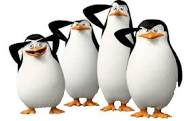

```{r setup, include=FALSE}
#AnnArbor 
#linkcolor: #191970
knitr::opts_chunk$set(echo = TRUE, comment = NA,cache=TRUE)
library(tidyverse)
```

# Introducción

## La librerías de `tidyverse`

\blue{Tidyverse} es una colección de paquetes/librerías de R para
ciencia de datos con diseño similar
[tidyverse.org](https://www.tidyverse.org/)

\red{ La idea principal es establecer una tecnología que aproxime el lenguaje natural a la manipulación de datos}
[Wickham, et al.
(2019)](https://joss.theoj.org/papers/10.21105/joss.01686){width="30%"}

[Hadley Wickham](https://hadley.nz/) es el director de los científicos
de datos de RStudio y profesor adjunto de estadística en la Universidad
de Auckland, la Universidad de Stanford y la Universidad de Rice.

Las librerías de tidyverse han venido a sustituir R base por su
eficiencia y facilidad de programación para no informáticos.

Casi todas las consultas a páginas técnicas de R son o incluyen código
de `tidyverse`.

```{r, echo=FALSE, out.width="10%",fig.align='right'}
knitr::include_graphics("Imgs/hex-tidyverse.png")
```

## Las librerías de `tidyverse`

**Paquetes de `tidyverse` base :**

-   `readr`: lectura de datos
-   `tibble`: una clase 'tbl_df' (el 'tibble') con una comprobación más
    estricta y un mejor formato que el data frame tradicional.
-   `stringr`: paquete de funciones para texto
-   `forcats`: paquete de funciones para factores
-   `tidyr`: arreglo y limpieza de datos
-   `dplyr`: manipulación de datos
-   `ggplot2`: visualización de datos (gráficos)
-   `purrr`: programación funcional (pipes)

Hay muchos otros paquetes para fines especiales que se integran sin
problemas, por ejemplo, lubridate (variables de tiempo), stringr
(texto), ...

```{r, echo=F, out.width='5%', fig.align='right'}
knitr::include_graphics("Imgs/hex-tidyverse.png")
```

## Instalar y cargar `tidyverse`

```{r,warning=FALSE, message=TRUE}
#install.packages("tidyverse")
library(tidyverse)
```

    -- Attaching packagesglimpse------------------------------------ tidyverse 1.3.1 --
    v ggplot2 3.3.5 v purrr 0.3.4
    v tibble 3.1.4 v dplyr 1.0.7
    v tidyr 1.1.3 v stringr 1.4.0
    v readr 2.0.1 v forcats 0.5.1
    -- Conflictsglimpse--------------------------------------- tidyverse_conflicts() --
    x dplyr::filter() masks stats::filter()
    x dplyr::lag() masks stats::lag()

Se puede ver la versión del paquete tidyverse y la de los paquetes base
de tidyverse.

\red{Cuidado que algunas funciones de R se sobrescriben por sus equivalentes de}
`tidyverse`}

En ocasiones es preferible indicar explícitamente el nombre de la
función que deseamos utilizar, por ejemplo: `dplyr::group_by` para
distinguir de `plyr::group_by` (dplyr es una evolución del paquete plyr)
.

## Más sobre `tidyverse`

Todos estos paquetes están pensados para:

1.  Tener una tecnología en la que puedan convivir desde informáticos
    puros, economistas, matemáticos, gestores etc. compartiendo el mismo
    flujo de datos...

2.  Facilitar el análisis y modelización de datos

```{r, echo=F, out.width='60%', fig.align="center"}
knitr::include_graphics("Imgs/data-science.png")
```

## Librerías para cada tarea

```{r, echo=F, out.width='30%', fig.align="center"}
knitr::include_graphics("Imgs/data-science.png")
```

-   **Import:** `readr`\
-   **Tidy:** `tidyr`\
-   **Transform:** `dplyr`, `forcats`, `stringr`\
-   **Visualize:** `ggplot2`\
-   **Model:** `tidymodels`\
-   **Communicate:** `rmarkdown`\
-   **Program:** `magrittr`, `purrr`, `tibble`

Algunos libros:

-   [Wickham/Grolemund (2017)](https://r4ds.had.co.nz/tidy-data.html).\*
-   [Yihui Xie, J. J. Allaire, Garrett
    Grolemund](https://bookdown.org/yihui/rmarkdown/)

## Más sobre `tidyverse`

Lo que se intenta es hacer un diseño y una gramática que sea sencilla
como una API para usuarios no "tecnólogos".

-   Las `tibbles` como estructura de datos (superan a los `data.frames`
    y simplifican los `data.table`)

-   El operador `%>%` para crear flujos de datos y funciones.

-   Estandarizar la nomenclatura de las funciones,

-   Establecer un orden razonable en los argumentos de las funciones
    (por ejemplo,
    `fn(argumento_A = datos, argumento_B = etiquetas de las columnas, ...)`.

## Más sobre `tidyverse`

La sintaxis del `tidyverse` puede verse como un "dialecto" de `R`.

```{r serpiente_camello, echo=FALSE,fig.align='center',out.width="40%"}
knitr::include_graphics("Imgs/serpiente_camello.png")
```

*Nota: Para más información*, véase [Tidyverse Team
(2020)](https://design.tidyverse.org/) y [Wickham
(2019)](https://cran.r-project.org/web/packages/tidyverse/vignettes/manifesto.html).

# Tidy data

## ¿Qué es tidy data?

Los conjuntos de datos ordenados son todos iguales; pero cada conjunto
de datos desordenado es desordenado a su manera. [Wickham/Grolemund:
r4ds](https://r4ds.had.co.nz/tidy-data.html)

Si tenemos datos provenientes de distintas fuentes, seguramente
tendremos que estructurarlos en una única tibble.

**Principios de los datos estructurados:**

El concepto de datos ordenados implica conjuntos de datos rectangulares
y tabulares compuestos por filas y columnas:

1.  Cada variable forma una columna.

2.  Cada observación forma una fila.

3.  Cada tipo de unidad de observación forma una tabla.

## ¿Qué es tidy data?

```{r tidydata, echo=FALSE,fig.align='center',out.width="60%"}
knitr::include_graphics("Imgs/tidy_data.PNG")
```

## Estructurar y ordenar datos (tidy)

**Violaciones de los principios de los datos ordenados:**

1.  Las cabeceras de las columnas son valores, no nombres de variables.

2.  Se almacenan múltiples variables en una columna.\

3.  Las variables se almacenan tanto en filas como en columnas.

4.  Se almacenan múltiples tipos de unidades de observación en la misma
    tabla.

5.  Una misma unidad de observación se almacena en varias tablas.

## Estructurar y ordenar datos

Veamos ejemplos de lo anterior con unos datos de
[pingüinos](https://allisonhorst.github.io/palmerpenguins/) con los que
seguiremos trabajando luego.

```{r, warning=FALSE}
#install.packages("palmerpenguins",dep=TRUE)
library("palmerpenguins")
print(penguins, width = 50)
```

## Estructurar y ordenar datos (tidy)

```{r, echo=F, warning=F}
set.seed(123)

penguins %>% 
  group_by(species, island) %>% 
  summarise(n = n(), .groups = "drop") %>% 
  pivot_wider(names_from = island, values_from = n) %>% 
  unnest(cols = c(Biscoe, Dream, Torgersen))
```

```{r, echo=F}
penguins %>% 
  select(species, island, sex, year) %>% 
  unite(col, species, sex) %>% 
  sample_n(5)
```

```{r, echo=F, message=F, warning=F}
penguins %>% 
  select(bill_length_mm, bill_depth_mm, flipper_length_mm) %>% 
  corrr::correlate(method = "pearson")
```

## Estructurar y ordenar datos (tidy)

```{r , echo=F,message=F, warning=F}
penguins %>% 
  select(species, island, sex) %>% 
  sample_n(3) %>% 
  bind_rows(
    mtcars %>%
      tibble::rownames_to_column("model") %>% 
      select(model, mpg, cyl) %>% 
      sample_n(3)
  )
```

```{r, echo=F, message=F, warning=F}
penguins %>% 
  select(species, island, sex) %>% 
  sample_n(3) %>% 
  bind_rows(
    mtcars %>%
      tibble::rownames_to_column("model") %>% 
      select(model, mpg, cyl) %>% 
      sample_n(3)
  )
```

## Estructurar y ordenar datos (tidy)

```{r plot_tidy, echo=F,fig.align="center",include=FALSE, out.width="30%"}
png("Imgs/plot_tidy.png")
set.seed(33)
x=rnorm(1000)
y=rnorm(1000)
colores=cut(x,4)
levels(colores)=c("red","blue","green","brown")
par(mfrow=c(1,2))
plot(x=x,y=y,pch=15,col=sample(c("red","blue","green","brown"),500,replace=TRUE),
axes=FALSE,xlab="",ylab="",main="Datos NO tidy")
plot(x=x,y=y,pch=15,col=as.character(colores),axes=FALSE,xlab="",ylab="",main="Datos tidy")
par(mfrow=c(1,1))
dev.off()
```

```{r tidy_data, echo=FALSE,fig.align='center',out.width="50%"}
knitr::include_graphics("Imgs/plot_tidy.png")
```

# Magrittr pipes (tuberías)

## Datos de los pingüinos del Archipelago de Palmer (Antarctica)

Como mencionamos antes, para poner ejemplos de los distintos paquetes de
`tidyverse` utilizamos datos del paquete `palmerpenguins` de [Allison
Horst](https://allisonhorst.github.io/palmerpenguins/).

El paquete incluye datos sobre los pingüinos observados en las islas del
archipiélago Palmer, cerca de la estación Palmer, en la Antártida.

```{r, echo=F, fig.align='center', out.width='30%'}

```

## Datos de los pingüinos

```{r, echo=F, fig.align='center', out.width='35%'}
knitr::include_graphics(c("Imgs/lter_penguins.png","Imgs/culmen_depth.png"))
```

## Operadores de "tuberías" para `R`

```{r,fig.align='right',out.width="5%",fig.align='right',echo=FALSE}
knitr::include_graphics("Imgs/logo_pipe.png")
```

Los operadores pipes de `magrittr` son:

-   **Operador de tuberías:** `%>%`
-   **Operador de asignación:** `%<>%`
-   **Operador "T":** `%T>%`
-   **Operador de extracción ("exposition"):** `%$%`.

**Ejemplo**

```{r, eval=FALSE}
rnorm(200) %>%
matrix(ncol = 2) %T>%
plot %>% # plot no suele retornar nada
colSums
```

## Operadores de "tuberías" para `R`

Estos operadores pretenden mejorar la legibilidad de los códigos de
múltiples maneras:

-   Organizando las operaciones en una cadena de instrucciones
    encadenadas (de izquierda a derecha) fácilmente legible,

-   Evitando las llamadas a funciones anidadas,

-   Minimizando el uso de asignaciones de variables locales (`<-`) y
    definiciones de funciones,

-   Añadiendo y/o eliminando fácilmente pasos del "pipeline" sin romper
    el código.

El operador %\$% pasa las variables de una tibble/data.frame.

```{r, message=FALSE, eval=FALSE}
library(magrittr)
iris %>%
  subset(Sepal.Length > mean(Sepal.Length)) %$%
  cor(Sepal.Length, Sepal.Width)
```

## Operadores de "tuberías" para `R`

```{r out.width="50%", fig.align='center'}
library(magrittr)
data.frame(z = rnorm(100)) %$%  ts.plot(z)
```

## El operador pipe

**pipes básicos:** pasan un valor, atributo u objeto (LHS: Left Hand
Side ) a la siguiente llamada de función (RHS: Right Hand Side) como
**primer** argumento <br>

```{r, eval=F}
x %>% f # equivalente a: f(x)
x %>% f(y) # equivalente a: f(x, y)
x %>% f %>% g %>% h # equivalente a: h(g(f(x)))
```

## El operador pipe

**pipes con marcadores de posición:** reenvían un valor u objeto (LHS) a
la siguiente llamada de función (RHS) como **cualquier** argumento

```{r, eval=F}
x %>% f(.) # equivalente a: x %>% f
x %>% f(y, .) # equivalente a: f(y, x)
x %>% f(y, z = .) # equivalente a: f(y, z = x)
x %>% f(y = nrow(.),
        z = ncol(.))  # equivalente a: f(x, y = nrow(x), z = ncol(x))
```

## Construcción de funciones con pipes

Una secuencia de código que comienza con el marcador de posición (`.`)
devuelve una función que puede utilizarse para aplicar posteriormente la
tubería a valores concretos

```{r, eval=F}
f <- . %>% cos %>% sin # equivalente a: f <- function(.) sin(cos(.))
```

```{r, eval=F}
f(20) # equivalente a: la tubería 20 %>% cos %>% sin
```

\blue{Nota: Para saber más sobre} `%>%`, haced `vignette("magrittr")` en
la consola de R.

\red{Se puede obtener la cadena} `%>%` en Rstudio desktop utilizando el
atajo de teclado:

\red{Ctrl + Shift  + M}.

## Ejemplo con el operador pipe

**Pregunta:** ¿Cuál es la masa corporal media en gramos de todos los
pingüinos observados en el año 2007 (tras excluir los valores perdidos)?

**En un mundo sin pipes:**

```{r, eval=F}
mean(subset(penguins, year == 2007)$body_mass_g, na.rm = T)
# alternativamente:
peng_bm_2007 <- subset(penguins, año == 2007)$body_mass_g
media(peng_bm_2007, na.rm = T)
```

**En un mundo con pipes:**

```{r, eval=F}
penguins %>% 
  subset(año == 2007) %>% 
  .$body_mass_g %>% 
  mean(na.rm = T)
```

## Ventajas de usar pipes

-   El estilo secuencial de las tuberías mejora la legibilidad y la
    lectura que las funciones anidadas.

-   Hace innecesario almacenar los resultados intermedios.

-   Es muy fácil añadir o eliminar pasos (empalmes de tuberías)
    individuales en el "pipe-line/canalización"

\blue{Nota:} Las versiones recientes de R ya tiene viene con un operador
de tuberías nativo también (`|>`).

## El pipe de R base

```{r}
mtcars |> head()  #  es lo mismo que head(mtcars)
mtcars |> head(2) #  es lo mismo que  head(mtcars, 2)
mtcars |> subset(cyl == 4) |> nrow()  
```

## Pipes avanzadas

Los empalmes de tuberías más avanzados como la `%T%` nos permiten
economizar lineas de código.

-   `%T>%` se puede utilizar para activar el efecto secundario de una
    función, por ejemplo, para imprimir salidas, y dejar que los datos
    originales pasen por alto el paso respectivo.

```{r}
penguins[1:5, c("island", "bill_length_mm" )] %T>% 
  print %>% .$"bill_length_mm"  %>%
  mean(na.rm=T)
```

## Tuberías avanzadas

-   La pipe `%$%` extrae las variables del objeto LHS a la expresión
    RHS. Esto es útil si la expresión RHS no permite un argumento `data`
    separado.

```{r, out.width="40%", fig.align='center'}
penguins %$% 
  plot(species,bill_length_mm)
```

## Tuberías avanzadas

`%<>%` se puede utilizar de forma equivalente al operador de asignación
base `R` (`<-`). Reasigna el resultado de la tubería a la variable
inicial.

```{r}
variable <- penguins$bill_length_mm
variable %<>% mean(na.rm=T)
variable
```

# Paquete tibble

## Data frame avanzado: tibble

EL paquete `tibble` proporciona un objeto de tipo data frame mejorado:
`tbl_df`. Un `tibble` se puede crear de cuatro maneras diferentes.

Crea un `tibble` a partir de vectores de columna con `tibble()`.

```{r}
tibble(
  x = c("a", "b"),
  y = c(1, 2),
  z = c(T, F)
)
```

## Data frame avanzado: tibble

Escribiendo en texto por columnas `tibble`, fila por fila con
`tribble()`.

```{r}
tribble(
  ~x, ~y, ~z,
  "a", 1, T,
  "b", 2, F
)
```

## Data frame avanzado: tibble

Crear un `tibble` a partir de otro objeto de las clases `matrix` o
data.frame`con`as_tibble()\`.

```{r}
data.frame(
  x = c("a", "b"),
  y = c(1, 2),
  z = c(T, F)
) %>% 
as_tibble
```

## Data frame avanzado: tibble

Crea un `tibble` a partir de vectores con nombre con `enframe()`.

```{r}
c(x = "a", y = "b", z = 1) %>%
  enframe(name = "x", value = "y")
```

## Data frame avanzado tibble

\red{Diferencias entre tibble y data.frame}

-   Un tibble nunca cambia el tipo de entrada.

    -   Ya no hay que preocuparse de que los caracteres se conviertan
        automáticamente en cadenas.

-   Un tibble puede tener columnas que son listas.

-   Un tibble puede tener nombres de variables no estándar.

    -   Pueden empezar por un número o contener espacios.
    -   Para utilizarlo se refiere a estos en un backtick: `peso en Kg`.

-   Sólo recicla vectores de longitud 1.

-   No tiene como atributo nombres de filas `row.names`.

## Data frame avanzado tibble

**Impresión:** Por defecto, `tibble()` imprime sólo las diez primeras
filas y todas las columnas que caben en la pantalla, y las clases de las
columnas

```{r}
penguins
```

## Data frame avanzado: tibble

Aquí se ve la diferencia con la clase `data.frame`.

```{r}
data.frame(penguins)
```

## Data frame avanzado: tibble

En contraste con `data.frame()` que imprime un número extenso de filas,
`glimpse` nos da la versión transpuesta de `print()`.

```{r}
penguins %>% glimpse
```

## Data frame avanzado: tibble

**Subconjunto:** El subconjunto de un `tibble` (`[]`) siempre devuelve
otro `tibble` y nunca un vector (en contraste con los objetos estándar
`data.frame`).

```{r}
data.frame(penguins) %>% .[, "species"] %>% class
```

```{r}
penguins[, "species"] %>% class
```

## Data frame avanzado: tibble

El subconjunto de un data.frame busca el nombre de variable más parecido

```{r}
names(data.frame(penguins))
head(data.frame(penguins)$spec)
```

\red{`tibble` no permite la coincidencia parcial, es decir, siempre se debe proporcionar el nombre completo de la columna.}

## Data frame avanzado: tibble

```{r}
head(penguins$spec)
```

```{r}
head(penguins$species)
```

-   Las tibbles tienen mejores `Warning` y `Error` ya que dan mejores
    mensajes de advertencia para solucionar problemas.

<!-- * `readr` no lee  datos en formatos que no sean texto, sino almacenados en un archivo de texto (txt, csv, excel) -->

# Leer datos de texto rectangulares `readr`

## Leer datos de texto rectangulares `readr`

```{r, out.width="5%",fig.align='right',echo=FALSE}
knitr::include_graphics("Imgs/logo_readr.png")
```

El paquete `readr` proporciona funciones de lectura y escritura para
múltiples formatos de archivo diferentes:

-   `read_delim()`: archivos delimitados en general
-   `read_csv()`: archivos separados por comas
-   `read_csv2()`: archivos separados por punto y coma. En la mayoría de
    los países europeos, Microsoft Excel utiliza `;` como delimitador
    común
-   `read_tsv()`: archivos separados por tabulaciones
-   `read_fwf()`: archivos de ancho fijo
-   `read_table()`: archivos separados por espacios en blanco
-   `read_log()`: archivos de registro web

## Leer datos de texto rectangulares `readr`

```{r, out.width="5%",fig.align='right',echo=FALSE}
knitr::include_graphics("Imgs/logo_readr.png")
```

-   Convenientemente, las funciones `write_*()` funcionan de forma
    análoga.

-   Se utiliza el paquete `readxl` para archivos de Excel,

-   El paquete `haven` para archivos de Stata, SAS y SPSS,

-   El paquete `googlesheets4` para Google Sheets

-   El paquete `rvest` para archivos HTML. Paquete de referencia en el
    contexto de la extracción de datos de la web con `R`

## Leer datos de texto rectangulares `readr`

Para ilustrar el paquete `readr`, a priori, los datos de los pingüinos
se escriben en un archivo csv utilizando:
`write_csv(penguins, archivo = "datos/penguins.csv")`.

```{r}
data <- read_csv(file = "data/penguins.csv")
```

## Leer datos de texto rectangulares `readr`

```{r, out.width="5%",fig.align='right',echo=FALSE}
knitr::include_graphics("Imgs/logo_readr.png") 
```

Mientras que...

```{r}
data <- read_csv(file = "data/penguins.csv", col_select = c(species, island))
```

## Leer datos de texto rectangulares `readr`

```{r, out.width="5%",fig.align='right',echo=FALSE}
knitr::include_graphics("Imgs/logo_readr.png")
```

```{r}
data <- read_csv(file = "./data/penguins.csv",
                 col_names = paste("Var", 1:8, sep = "_"))
```

## Leer datos de texto rectangulares `readr`

```{r, out.width="5%",fig.align='right',echo=FALSE}
knitr::include_graphics("Imgs/logo_readr.png")
```

```{r}
data <- read_csv(file = "./data/penguins.csv", skip = 5)
```

\red{Nota}: la salida de cualquier función `read_*()` es un objeto
`tibble`.

## Leer datos de texto rectangulares `readr`

```{r, out.width="5%",fig.align='right',echo=FALSE}
knitr::include_graphics("Imgs/logo_readr.png")
```

-   `readr` imprime las especificaciones de las columnas después de la
    importación.

-   Por defecto, `readr` intenta inferir el tipo de columna (por
    ejemplo, `int`, `dbl`, `chr`, `fct`, `date`, `lgl`) a partir de las
    primeras 1.000 filas y analiza las columnas en consecuencia.

-   Intentad hacer explícitas las especificaciones de las columnas. Es
    probable que os familiaricéis más con sus datos y veáis advertencias
    si algo cambia inesperadamente.

## Leer datos de texto rectangulares `readr`

```{r, out.width="5%",fig.align='right',echo=FALSE}
knitr::include_graphics("Imgs/logo_readr.png")
```

```{r, eval=F}
read_csv(
  archivo = "./data/penguins.csv",
  col_types = cols(
    species = col_character(),
    año = col_datetime(formato = "%Y"),
    isla = col_skip())
  )
```

## Leer datos de texto rectangulares `readr`

```{r, out.width="5%",fig.align='right',echo=FALSE}
knitr::include_graphics("Imgs/logo_readr.png")
```

Analizar sólo las primeras 1.000 filas es eficiente, pero puede provocar
errores:

```{r, eval=F}
read_csv(file = "./data/penguins.csv", guess_max = 2000)
```

\blue{Nota}: Encuentra más información y funciones de `readr` en [hoja
de
trucos](https://raw.githubusercontent.com/rstudio/cheatsheets/master/data-import.pdf).

A veces puedes tener problemas al leer datos de texto (tipo carácter):
los signos especiales como ö, ä o ü pueden ser codificados de forma
extraña como símbolos crípticos. En esos casos debe controlar la
codificación de sus datos en la función read_csv (por ejemplo, UTF-8)

## Leer datos de texto rectangulares `readr`

```{r, out.width="5%",fig.align='right',echo=FALSE}
knitr::include_graphics("Imgs/logo_readr.png")
```

A veces, deseamos dejar de utilizar los archivos `.xlsx` y `.csv` ya que
no son capaces de almacenar de forma fiable sus metadatos (por ejemplo,
los tipos de datos).

Las funciones `write_rds()` y `read_rds()` (son wrappers de `writeRDS` y
`readRDS` del paquete base de R) proporcionan una buena alternativa para
[serializar](https://en.wikipedia.org/wiki/Serialization) tus objetos
`R` (por ejemplo, `tibbles`, modelos) y almacenarlos como archivos
`.rds`.

Más información sobre [archivos
rds](https://mgimond.github.io/ES218/Week02b.html#Export_to_a_Rds_file)

## Leer datos de texto rectangulares `readr`

```{r, out.width="5%",fig.align='right',echo=FALSE}
knitr::include_graphics("Imgs/logo_readr.png") 
```

```{r}
penguins %>% 
  write_rds(file = "./data/penguins.rds")
```

```{r}
penguins <- read_rds(file = "./data/penguins.rds")
```

Notad que:

-   `write_rds()` solo puede utilizarse para guardar
    \red{un objeto a la vez},

-   un archivo `.rds` cargado debe ser almacenado en una nueva variable,
    es decir, darle un nuevo nombre,

-   `read_rds()` ¡conserva los tipos de datos!

# Tidyr: Ordenar datos desordenados

## Tidyr: Ordenar datos desordenados: `tidyr`

```{r, out.width="5%",fig.align='right',echo=FALSE}
knitr::include_graphics("Imgs/logo_tidyr.png") 
```

El paquete `tidyr` nos proporciona muchas funciones para *asear,
arreglar datos*/ *tidy data* por ejemplo: reformatear (reshaping),
separar columnas (splitting columns), manejar valores perdidos (handling
missing values) e incluso genera datos anidados (esting data).

```{r}
penguins
```

## Tidyr: Ordenar datos desordenados: `tidyr`

```{r, out.width="5%",fig.align='right',echo=FALSE}
knitr::include_graphics("Imgs/logo_tidyr.png") 
```

**Pivotting:** Converts between long and wide format using
`pivot_longer()` and `pivot_wider()`.

```{r}
long_penguins <- penguins %>% 
  pivot_longer(
    cols = c(species, island),
    names_to = "variable", values_to = "valor"
  )
```

## Tidyr: Ordenar datos desordenados: `tidyr`

```{r}
long_penguins %>% glimpse
```

```{r}
long_penguins %>% 
  pivot_wider(
    names_from = "variable", values_from = "valor"
  ) %>%
glimpse
```

`pivot_longer()`: - ahora para cada observación tenemos dos filas, una
fila por variable pivotada -\> ya no hay formato ordenado - dim: 688 x 8

`pivot_wider()`: - invierte en egecto de `pivot_longer()` - dim: 344 x 8

## Tidyr: Ordenar datos desordenados: `tidyr`

```{r, out.width="5%",fig.align='right',echo=FALSE}
knitr::include_graphics("Imgs/logo_tidyr.png") 
```

\red{Falta dibujo}

```{r, echo=F, out.height='80%', out.width='80%', eval=FALSE}
knitr::include_graphics("https://raw.githubusercontent.com/apreshill/teachthat/master/pivot/pivot_longer_smaller.gif")
```

Source: [Allison
Hill](https://github.com/apreshill/teachthat/blob/master/pivot/pivot_longer_smaller.gif)

\*Note: Find more information about `pivot_*()` in the [pivoting
vignette](https://tidyr.tidyverse.org/articles/pivot.html).

## Tidyr: Ordenar datos desordenados: `tidyr`

```{r, out.width="5%",fig.align='right',echo=FALSE}
knitr::include_graphics("Imgs/logo_tidyr.png") 
```

**Nesting:** Groups similar data such that each group becomes a single
row in a data frame.

```{r}
nested_penguins <- 
  penguins %>% 
    nest(nested_data = 
           c(island, bill_length_mm, 
             bill_depth_mm, flipper_length_mm,
             body_mass_g, sex))
nested_penguins
```

## Tidyr: Ordenar datos desordenados: `tidyr`

```{r, out.width="5%",fig.align='right',echo=FALSE}
knitr::include_graphics("Imgs/logo_tidyr.png") 
```

-   La función `nest()` generad datos anidados en un data frame con una
    fila por `species` y \`year
-   Los datos anidados `nested_data` por columnas contienen`tibbles` con
    seis columnas cada uno y una ciertyo número de observaciones que
    pueden ser distintos.
-   Los datos anidados son útiles si queremos aplicar funciones a cada
    subgrupo de datos (por ejemplo, comparar estadísticos por especie

nombre: nested-data

## Tidyr: Ordenar datos desordenados: `tidyr`

```{r, out.width="5%",fig.align='right',echo=FALSE}
knitr::include_graphics("Imgs/logo_tidyr.png") 
```

**Rectangling:** Deshace las estructuras de datos anidados (por ejemplo,
JSON, HTML) y las lleva al formato de *datos ordenados*.

Extrae objetos individuales de una estructura de datos anidada mediante
`purrr::pluck()`.

```{r}
nested_penguins %>% purrr::pluck("nested_data", 1)
```

## Tidyr: Ordenar datos desordenados: `tidyr`

```{r, out.width="5%",fig.align='right',echo=FALSE}
knitr::include_graphics("Imgs/logo_tidyr.png") 
```

Aplana las estructuras de datos anidados mediante `tidyr::unnest()`.

```{r}
nested_penguins %>% unnest(cols = c(nested_data)) 
```

## Tidyr: Ordenar datos desordenados: `tidyr`

```{r, out.width="5%",fig.align='right',echo=FALSE}
knitr::include_graphics("Imgs/logo_tidyr.png")
```

Extraer selectivamente componentes individuales de un objeto en una
estructura de datos anidada mediante `tidyr::hoist()`.

```{r}
nested_penguins %>% hoist(nested_data, hoisted_col = "bill_length_mm")
```

Alternativamente, usa `unnest_wider()` o `unnest_longer()` para tener
más control sobre la operación de rectangulación.

## Tidyr: Ordenar datos desordenados: `tidyr`

```{r, out.width="5%",fig.align='right',echo=FALSE}
knitr::include_graphics("Imgs/logo_tidyr.png") 
```

**Dividir** y **Combinar:** Transforma una columna de un solo carácter
en varias columnas y viceversa.

## Tidyr: Ordenar datos desordenados: `tidyr`

```{r, out.width="5%",fig.align='right',echo=FALSE}
knitr::include_graphics("Imgs/logo_tidyr.png") 
```

Combina múltiples columnas en una sola columna.

```{r}
penguins %>% unite(col = "specie_sex",
                   c(species, sex), sep = "_", remove = T)
```

## Tidyr: Ordenar datos desordenados: `tidyr`

```{r, out.width="5%",fig.align='right',echo=FALSE}
knitr::include_graphics("Imgs/logo_tidyr.png") 
```

Separar una sola columna, que contiene varios valores, en varias
columnas.

```{r}
penguins %>% separate(bill_length_mm, sep = 2, into = c("cm", "mm"))
```

## Tidyr: Ordenar datos desordenados: `tidyr`

```{r, out.width="5%",fig.align='right',echo=FALSE}
knitr::include_graphics("Imgs/logo_tidyr.png") 
```

Separar una sola columna, que contiene varios valores, en varias filas.

```{r}
penguins %>% separate_rows(island, sep = "s", convert = T)
```

Podemos `separar` basándose en la coincidencia de caracteres

## Tidyr: Ordenar datos desordenados: `tidyr`

```{r, out.width="5%",fig.align='right',echo=FALSE}
knitr::include_graphics("Imgs/logo_tidyr.png") 
```

**Manejo de los valores perdidos:** Elimine o sustituya los valores
perdidos explícitos o implícitos (`NA`).

```{r, echo=F}
incompl_penguins <- tibble(
  species = c(rep("Adelie", 2), rep("Gentoo", 1), rep("Chinstrap", 1)),
  year = c(2007, 2008, 2008, 2007),
  measurement = c(rnorm(3, mean = 50, sd = 15), NA)
)
```

## Tidyr: Ordenar datos desordenados: `tidyr`

```{r, out.width="5%",fig.align='right',echo=FALSE}
knitr::include_graphics("Imgs/logo_tidyr.png") 
```

```{r}
incompl_penguins
```

Hacer explícitos los valores perdidos implícitos.

```{r}
incompl_penguins %>% 
  complete(species, year, fill = list(measurement = NA))
```

## Tidyr: Ordenar datos desordenados: `tidyr`

```{r, out.width="5%",fig.align='right',echo=FALSE}
knitr::include_graphics("Imgs/logo_tidyr.png") 
```

Hacer implícitos los valores perdidos explícitos.

```{r}
incompl_penguins %>% 
  drop_na(measurement)
```

```{r}
incompl_penguins %>% 
  drop_na(measurement)
```

## Tidyr: Ordenar datos desordenados: `tidyr`

```{r, out.width="5%",fig.align='right',echo=FALSE}
knitr::include_graphics("Imgs/logo_tidyr.png") 
```

Reemplaza los valores que faltan por el valor siguiente/anterior.

```{r}
incompl_penguins %>% 
  fill(measurement, .direction = "down")
```

## Tidyr: Ordenar datos desordenados: `tidyr`

```{r, out.width="5%",fig.align='right',echo=FALSE}
knitr::include_graphics("Imgs/logo_tidyr.png") 
```

Reemplaza los valores que faltan por un valor predefinido.

```{r}
incompl_penguins %>%
  replace_na(replace = list(measurement = mean(.$measurement, na.rm = T)))
```

## Tidyr: Ordenar datos desordenados: `tidyr`

```{r, out.width="5%",fig.align='right',echo=FALSE}
knitr::include_graphics("Imgs/logo_tidyr.png") 
```

[Más información en `tidyr`
cheatsheet](https://raw.githubusercontent.com/rstudio/cheatsheets/master/data-import.pdf).

Nota: los argumentos de función precedidos por un punto en el tidyverse
pueden tener una de estas dos razones - la función es todavía prematura,
es decir, los desarrolladores aún piensan en la mejor manera de
implementar y nombrar la función - la función se aplica regularmente
dentro de otra función para no confundir los argumentos de la función
entre la función interna y la externa

# Una gramática para manipular datos `dplyr`

## Una gramática para manipular datos `dplyr`

El paquete `dplyr` proporciona un conjunto de funciones para manipular
tablas de datos en general (por ejemplo, `tibbles`). Intenta crear un
agramatica de manipulación de tablas

1.  **Operaciones sobre las filas**
2.  **Operaciones sobre las columnas**
3.  **Operaciones sobre datos agrupados**

## Una gramática para manipular datos `dplyr`

**Operaciones sobre las filas** - `filter()` recoge las filas que
cumplen uno o varios criterios lógicos - `slice()` selecciona las filas
en función de su ubicación en los datos - `arrange()` cambia el orden de
las filas

**Operaciones sobre las columnas** - `select()` selecciona o elimina
determinadas columnas - `rename()` cambia los nombres de las columnas -
`relocate()` cambia el orden de las columnas - `mutate()` transforma los
valores de las columnas y/o crea nuevas columnas

**Operaciones sobre datos agrupados** - `group_by()` divide los datos en
función de una o varias columnas - `summarise()` reduce un grupo de
datos en una sola fila

## Una gramática de manipulación de datos `dplyr`

```{r, echo=F, out.width='80%',fig.align='center'}
knitr::include_graphics("Imgs/dplyr_filter.png")
```

Fuente [Allison Short
github](https://github.com/allisonhorst/stats-illustrations).

## Una gramática de manipulación de datos `dplyr`

**Operaciones sobre las filas:** `filter()` escoge las filas que cumplen
uno o varios criterios lógicos

Filtro para todos los pingüinos de la `especie` "Adelie".

```{r, eval=F}
penguins %>% 
  filter(species == "Adelie")
```

## Una gramática de manipulación de datos `dplyr`

Filtrar todos los pingüinos con un valor perdido en la medida
`bill_length_mm`.

```{r, eval=F}
penguins %>% 
  filter(is.na(bill_length_mm) == T)
  # filter(!is.na(bill_length_mm) == F)
```

## Una gramática de manipulación de datos `dplyr`

Filtra todos los pingüinos observados antes del año2008 o después del
`año` 2008 y en los que la masa corporal (`masa_cuerpo_g`) está entre
3.800 y 4.000 gramos.

```{r, eval=F}
penguins %>% 
  filter(between(body_mass_g, 3800, 4000) & (year < 2008 | year > 2008))
```

## Una gramática de la manipulación de datos `dplyr`

**Operaciones sobre las filas:** `slice()` recoge las filas en función
de su ubicación en los datos

Recoge filas en función de su índice.

```{r}
penguins %>% 
  slice(23:27)
```

## Una gramática de la manipulación de datos `dplyr`

Selecciona las primeras `n` filas (viceversa para `slice_tail()`).

```{r}
penguins %>% 
  slice_head(n = 5) # alternativamente: slice_head(frac = 0.05)
```

## Una gramática de la manipulación de datos `dplyr`

Selecciona una muestra aleatoria de `n` filas (con o sin reemplazo).

```{r}
penguins %>% 
  slice_sample(n = 5)
```

## Una gramática de la manipulación de datos `dplyr`

Selecciona las filas de `n` con el valor más grande (viceversa para
`slice_min()`).

```{r}
penguins %>% 
  slice_max(bill_length_mm, n = 5)
```

-   slice_sample para generar muestras de arranque

## Una gramática de la manipulación de datos `dplyr`

**Operaciones sobre las filas:** `arrange()` cambia el orden de las
filas

Devuelve los cinco pingüinos con menor masa corporal.

```{r}
penguins %>% 
  arrange(body_mass_g) %>% 
  slice_head(n = 5) # equivalente a: slice_min(body_mass_g, n = 3)
```

## Una gramática de la manipulación de datos `dplyr`

Devuelve los cinco pingüinos con mayor masa corporal, en orden
\blue{decreciente}.

```{r}
penguins %>% 
  arrange(desc(body_mass_g)) %>% 
  slice_head(n = 5) # equivalente a: slice_max(body_mass_g, n = 3)
```

-   arrange por defecto siempre ordena de menor a mayor

## Una gramática de la manipulación de datos `dplyr`

**Operaciones sobre las columnas:** `select()` selecciona o elimina
determinadas columnas

```{r}
penguins %>% 
  select(1:3) %>% 
  glimpse
```

## Una gramática de la manipulación de datos `dplyr`

```{r}
penguins %>% 
  select(species, island, bill_length_mm) %>% 
  glimpse
```

## Una gramática de la manipulación de datos `dplyr`

**Operaciones sobre las columnas:** `select()` selecciona o elimina
determinadas columnas (utilizando los ayudantes `tidyselect`)

Selecciona todas las columnas.

```{r}
penguins %>% 
  select(everything()) %>% 
  glimpse
```

## Una gramática de la manipulación de datos `dplyr`

Selecciona la última columna del marco de datos.

```{r}
penguins %>% 
  select(last_col()) %>% 
  glimpse
```

## Una gramática de la manipulación de datos `dplyr`

Selecciona las columnas cuyos nombres comienzan con una cadena
determinada.

```{r}
penguins %>% 
  select(starts_with("bill")) %>% 
  glimpse
```

## Una gramática de la manipulación de datos `dplyr`

Selecciona las columnas cuyos nombres terminan con una determinada
cadena.

```{r}
penguins %>% 
  select(ends_with("mm")) %>% 
  glimpse
```

## Una gramática de la manipulación de datos `dplyr`

Selecciona las columnas cuyo nombre contiene una determinada cadena.

```{r}
penguins %>% 
  select(contains("e") & contains("a")) %>% 
  glimpse
```

## Una gramática de la manipulación de datos `dplyr`

Seleccionar columnas basadas en una expresión regular
([regex](https://www.rexegg.com/regex-quickstart.html)).

```{r}
penguins %>% 
  select(matches("_\\w*_mm$")) %>% 
  glimpse
```

## Una gramática de la manipulación de datos \`dplyr\`\`

Selecciona las columnas para las que una función evalúa a `TRUE`.

```{r}
penguins %>% 
  select(where(is.numeric)) %>% 
  glimpse
```

## Una gramática de la manipulación de datos `dplyr`

**Operaciones sobre las columnas:** `select()` selecciona o elimina
determinadas columnas

Otras consultas ¿qué resulatados devuelven?

```{r, eval=F}
penguins %>% 
  select(starts_with("s"))
```

```{r, eval=F}
penguins %>% 
  select(ends_with("mm"))
```

```{r, eval=F}
penguins %>% 
  select(contains("mm"))
```

## Una gramática de la manipulación de datos `dplyr`

```{r, eval=F}
penguins %>% 
  select(-contains("mm"))
```

```{r, eval=F}
penguins %>% 
  select(where(~ is.numeric(.))) %>% # equivalente a: select(where(is.numeric))
  select(where(~ mean(., na.rm = TRUE) > 1000))
```

## Una gramática de la manipulación de datos `dplyr`

**Operaciones sobre columnas:** `rename()` cambia los nombres de las
columnas

Cambia el nombre de la columna `body_mass_g` (`sex`) por `bm`
(`gender`).

```{r}
penguins %>% rename(bm = body_mass_g, gender = sex) %>%
  colnames()
```

## Una gramática de la manipulación de datos `dplyr`

Convierte el nombre de las columnas que incluyen la cadena `"mm"` a
mayúsculas.

```{r}
penguins %>% rename_with(.fn = toupper, .cols = contains("mm")) %>% 
  colnames()
```

## Una gramática de la manipulación de datos `dplyr`

```{r, echo=F,  out.width='60%',fig.align='center'}
knitr::include_graphics("Imgs/dplyr_relocate.png")
```

## Una gramática de la manipulación de datos `dplyr`

**Operaciones sobre las columnas:** `relocate()` cambia el orden de las
columnas

Cambia el orden de las columnas en el `tibble` según el siguiente
esquema: 1. colocar `especie` después de `masa_cuerpo_g` 2. colocar
"sexo" antes de "especie". 3. colocar "isla" al final

```{r}
penguins %>% 
  relocate(species, .after = body_mass_g) %>%
  relocate(sex, .before = species) %>%
  relocate(island, .after = last_col()) %>%
  colnames()
```

## Una gramática de la manipulación de datos `dplyr`

**Operaciones sobre las columnas:** `mutate()` transforma los valores de
las columnas y/o crea nuevas columnas

Crea una nueva variable `bm_kg` que refleja `body_mass_g` medida en kilo
gramos.

```{r}
penguins %>% 
  mutate(bm_kg = body_mass_g / 1000, .keep = "all", .after = island) %>% 
  slice_head(n = 5)
```

## Una gramática de la manipulación de datos `dplyr`

-   Usa el argumento `.keep` para especificar qué columnas se conservan
    después de la manipulación.
-   Usa los argumentos `.before`/`.after` para especificar la posición
    de la nueva columna.
-   Para anular una columna dada simplemente usa el mismo nombre de
    columna.
-   Para mantener sólo la nueva columna usa `dplyr::transmute()`.

## Una gramática de la manipulación de datos `dplyr`

```{r dibu_blanco1, echo=F, out.width="80%",fig.align='center'}
knitr::include_graphics("Imgs/dplyr_case_when.png")
```

## Una gramática de la manipulación de datos `dplyr`

**Operaciones sobre las columnas:** `mutate()` transforma los valores de
las columnas y/o crea nuevas columnas. Crea una variable *codificada*
para `sex`.

```{r}
penguins %>% 
  mutate(
    sex_binary = case_when(
      sex == "male" ~ 1,
      sex == "female" ~ 0),
    .keep = "all", .after = island
  ) %>% 
  slice_head(n = 3)
```

## Una gramática de la manipulación de datos `dplyr`

**One-hot Encoding:** Codificación disyuntiv, se separa el factor en
varias variables binarias una variable 0 (ausencia) o 1 (presencia) para
cada nivel del factor.

case_when:

-   versión vectorizada de if_else
-   fórmulas de dos lados: El LHS comprueba la condición, el RHS
    especifica el valor de sustitución
-   para los casos no coincidentes, la función devuelve NA
-   usad el LHS `TRUE` para capturar todos los casos no especificados
    explícitamente de antemano

## Una gramática de manipulación de datos `dplyr`

```{r, echo=F, out.width="80%",fig.align='center'}
knitr::include_graphics("Imgs/dplyr_across.png")
```

## Una gramática de la manipulación de datos `dplyr`

**Operaciones sobre las columnas:** `mutate()` transforma los valores de
las columnas y/o crea nuevas columnas

Transforma las variables de medida a metros.

```{r}
penguins %>% 
  mutate(
    across(contains("mm"), ~ . / 1000),
    .keep = "all"
  ) %>% 
  slice_head(n = 3)
```

## Una gramática de la manipulación de datos `dplyr`

Podemos hacer muchas operaciones distintas:

-   aplicar la misma transformación en varias columnas
-   le permite utilizar la semántica que conoce de la función
    `select()`.
-   no requiere que se especifique explícitamente un nombre de columna,
    sólo transforma las columnas existentes

## Una gramática para manipular datos `dplyr`

```{r, echo=F, out.width="60%"}
knitr::include_graphics("Imgs/dplyr_across.png")
```

## Una gramática de la manipulación de datos `dplyr`

**Operations on columns:** `mutate()` transforms the column values
and/or creates new columns

Define `species`, `island` and `sex` as a categorical variable, i.e.
*factors*, using `across()`.

```{r}
penguins %>% 
  mutate(
    across(where(is.character), as.factor),
    .keep = "all"
  ) %>% 
  slice_head(n = 3)
```

## Una gramática para manipular datos `dplyr`

**Operations on grouped data:** `group_by()` partitions data based on
one or several columns

```{r}
penguins %>% group_by(species)
```

Use `group_keys()`, `group_indices()` and `group_vars()` to access
grouping keys, group indices per row and grouping variables.

## Una gramática para manipular datos `dplyr`

**Operations on grouped data:** `group_by()` partitions data based on
one or several columns

Under the hood `group_by()` changes the representation of the `tibble`
and transforms it into a grouped data frame (`grouped_df`). This allows
us to operate on the subgroups individually using `summarise()`.

**Operations on grouped data:** `summarise()` reduces a group of data
into a single row

```{r}
penguins %>% group_by(species) %>% 
  summarise(count = n(),.groups = "drop")
```

## Una gramática de la manipulación de datos `dplyr`

```{r}
penguins %>% group_by(species, sex) %>%
  summarise(count = n(), .groups = "drop")
```

-   use `.groups =` para indicar lo que sucede con los grupos después de
    resumirlos

## Una gramática para manipular datos `dplyr`

**Operaciones para datos agrupados:** `group_by()` los
grupos/particiones e hacen para varias columnas y la función
`summarise()` nos da los resumenes/sumarios/estadisticos en una fila
para cada grupo.

```{r}
penguins %>%
  group_by(species) %>%
  summarise(
    across(contains("mm"), ~ mean(., na.rm = T), .names = "{.col}_avg"),
    .groups = "drop"
  )
```

## Una gramática de la manipulación de datos `dplyr`

Utilizando la función `group_by()`, seguida de una función `summarise()`
y `ungroup()` nos ofrece al completo la manipulación de datos
**segmentar-aplicar-resumir**. Segmentar/agrupar/agregar los datos en
grupos, aplicar funciones a cada grupos y ofrecer una tabla/panel/... de
los resultados para cada grupo.

-   Esta metodología aparece en múltiples ámbito como el **Big Data** :
    **Split-Apply-Combine and Map-Reduce**

## Una gramática para manipular datos `dplyr`

**Operaciones \`para datos agrupados:**

La función `group_by()` divide los datos en función de una o varias
columnas y `summarise()` reduce un grupo de datos a una sola fila

```{r, echo=F, out.width="30%",fig.align='center'}
knitr::include_graphics("Imgs/group_by_ungroup.png")
```

\blue{Nota}: En lugar de utilizar `desagrupar()` también puede
establecer el argumento `.groups` en `summarise()` igual a "drop".
\red{!!! No olvidar sesagrupar datos¡¡¡}

## Una gramática para manipular datos `dplyr`

-   ahora veamos algunos casos de uso más avanzados

**Apilado `group_by()`:** Utiliza `.add = T` para añadir nuevas
variables de agrupación (en caso contrario se anula la primera)

```{r}
penguins %>% 
  group_by(species) %>% 
  group_by(year, .add = T)   # equivalent to: group_by(species, year)
```

## Una gramática para manipular datos `dplyr`

**Aplicar un summary de estadísticos:** Proporcionar una lista de
funciones de estilo `purrr` a `across()` (\red{Atención} `purrr` es el
paquete de tidyverse de programación funcional)

```{r, echo=FALSE}
penguins %>%
  group_by(species) %>%
  summarise(
    across(
      contains("mm"),
      list(avg = ~ mean(., na.rm = T), sd = ~ sd(., na.rm = T)),
      .names = "{.col}_{.fn}"
    ),
    .groups = "drop"
  )
```

## Una gramática para manipular datos `dplyr`

```{r}
penguins %>%
  group_by(species) %>%
  summarise(
    across(
      contains("mm"),
      list(avg = ~ mean(., na.rm = T), sd = ~ sd(., na.rm = T)),
      .names = "{.col}_{.fn}"
    ),
    .groups = "drop"
  )
```

## Una gramática para manipular datos `dplyr`

**Modificar el comportamiento de `mutate()`:** Las funciones de
resúmenes estadísticos como `mean()` or `sd()` pueden operar para cada
nivel del `group_by`

```{r, size="tiny"}
penguins %>%
  group_by(species) %>% 
  mutate(stand_bm =
           (body_mass_g - mean(body_mass_g, na.rm = T)) / sd(body_mass_g, na.rm = T)) %>% 
  glimpse
```

-   $z$-scores (tipificación/estadandarización) por grupo

## Una gramática para manipular datos `dplyr`

**La función `group_by()`para transformar una columnas:**

Tenemos una opción de `mutate()` dentro de una llamada de la función
`group_by()`

```{r}
bm_breaks <- mean(penguins$body_mass_g, na.rm = T) - (-3:3) * sd(penguins$body_mass_g, na.rm = T)
penguins %>% 
  group_by(species, bm_bin = cut(body_mass_g, breaks = bm_breaks)) %>%
  summarise(count = n(), .groups = "drop")
```

## Una gramática para manipular datos `dplyr`

1.  Calcula bins (codificación intervalos) para `body_mass`, utilizando
    para el cáculos la desviación estatádar de la media.
2.  Agrupa para cada bins/clase

## Una gramática para manipular datos `dplyr`

**Modificar la función `filter()`:** LA fucnión `filter`puede operara
sobre particones de los datos, como por ejemplo :

```{r}
penguins %>% 
  group_by(species, island) %>% 
  filter(flipper_length_mm == max(flipper_length_mm, na.rm = T))
```

-   Agrupar por todas las combinaciones únicas de `species`-`island` y
    filtrar por los pingüinos `penguins` con la máxima longitud de aleta
    por combinación

## Una gramática para manipular datos `dplyr`

**Anidación de datos agrupados:** Lo más sencillo es hacer un
`group_by()` y luego un `nest()` para anidar tablas de datos...

```{r}
penguins %>% 
  group_by(species, year) %>% 
  tidyr::nest()
```

\blue{Más información:} `vignette("grouping")`.

## Una gramática para manipular datos `dplyr`

**Más, más y más... funciones del paquete `dplyr`**

`distinct()` trata de eliminar duplicados.

```{r}
penguins %>% 
  distinct(species, island)
```

## Una gramática para manipular datos `dplyr`

**Más... funciones del paquete `dplyr`**

```{r, echo=F}
options(max.print=100)
```

```{r}
penguins %>% 
  pull(year)  # equivalent to: penguins$year
```

```{r, echo=F}
options(max.print=1000)
```

## Una gramática para manipular datos `dplyr`

```{r}
penguins %>% select(species, island, body_mass_g) %>% 
  mutate(penguin_size = if_else(body_mass_g < 3500, "tiny penguin", "big penguin"))
```

`lag()` retardos desplaza `n` valores/posiciones atrás.

```{r}
penguins %>% select(species, body_mass_g) %>% 
  mutate(lagged_bm = lag(body_mass_g, n = 1))
```

```{r}
penguins %>% select(species, body_mass_g) %>% 
  mutate(lead_bm = lead(body_mass_g, n = 2))
```

\*Nota: Encuentre más información sobre `dplyr` ejecutando
`vignette("dplyr")` y consultando la [hoja de trucos] oficial
(<https://raw.githubusercontent.com/rstudio/cheatsheets/master/data-transformation.pdf>).

## Una gramática para manipular datos `dplyr`

`left_join()`, `right_join()`, `inner_join()` y `full_join()` son als
mismas fuciones para agregar tablas por una `keys` (son simlares a los
de SQL).

\blue{Ampliar información} del paquete `dplyr` con `vignette("dplyr")` y
consultando la [cheatsheet de dplyr]
(<https://raw.githubusercontent.com/rstudio/cheatsheets/master/data-transformation.pdf>).\*

## Una gramática para manipular datos `dplyr`

**La funciones de `dplyr` son similar a las de consultas `SQL`**

```{r, echo=F, out.width="70%",  fig.align='center'}
knitr::include_graphics("Imgs/sql-tidyverse.png")
```

Unas lecciones (son del grupop de Rstudio) de R y SQL [Steves
(2021)](https://www.rstudio.com/resources/rstudioglobal-2021/the-dynamic-duo-sql-and-r/)
